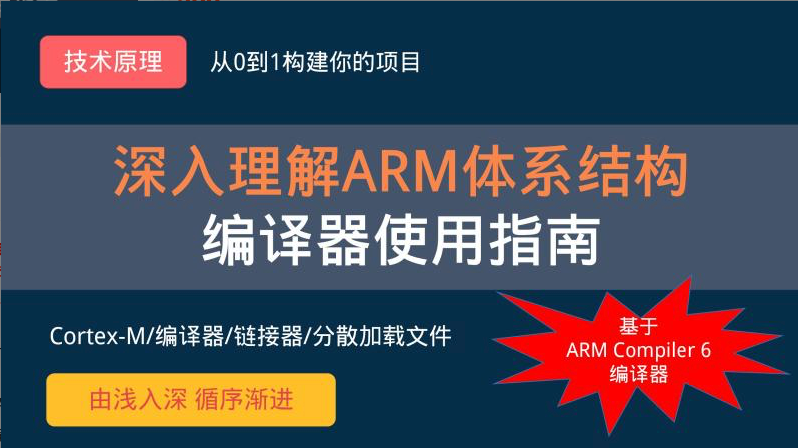
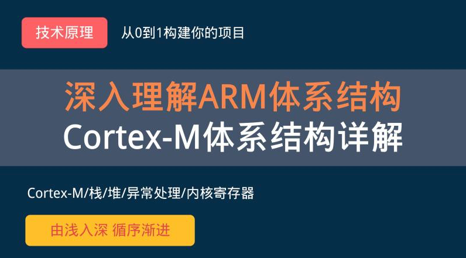
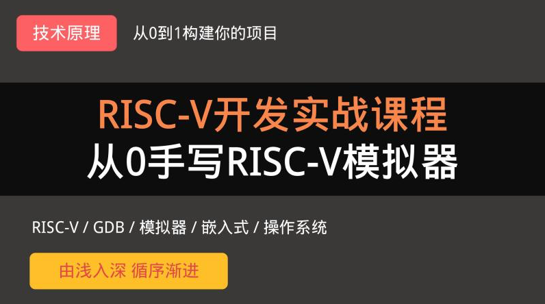

[《用6000+行代码开发x86 Linux操作系统》](https://zw8ls.xetlk.com/s/onWQO)

[项目实战：从0用10000+行代码实现TCP/IP协议栈](https://zw8ls.xetlk.com/s/1pF4qg)

[项目实战：从0写8051虚拟机](https://zw8ls.xetlk.com/s/1zH6c6)

[项目实战：从0到1写FAT32文件系统](https://zw8ls.xetlk.com/s/VeHie)

[项目实战：从0设计TFTP客户端和服务器](https://zw8ls.xetlk.com/s/2tfclD)

[项目实战：从0设计NTP时间服务客户端](https://zw8ls.xetlk.com/s/3S4fb1)

[【RTOS内核开发】从0手写嵌入式操作系统](https://zw8ls.xetlk.com/s/H2F1Y)

[【RTOS项目实战】远程温湿度监控设备](https://zw8ls.xetlk.com/s/3ozYk3)

[深入理解ARM体系结构-编译器使用指南](https://zw8ls.xetlk.com/s/3ByCo3)

[深入理解ARM体系结构-实战汇编语言编程](https://zw8ls.xetlk.com/s/3ct5Sw)

[深入理解ARM体系结构-RTOS任务切换机制详解](https://zw8ls.xetlk.com/s/rL5VD)

[深入理解ARM体系结构-Cortex-M内核架构与编程](https://zw8ls.xetlk.com/s/25AAN0)

[RISC-V开发实战：从0手写RISC-V模拟器](https://zw8ls.xetlk.com/s/1SAu05)

[RISC-V体系详解：基于青稞 V4系列微处理器](https://zw8ls.xetlk.com/s/3ORgRD)

[FATFS详解系列（1）：5小时快速入门嵌入式文件系统FATFS](https://zw8ls.xetlk.com/s/3kcyuO)

[从0手写多线程HTTP客户端](https://zw8ls.xetlk.com/s/3slDop)

[自己动手从0到1写嵌入式操作系统](https://zw8ls.xetlk.com/s/2v0Mkf)

[FATFS详解系列（2）- 怎样移植嵌入式文件系统FATFS](https://zw8ls.xetlk.com/s/1OgDjX)

[【从零玩转RT-Thread】移植详解](https://zw8ls.xetlk.com/s/4rHleg)

[【从零玩转RT-Thread】应用指南](https://zw8ls.xetlk.com/s/YKN3K)

