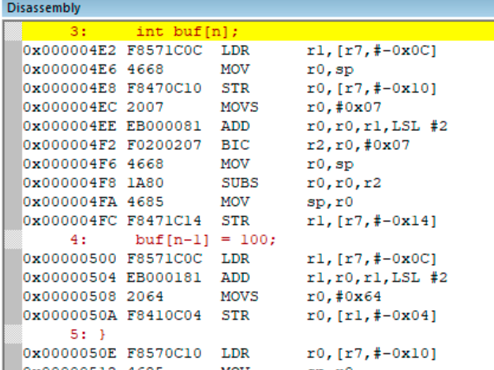

大家好，我是李述铜，一名专注于嵌入式系统与底层开发的技术讲师，我的主要工作是制作课程带大家从零手写操作系统、TCP/IP协议栈、文件系统等核心系统，从实现的视角理解计算机底层原理。

今天继续写一写C语言中很实用、但常被忽略的特性——**变长数组（Variable Length Array, VLA）**。这个特性同样是我在阅读《C Primer Plus》中看到的内容。

> 在做嵌入式开发时，你是不是也遇到过这种尴尬的问题：
> 
> 为了存放通信的数据包，需要定义一个数组，然而数组要预分配成MAX_LEN长度。
> 
> 但是，实际使用时只用了前面几十字节，却硬生生占掉上千字节空间。
> 
> 而为了节省内存，就只能上malloc()，却还得担心泄漏。
> 
> 很多时候，我们并不是不会写，而是受限于语言本身。针对该问题，C99标准已经给出了更优雅的解决方案:**变长数组（VLA）**。
> 
> 可惜它一直被低估、被忽视，甚至许多工程师压根不知道自己可以用它。今天，我们就来认真说说这个看似不起眼，却能让代码变得又优雅又高效的小能力。

---

## 为什么要有变长数组？

在嵌入式开发中，如果我们要定义一个数组，往往会这样写：

```c
int buf[10];
```

也就是说，在定义数组的时候，会给数组指定好长度。这样一来，数组的长度就在**编译期**就确定。

不过，在有些情况下，比如协议解析时，数组长度往往是**运行时**才知道的。比如：

```c
int n;
scanf("%d", &n);
int buf[n]; 
```

在上面的代码中，我们想要根据用户输入的字节数量，来确定分配多大的空间。但是，这段代码在旧版C标准（C89/C90）中会报错，因为数组长度必须是常量表达式。所以，**我们可能会预先定义一个最大可能使用的空间，或者使用malloc()根据实际需要动态分配。**比如：

```c
#define MAX_LEN 1024
int n;
scanf("%d", &n);
int buf[200];           // 按最大的来
```

这种处理方法非常常见，简单有效，但是有时候也会带来一些问题：

* 浪费内存：如果实际只用几十个元素，却分配了上千个空间。
* 缺乏灵活性：数组长度必须是编译时常量，无法根据运行时的输入动态调整。
* 可读性差：到处写着MAX_LEN、BUFFER_SIZE这样的宏，却很少能真正代表实际数据长度。

有的同学可能会采用动态内存分配，按需分配内存，比如：

```c
int n;
scanf("%d", &n);
int * buf = (int *)malloc(100);
```

这种处理方法虽然能节省内存空间；但是，由于需要调用malloc()，因此额外增加了程序运行时间，并且需要及时释放内存以免内存泄漏。

为了解决这个问题，C99标准引入了**变长数组（Variable Length Array）**。使用这种方法能更加简单有效的解决上述问题。


## 变长数组的定义

**所谓的变长数组，指的是允许你在定义数组时，使用一个运行时变量作为数组长度。**

也就是说，变长数组的定义方式非常简单：只需让数组长度使用一个**变量**即可。

```c
void func(int n)
{
    int buf[n];
    for (int i = 0; i < n; i++) {
        buf[i] = i * 2;
    }
}
```

**这就使得数组的长度可以在运行时根据实际需要来确定，而不是编译时确定。**

这样一来，这段代码就非常灵活了，可以充分地利用存储空间，实现“用多少分配多少”。


## 它的内存是如何分配的？

你可能会想，既然根据需要“动态分配”，那么这个数组的存储空间是不是像malloc()那样，从堆中动态分配？

实际上，与给定了固定长度的数组相比，只要未指定该数组为静态；那么，该变长数组是在**栈上动态分配**空间的。  

**也就是说，它的生命周期与所在函数一致，一旦函数返回，数组的空间就会自动释放。**

我们可以举个ARM Cortex-M3平台上的例子来观察这一点。

假设我们有以下代码：

```c
void test(int n)
{
    int buf[n];
    for (int i = 0; i < n; i++) {
        buf[i] = i;
    }
}
```

对上述代码编译后，在该函数的反汇编中我们会看到以下指令：



可以看到，这段汇编代码并没有任何函数调用的操作，有的也仅仅是涉及到栈顶指针寄存器的sp的相关访问。如果仔细观察其代码；可以看到，对buf的元素的访问，实际上对当前栈空间某个存储位置的访问，

这意味着：**对于变长数组而言，其占用的空间是根据传入的n，在栈上动态分配的。**  

这样一来，当函数返回时，这个数组的空间就会自然被释放掉。这种机制让变长数组既灵活又高效，不需要调用 `malloc()`，也不会造成堆碎片。

---

## 注意事项

虽然变长数组很好用，但是我们在实际使用时，也有一些需要注意的地方。比如：

1. **不要分配过大的数组**  
   因为它分配在栈上，而栈的大小通常只有几KB或几十KB，分配过大会导致栈溢出。这个是我们写程序是特别要注意的一点！！！
   
   如果想使用较大的数组，那么就得使用malloc()进行动态分配。记得用完后一定要释放！！！

2. **不能使用 `sizeof()` 求长度**  
   因为数组长度在运行时决定，而`sizeof(buf)` 主要在编译时确定元素的大小。所以，我们不能将其用于求动态数组的大小。

3. **并非所有编译器都支持**  
   比如一些老旧的Keil C51编译器、或在ARM裸机环境中使用的旧编译器版本可能不支持变长数组。如果想使用这种特性，就得使用支持c99标准的编译器。此外，有些编译器默认是不开启c99支持的。遇到这种情况，你就得自己通过编译参数自行打开了。  


## 总结

变长数组为C语言带来了介于“静态数组”和“动态堆分配”之间的灵活方式。通过合理地使用VLA，可以让你的代码既高效又简洁。

---

> 💡 **作者介绍**
>
> 李述铜，嵌入式系统与底层架构领域讲师，专注于操作系统、CPU 架构、RTOS 内核与系统软件实现原理的教学与研究。  
> 出版作品《从0手写x86计算机操作系统》，主讲课程包括：《从0手写嵌入式操作系统》《从0手写TCP/IP协议栈》《从0手写FAT32文件系统》等。  
>  
> 欢迎关注我，或访问 👉 [lishutong1024.cn](https://lishutong1024.cn) 获取更多内容。

## 往期文章

* [告别固定大小：利用C语言伸缩型数组，实现动态结构体](https://mp.weixin.qq.com/s/bmYTlPv5-dCidAMylz0HqQ)
* [C结构体的初始化你还在按顺序写？试试这个C99神操作！](https://mp.weixin.qq.com/s/AbpN8CL5Fj9tLnFLKAeYew)
* [C语言居然也有布尔类型？！](https://mp.weixin.qq.com/s/FGPJdMlZ0FkPWQGS-vhpaA)
* [介绍一个C语言编程技巧：处理超长字符串显示](https://mp.weixin.qq.com/s/vgSzgucviEDN7sB0VM66Ew)

## 课程推荐

* [全新升级的手写RTOS课程：从原理到实战，一次掌握操作系统的核心](https://mp.weixin.qq.com/s/tUMnG1R5FWwL6IpztO3Rdg)
* [用10000+行代码手写一个TCP/IP协议栈](https://mp.weixin.qq.com/s/2hjC7um-5uxFj6VCba9Skg)
* [硬核项目，从0手搓一个RISC-V模拟器！](https://mp.weixin.qq.com/s/6ULO5HO_CtjlawaRPMJ6Yw)