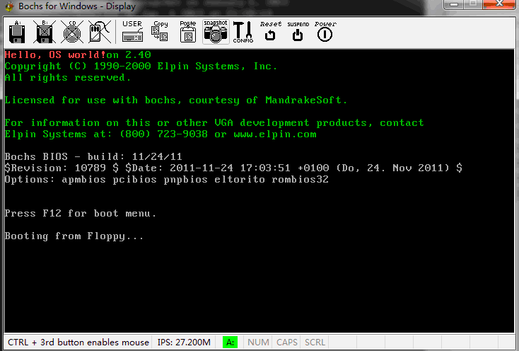
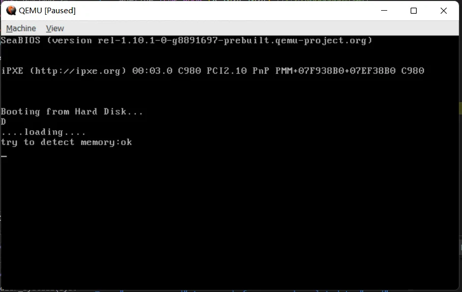
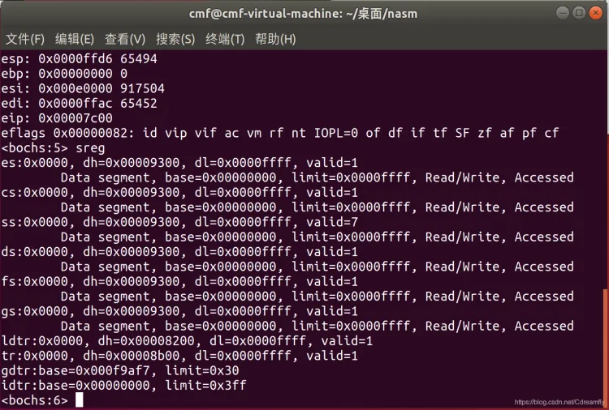
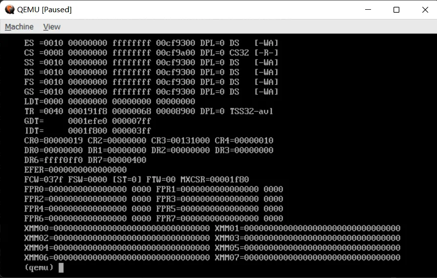
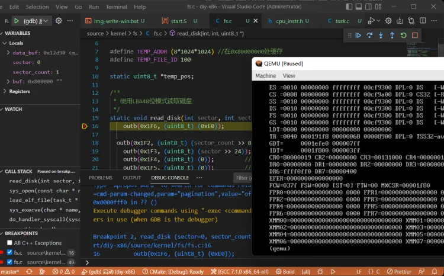
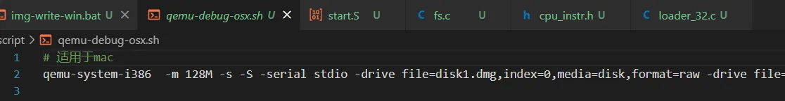

摘要：对比了用于模拟x86计算机的Bochs和QEMU软件，从特点、支持平台、调试手段、易用性等方面阐述。Bochs仅模拟x86硬件，QEMU速度快且支持多种CPU架构。QEMU在调试手段和易用性上更优，
<!-- more -->

最近有同学问我：为什么你的《从0写x86 Linux操作系统课程》选择了bochs，而不是qemu？他认为bochs更加好用，很多资料上都写了用该软件。其实我也是经过不断地对比和尝试后，选择使用qemu。

Bochs和QEMU是两个著名的模拟器，均可用于模拟x86计算机，网上有很多写如何开发操作系统的资料用到了其中一个。在这里我对这两个软件的特点、支持的平台、调试手段和易用性等方面进行详细介绍。
# 软件特点

Bochs是一个用C++编写的开源模拟器，仅可模拟x86计算机硬件环境，包括CPU、内存、硬盘、显示器、网卡等。能够运行各种不同的操作系统，如DOS、Windows、Linux、BSD等。还支持许多外部设备，如键盘、鼠标、串口、并口等。此外，Bochs还支持多种调试方式，如断点、单步执行、内存监视等。

QEMU是一个快速的开源模拟器和虚拟机管理器，能够模拟x86、ARM、PowerPC、SPARC等多种CPU架构。相比bochs，其特点在于它的快速性，能够运行本机代码，实现在模拟器中运行的虚拟机与物理机的速度相当。QEMU还支持各种外部设备，如USB设备、串口、网卡等。此外，QEMU还能够通过GDB、VNC等多种调试方式进行调试。

由于我是开发一个面向x86硬件的小操作系统，所以单纯从功能上来说，两个软件似乎都合适。
# 支持平台
Bochs可以运行在多种操作系统平台上，包括Windows、Linux、macOS等，可以模拟各种不同的操作系统。但是在有些平台上，可能需要重新编译源码才能获得可执行的程序。

QEMU也支持多种操作系统平台，包括Windows、Linux、macOS等。QEMU的特点在于它能够在多种不同的CPU架构之间进行模拟，例如在x86主机上模拟ARM架构的操作系统。

在实际使用了这两款软件后，我发现qemu更加方便，官方直接提供了针对win/linux/mac的安装包，而bochs针对有的平台提供，有的却要自己重新编译源码，非常的麻烦。

# 调试手段
当谈到操作系统开发时，调试是至关重要的。Bochs和QEMU都提供了各种调试手段，以帮助用户诊断和调试操作系统。不过，从我的使用经验来说，使用qemu进行操作系统开发时，可以提供相比bochs更为丰富的调试手段。

虽然bochs提供了许多内置的调试命令，如break、step、registers等，可以让用户在模拟器中单步执行和检查CPU寄存器的值。但是这些命令仅限于命令行的交互模式下使用，而在这种模式下，只能进行指令级调试，无法进行源码级调试，使用起来非常不方便。所以，我觉得更适合于调试汇编代码。

当然，Bochs也支持GDB调试，但是需要重新编译源码生成带GDB支持的bochs，非常麻烦。而且在GDB模式下，内置的调试命令将无法使用。

而QEMU也提供了许多调试功能，例如单步执行、断点和CPU寄存器查看等，这些命令在monitor窗口中可直接使用。如下图所示，在进入该窗口后，可以直接输入各种命令，实现bochs同样的命令的功能。这些命令，可以有效的帮助同学分析开发过程中的各种问题。

与此同时，还支持GDB调试器，可以结合vscode直接进行源码级调试，如内存查看、寄存器修改等。这个是非常非常重要的一项功能！我之所以选择qemu，最大的原因也在于此。qemu直接内置了GDB的支持，不需要像bochs那样还要重新编译源码。我在对vscode的工程中进行了配置，可以直接一键源码级调试boot、loader、kernel，还有应用程序，非常地方便。通过这样的配合，可以使得同学在课程的学习中将关注点完全集中在操作系统实现本身的学习上，而不用关注工具的使用。

因此，在调试手段上，我认为QEMU似乎是一个更好的选择，尤其对于那些希望更快地上手和入门的初学者。
# 易用性
相对bochs来说，我觉得QEMU更为易于使用。

对于初学者来说，QEMU可能会更容易使用，因为它的命令行参数和配置文件更简单，也更直观。在课程提供的工程中，我为qemu添加了一个启动脚本，只需要通过命令行参数就可以完成虚拟机的各项配置，非常简单。

而Bochs则可能需要更多的配置和调整，以便正确运行操作系统。它需要一个单独的配置文件，里面保存了虚拟机的各种配置细节，为了修改该配置文件，还需要使用相应的工具，比较麻烦。
# 总结
综合考虑以上因素，我最终选择的是QEMU，因为其在操作系统开发中更加适合初学者。这个软件提供了更好的易用性和灵活性，以及对于调试手段的支持。
