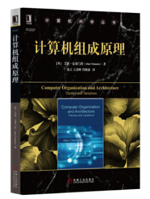
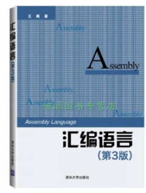
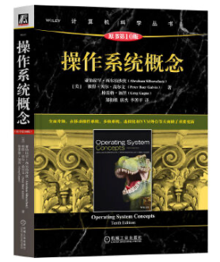

> 大家好，我是李述铜，一名专注于嵌入式系统与底层开发的技术讲师，我的主要工作是制作课程带大家从零手写操作系统、TCP/IP协议栈、文件系统等核心系统，从实现的视角理解计算机底层原理。

昨天，我在知乎上看到这样一个问题。

> “我还是个大一学生，我能不能像 Linus Torvalds 一样，从零写出一个属于自己的操作系统？”

说实话，我第一时间的感觉是：**这个年轻人相当不错，有想法、愿意去尝试**。这比单纯地在学校里按部就班地上着课要强很多了。

手写操作系统这件事情，听起来似乎离我们很遥远，有人认为这大神级别才能做的事。

但当你真正理解 “Linux是怎么被写出来的”，你会发现：这并不是神话，而是一个从简单到复杂、不断验证想法的过程。

在此，我想借此机会，结合自己过往的经历，和我做[《用6000+行代码开发x86 Linux操作系统》](https://zw8ls.xetlk.com/s/onWQO)课程的经验，来聊聊这些问题：

> 一个真正想做这件事的大一学生，需要具备什么？
> 
> 怎么学？能不能做？有没有意义？
> 
> 如何一步步走下去，并最终写出自己的操作系统。

---

## 01 为什么会有这样的想法？

我其实非常理解那位同学能产生那样的想法。

记得我刚上大学时，学得并非计算机专业，且在此之前对电脑也并没有过深入地接触。后来，随着专业课的学习，渐渐了解到除了Windows系统外，还有Linux系统。我甚至还去校园里卖光盘的地方，买了张Red Hat 9 Linux发行版本安装到自己的电脑。之后，就是不断地在Linux系统上折腾。

后来，当听说Linus只是个研究生，就靠一台电脑写出了Linux时，也非常震撼。

* 他的背后没有强大的团队
* 没有什么资金的支持
* 也没有所谓的“工业级开发流程”，靠自己独立完成

而开发Linux的原因也只是因为兴趣，以及因为不满意当时的Unix学习环境，于是心血来潮：

> 不如自己实现一个算了。

听上去这似乎很疯狂，对吧？而且他真的成功了。

那里我对编程还一知半解，在听到背后的故事，相当佩服这个人能做出厉害的系统出来。

我相信提这个问题的学生，原因也类似：

* 对计算机充满好奇
* 想做点真正“底层”“厉害”的事情
* 想知道系统到底是怎么跑起来的
* 想挑战自己

我觉得：**这是一种很值得保护的冲动。**这种冲动或兴趣，足以促使其将来更深入地在计算机学习道路上走得更远。

---

## 02 大学生做这件事，有意义吗？

我看到有人会说：

> “写操作系统又没法找工作，那我做它干嘛？”
> “写出来的也只是一个玩具系统，没有任何价值”

我想说：

> 写OS的意义，绝不在于你真的要写一个“能替代Linux的系统”，也不是要你开发一个实用的系统。

而是：

> **让自己能从更高维度理解计算机的运行机制。**

当你写过操作系统之后，你会发现很多以前看不懂的东西，会突然变得简单，比如下面这些问题：

* 驱动是什么
* 进程怎么切换
* 内存怎么管理
* 中断怎么工作
* 程序为什么能跑
* ELF为什么那样设计

也正因为这样，**写过操作系统的人，学习任何相关的技术都更快**，因为这个过程给你打下了坚实的基础。

* 学驱动更快
* 学编译器更快
* 学内核更快
* 学嵌入式更快

你会发现，在写操作系统中学到的知识点和理论，在很多其它场合都用得上。所以，做这件事情的意义在于：

> **真正理解计算机的运行原理。**

所以，哪怕你做出来的是一个玩具操作系统，它给你

---

## 03 开发操作系统，需要掌握哪些基础知识？

虽然开发操作系统非常的“酷”，不过很多人的第一反应是：

> 是不是要学很多很多东西？
> 
> 工作量是不是很大，非常地难？

其实，可以不用那么焦虑。**我们可以降低要求，不要试图开发一个功能非常完善的系统。**

接下来，就可以开始为此做一些初步的准备，不需要把整个计算机的专业知识都学完才能动手。

这里，我结合自己的经验，以及[《用6000+行代码开发x86 Linux操作系统》](https://zw8ls.xetlk.com/s/onWQO)课程开发的经验，列举大概需要掌握的基础知识。

### **1）C语言**

首先，你需要熟悉C语言，即至少要能写出结构化程序。也就是说，你需要至少掌握以下知识点：

* 指针
* 内存操作
* 函数调用
* 全局变量
* 编译&链接
* ……

操作系统的主要开发语言为C语言。比如，我的[《用6000+行代码开发x86 Linux操作系统》](https://zw8ls.xetlk.com/s/onWQO)课程的系统代码，95%以上C代码。

如果你想加深对C语言的掌握，推荐看《C Primer Plus》：

---

### **2）理解基本的计算机体系结构**

其次，需要理解基本的计算机体系结构。大学的《计算机组成原理》等课程中，都会介绍相关的知识。

由于操作系统需要直接和硬件打交道；因此，你需要掌握以下知识，从而顺利地编写相关代码来操作硬件。这些知识但不限于：

* CPU是怎么执行指令的
* 内存怎么存储数据
* I/O是怎么跟CPU通信的
* 中断是什么
* 寄存器大概是什么
* ……

对于这些知识，不需要掌握地很深，但至少要了解大概是什么。你也可以通过《计算机组成原理》来学习：

---

### **3）汇编语言（少量）**

在操作系统的内部，有些操作功能需要使用特殊的指令来完成，而这仅仅靠C语言是无法完成的，必须借助汇编语言。

对于汇编语言，不必精通，但是至少要能够会写简单的汇编程序，比如：

* 知道寄存器怎么读写
* 知道怎么写简单的启动代码
* 懂得如何与C混合编译

我在[《用6000+行代码开发x86 Linux操作系统》](https://zw8ls.xetlk.com/s/onWQO)课程中，使用了汇编语言来编写启动代码、任务切换。不过，这部分代码占比好小，完全不难。

如果你还完全不了解汇编语言，可以阅读王爽老师的《汇编语言》书籍。

---

###  **4）操作系统概念**
当然了，既然是开发操作系统，那么还需要对操作系统有所理解。你至少需要了解以下基本概念。

* 进程
* 虚拟内存
* 文件系统
* 中断
*  ……

为了了解这些知识，可以去阅读操作系统的教材，这里推荐书籍： **《操作系统概念》** 。

不过，这类书籍对于相关概念和原理介绍的都比较抽像。建议通读，了解基本概念即可，重点还是在于动手实践。

就也是说，在了解完相关的概念和理论之后，就可以掌握开始动手编写代码实践了。比如，跟着我的[《用6000+行代码开发x86 Linux操作系统》](https://zw8ls.xetlk.com/s/onWQO)课程编写代码，在实践中进一步加深对这些知识和概念的理解。

---

### **入门门槛总结**

实际上，为了开发一个操作系统，虽然需要做一些准备，但是**并没有想象中高，需要坚持。**

我更推荐的是在学习了相关的基础知识后之后，就开始立即动手实践了。

大部分知识，在开发OS的过程中，会反过来推动你去学。在这个过程中，你会发现有很多不懂的地方，然后去查资料学习，从而进一步提升。

所以关键不是**学够了再写**，而是**边写边学**。

---

## 04 具体行动路线？

在了解了以上内容之后，我们就可以整理出一条比较可行的路线。

### ✅ **第一步：学会C语言开发**

掌握基本的开发流程+灵活使用指针 + 结构 + 程序调试

> 时间：1–2 个月

---

### ✅ **第二步：学简单汇编**

知道CPU有哪些寄存器，能写点启动代码。不需要精通汇编语言编程：

> 时间：1–2 周

---

### ✅ **第三步：学体系结构概念**

参考相关书籍和CPU体系结构的数据手册进行学习：

> 时间：1–3 周

---

### ✅ **第四步：写一个能在跑的最小程序**

这个系统可以跑在QEMU等模拟器上，跑起来之后能够：

* 输出字符
* 循环

完成这一步，相当于自己能够“让电脑完全被自己控制”。

---

### ✅ **第五步：写最小内核**

之后，就可以根据CPU体系结构的特点，编写系统初始化代码，实现基本的进程运行：

* GDT
* IDT
* 中断
* 时钟

---

### ✅ **第六步：内存管理**

然后，就可以开启虚拟内存，从而实现多进程的运行。

* 简单分页
* 分配器

---

### ✅ **第七步：文件系统/用户程序**

最后，实现文件系统，使得系统能够：

* 读写磁盘上的文件
* 从磁盘上加载应用程序到内存中执行

到这一步，你已经能自己手写一个“迷你版Linux”。

以上的这一整套路线，在我[《用6000+行代码开发x86 Linux操作系统》](https://zw8ls.xetlk.com/s/onWQO)课程中都有完整实战，每一步都带你实现，逐步完成。

---
## 05 写OS的难点在哪里？

其实，对大部分初学者来说，写OS难的不是知识本身，而是——

> **不知道从哪里开始。**

这大概是最劝退人的一点。

因为哪怕只是一个很小的系统，对于初学者来说，这个系统也很大、很复杂。这就导致了你不知道哪一步才是“第一步”。

所以很多人看书看了半年，还是下不了手。

而实际上，写OS的过程是渐进式的：

> **能打印字符 → 能处理中断 → 能调度任务 → 能访问内存 → 能读写文件 → 能跑程序**

只要拆成小步骤，每一步其实都不难。在理解相关的原理之后，按部就班地去实现相应的功能即可。

这也是我做[《用6000+行代码开发x86 Linux操作系统》](https://zw8ls.xetlk.com/s/onWQO)课程时最重要的理念：

> **带你从0按部就班地，写到能启动应用程序。**

我在做这门课程时，尽可能地从初学者的角度出发，将整个复杂的功能一步步拆解成小的功能模块。然后，通过反复迭代、功能增加的方式，让你一步步开始出一个属于自己的操作系统。

也就是说，不是给你一坨现成代码，而是每一步都让你搞懂为什么这样做。

---

## 06 我能成功吗？值不值得做？

写自己的操作系统并不是一件易事，绝大多数人，中途都会放弃。其中的原因并不是因为做不到，而是因为：

> 这个过程不是很快就能完成的，需要耐心，需要成体系地做
>
> 很多人由于在短期内看不到结果，导致稍微碰到点困难就放弃。

但只要你能坚持，即使哪怕仅能完成**60%**，这个过程也能让你终身受用。

我在做课程时看到很多学生，本来只会C语言，但是最后通过努力学习，最后能跑起内核、能看Linux源码、能写驱动。

这就是价值。

---

## 最后想说：

如果你真的想写自己的操作系统，那你已经比99%的计算机学生更勇敢。

别担心自己太菜、太晚、基础差，这些都不是问题。**问题是——你愿不愿意开始。**

希望这篇文章，能帮你找到方向。

如果你真的想体验从0写操作系统的全过程，建议你看看我做的课程：**[《用6000+行代码开发x86 Linux操作系统》](https://zw8ls.xetlk.com/s/onWQO)**。

这门课程还你：

> 从最小启动代码开始，带着你
> → 实现中断
> → 内存
> → 调度
> → 文件系统
> → 最后能运行自制程序

**整个过程不是看，而是动手写，完全从0开始实现一个完整的多进程、支持虚拟内存、提供系统调用API、能从磁盘加载应用程序运行的系统。**

写完之后，你会发现：

> 原来写操作系统，真的不是遥不可及的神话。

**它不过是——一行行代码而已。**

---

> 💡 **作者介绍**
>
> 李述铜，嵌入式系统与底层架构领域讲师，专注于操作系统、CPU 架构、RTOS 内核与系统软件实现原理的教学与研究。  
> 出版作品《从0手写x86计算机操作系统》，主讲课程包括：《从0手写TCP/IP协议栈》、《从0手写FAT32文件系统》等。  
>  
> 欢迎关注我，或访问 👉 [lishutong1024.cn](https://lishutong1024.cn) 获取更多内容。

## 往期文章

* [告别固定大小：利用C语言伸缩型数组，实现动态结构体](https://mp.weixin.qq.com/s/bmYTlPv5-dCidAMylz0HqQ)
* [C结构体的初始化你还在按顺序写？试试这个C99神操作！](https://mp.weixin.qq.com/s/AbpN8CL5Fj9tLnFLKAeYew)
* [C语言居然也有布尔类型？！](https://mp.weixin.qq.com/s/FGPJdMlZ0FkPWQGS-vhpaA)
* [介绍一个C语言编程技巧：处理超长字符串显示](https://mp.weixin.qq.com/s/vgSzgucviEDN7sB0VM66Ew)

## 课程推荐

* [《用6000+行代码开发x86 Linux操作系统》](https://zw8ls.xetlk.com/s/onWQO)
* [全新升级的手写RTOS课程：从原理到实战，一次掌握操作系统的核心](https://mp.weixin.qq.com/s/tUMnG1R5FWwL6IpztO3Rdg)
* [用10000+行代码手写一个TCP/IP协议栈](https://mp.weixin.qq.com/s/2hjC7um-5uxFj6VCba9Skg)
* [硬核项目，从0手搓一个RISC-V模拟器！](https://mp.weixin.qq.com/s/6ULO5HO_CtjlawaRPMJ6Yw)

