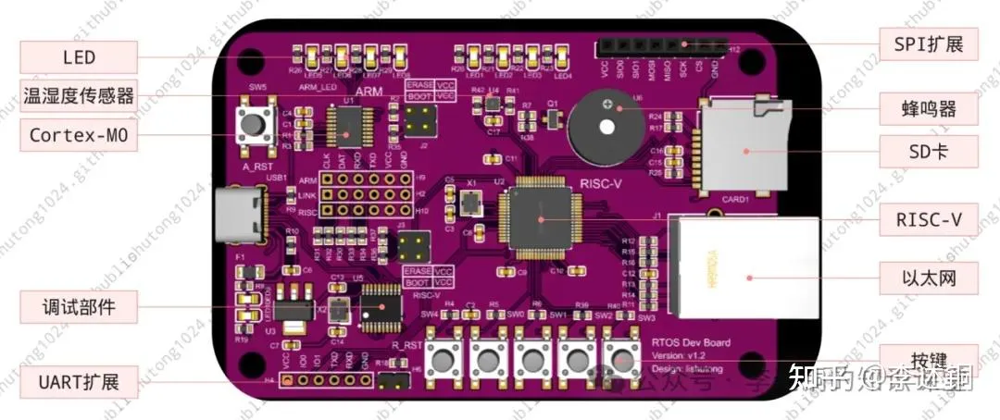
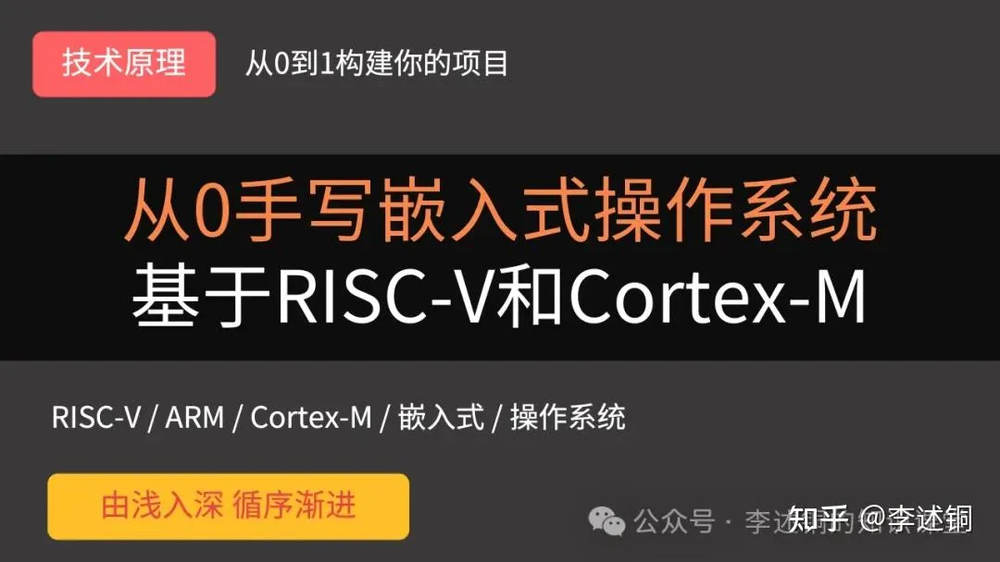
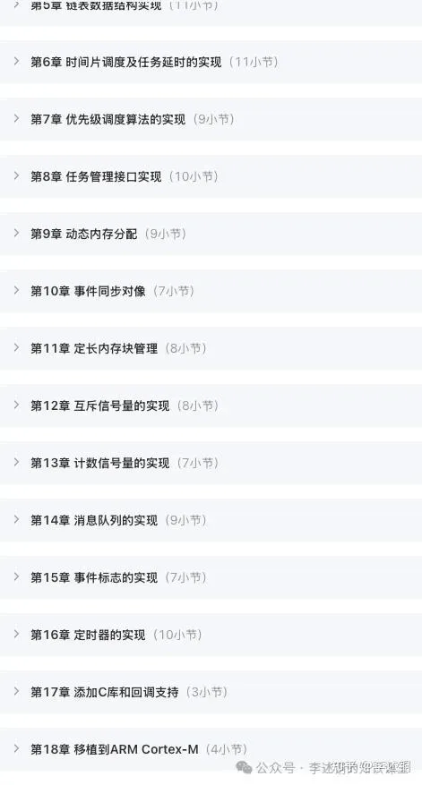
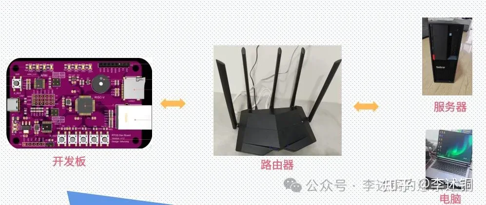
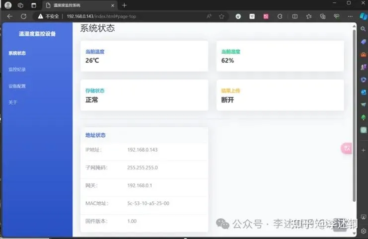
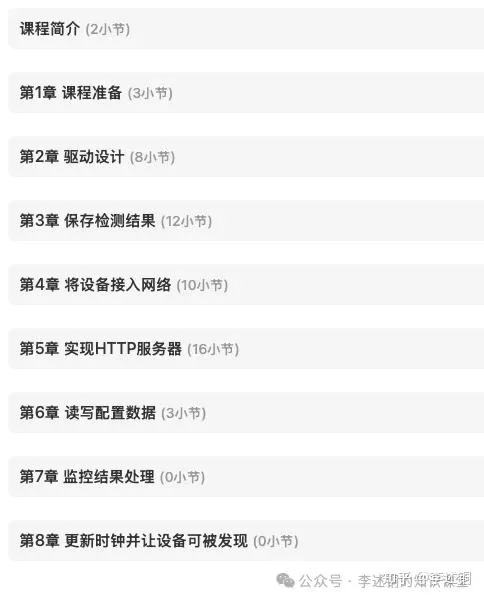
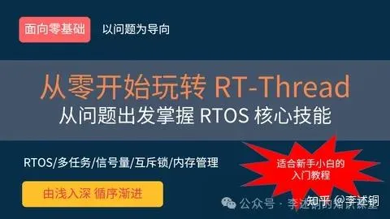

## 💡怎样才能掌握 RTOS？

曾经，很多同学问我：“怎样才能真正掌握RTOS？”我的回答是：**先学会使用一两种RTOS，然后再深入研究其实现原理。这样才能做到不仅会用，也能真正搞懂系统的实现原理** 。过去几年，我见过太多工程师通过网络博文、书籍和视频去学习，却仍然无法彻底理解RTOS。很多人仅停留在调用API的层面，对于系统如何工作一无所知。当遇到任务切换异常、死锁、优先级反转、延时不准、系统卡死、内存溢出等问题时，他们往往束手无策——因为他们只会“用”，却不了解系统“为什么会这样”。而只有真正理解了：

* 调度器如何决策
* 任务栈如何保存和恢复
* 延时机制的底层实现
* 信号量和消息队列如何协同调度
* 栈和堆是如何分配和使用
 
你才能从容应对各种棘手问题。所以，我决定亲手设计一块开发板——一块能让你真正看懂、理解RTOS工作原理的开发板。💡这块开发板能做什么？它不是普通的开发板，也不仅仅是用来演示RTOS API使用方法的工具。它是一块为深入理解RTOS原理和动手实战而设计的开发板。

你可以在板上做两件事：

* **手写RTOS内核**：从任务调度、延时机制到中断管理，你将亲手实现一个完整的RTOS内核，直观理解任务切换和调度背后的原理。
* **构建实战应用**：利用该RTOS，你可以快速搭建一个温湿度采集系统，将理论直接应用到硬件项目中。
换句话说，这块板子让RTOS从抽象的系统逻辑变成你手中可操作的现实，让你从“会调用 API”变成真正懂系统、能用系统做项目。

## 🧩一块板 + 两门课 = 真正的理解

这块板随我的新课程《从0手写RTOS系列课程》赠送。这意味着，你不仅有视频讲解课程，还有一块硬件平台，可以将每一个原理转化为直观可见的操作。

### 课程一：从0手写嵌入式操作系统

本课程以RISC-V和ARM Cortex-M两大类流行处理器内核为基础，带你从零开始手写完整嵌入式操作系统。

无论你是想了解现代嵌入式架构，还是希望掌握面向主流硬件的系统开发能力，这门课程都将让你亲手在真实硬件上实现操作系统核心模块，全面掌握任务调度、延时机制、中断管理等关键技术

* 课时/章节：约140个课时，总时长34+小时，共18章
* 学习目标：从空白工程开始，手写完整RTOS内核
* 系统覆盖：基于裸机，可运行于基于RISC-V和ARM Cortex-M的各类芯片

目前，该课程已经更新完毕。各个章节的内容安排如下：

本课程相比我早前开发的《从0到1手写嵌入式操作系统》课程，所有代码完全重写，更详细丰富，更贴近实际工程。

### 课程二：项目实战——远程温湿度监控设备

在本实战项目中，你将利用自己亲手实现的RTOS，开发一个功能完整的物联网设备。

该设备能够实时采集环境温湿度数据、记录采集时间、存储至SD卡，并将数据上传到指定服务器。用户可以通过电脑或手机浏览器访问，查看历史采集数据，实现远程监控。

通过该项目，你将掌握：

* 传感器数据采集与任务管理
* 文件系统（FATFS）存储与管理
* 网络通信（LWIP）与HTTP网页访问
* 多任务调度、任务优先级与并发管理

这个项目让你不仅理解RTOS内核原理，更能将它应用到完整、可运行的嵌入式系统中，体验从硬件驱动到网络服务的完整开发流程。

目前，该课程正在更新中。各个章节的内容安排如下：

🎯 如果你目前存在以下困惑，那么这门课程特别适合你

* 学过RTOS却不知道怎么实际做项目
* 想提升软硬件结合、系统集成能力
* 想做物联网终端，但苦于没有系统化项目训练
* 想搞明白FATFS、LWIP怎么集成、裁剪和调试
* 想积累完整项目经验，为简历和面试加分

## ❓ 常见问题 FAQ

1. 这门课程有答疑吗？
   
课程提供在线答疑服务，你可以在课程群或向我微信提问，获得针对视频内容、实战项目以及核心原理的解答。

2. 这门课程和以前的《从0到1手写嵌入式操作系统》有什么不同？

本课程是升级版，代码完全重写，更详细、更贴近实际工程实践。除了手写RTOS内核，还增加了实战项目：远程温湿度监控设备，讲解如何将 RTOS与FATFS、LWIP、NTP等主流组件结合。同时，支持RISC-V 和 ARM Cortex-M两大主流内核，让学习更前沿。

3. 我之前没学过RTOS，可以学吗？

如果之前没有学过RTOS，可以先学习一款主流的RTOS，比如RT-Thread。我也提供了相关的课程，从而了解什么是RTOS及其常见的使用接口。

在学习完毕之后，就可以转而学习本课程。

4. 开发板能单独购买吗？

❌ 不能，本开发板仅随课程赠送，用于课程学习和实战项目。

5. 项目实战需要哪些基础？

建议有一定C语言基础和嵌入式开发经验，但课程会从最基础的裸机开发开始讲解，逐步引导完成RTOS内核和物联网项目。

6. 该RTOS是裁剪了别人RTOS来实现的吗？

❌否。课程中的RTOS设计参考了主流RTOS的实现原理，但代码完全由我自行开发，结构和实现方式经过优化和重构，更适合教学与实战。

## 💰 目前，课程目前正在更新，限时大幅优惠中

少量9.9元抵扣200元优惠券（券后598元，请抓紧领取）

《从0到1手写嵌入式操作系统》老学员专属：再减100元（券后498元）。

无需支付额外费用，购买课程即送开发板。扫描下面二维码，立即了解课程详情

也可直接点击课程链接直接访问:[课程链接](https://app7ulykyut1996.h5.xiaoeknow.com/v1/goods/goods_detail/SPU_COP_1704459226E22xwR3IprTAO)