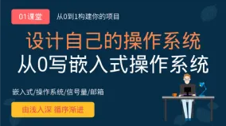
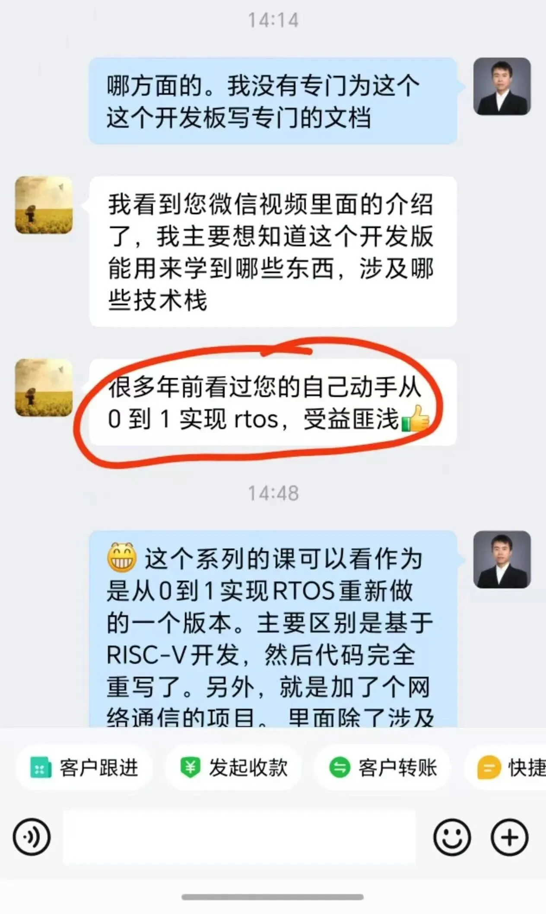
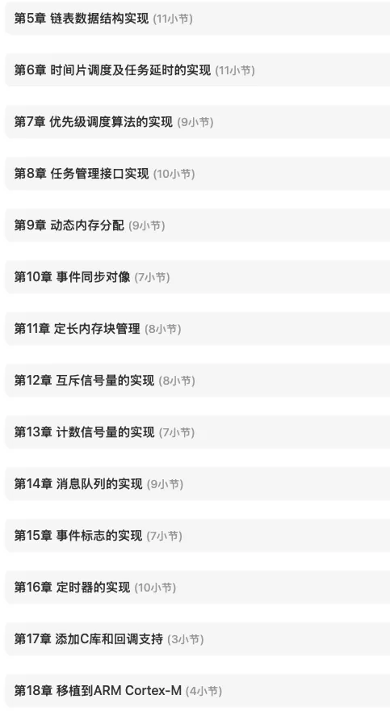
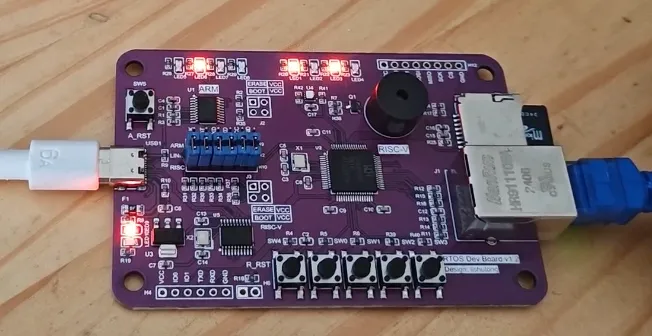
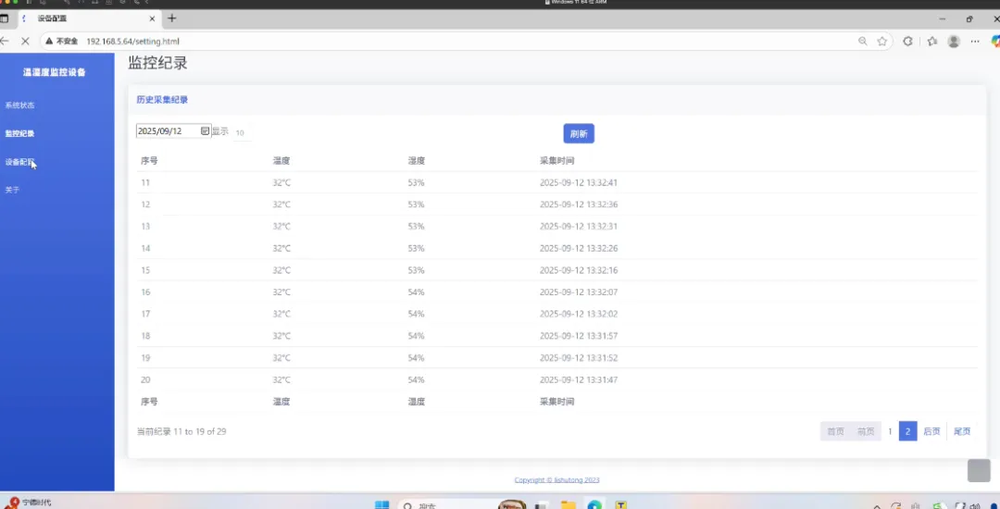
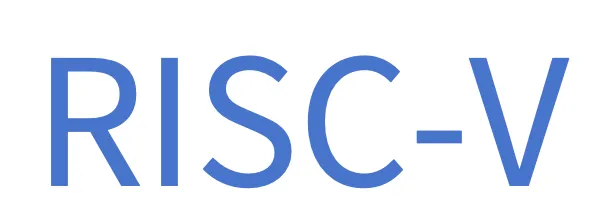
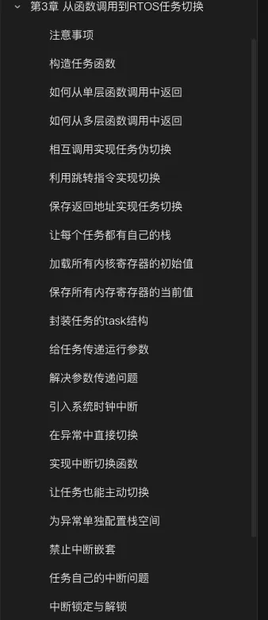
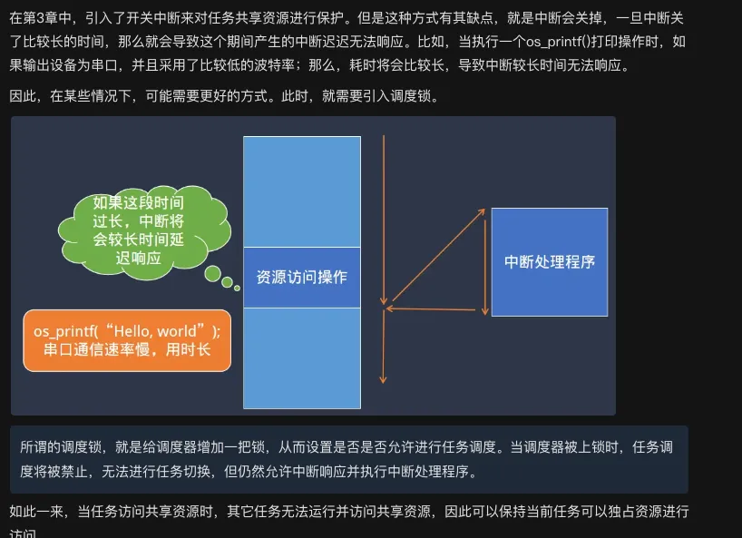
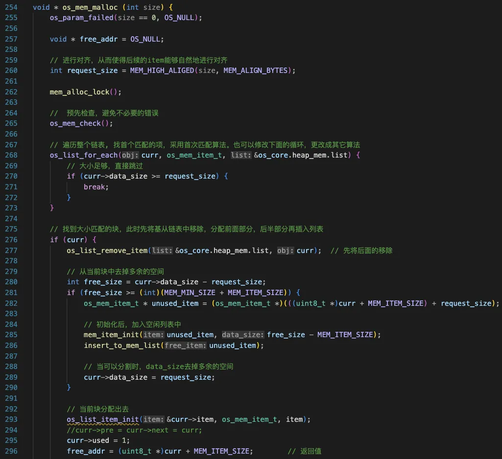

大家好，我是李述铜，一名专注于嵌入式系统与底层开发的技术讲师，我的主要工作是制作课程带大家从零手写操作系统、TCP/IP协议栈、文件系统等核心系统，从实现的视角理解计算机底层原理。

我的《RTOS开发与实战》系列课程已经正式发布一个多月了，该课程包含两个子课程《【RTOS内核开发】从0手写嵌入式操作系统》和《【RTOS项目实战】远程温湿度监控设备》。

课程发布后，得到了很多新老学员的支持。其中，有不少同学问我：*“老师，新出的RTOS课程和你以前那门《***自己动手***从0到1写嵌入式操作系统》有什么不同？是不是只是重新录了一遍？”*

为了方便解释新旧两门课程的区别，我干脆写篇文章来完整讲讲这两者之间的区别。

**<一、为什么要做新版课程*

旧版《从0到1写嵌入式操作系统》录制于2017年，至今已经过去近9年。

当时录制这门课程时，我的目的比较简单，就是结合自己学习RTOS时的痛点，做出一门课程带大家“*真正从零理解操作系统是怎么写出来的*”。

这门课发布后，先后在网易云课堂和CSDN等平台上线，得到了大量学员的好评，帮助了他们打开思路，第一次真正理解了任务调度、上下文切换这些底层原理。

经常会碰到同学说多久前学过我的这门课程，表示收获非常大。

但几年过去，嵌入式开发的工具链、芯片环境都在变化，且我自己在教学和项目实践中也积累了更多经验。因此，打算对该课程进行重新录制、全面升级。

新版课程的目标比较明确：

既能动手写出一个功能完善的RTOS，也能结合实际项目看到RTOS是如何应用于实战。

**<二、旧版课程的定位与局限*

旧版的最大特点是“*纯手写 + 直击底层 *”。

在该课程中，通过反复迭代，一步步实现任务切换、调度器、邮箱、信号量等。很多人正是通过我的课程第一次真正理解了RTOS的本质，这也是那门课的最大价值。

但与此同时，这门课程也有比较大的局限性：

● *部分原理性地内容讲解地不够深入具体，对初学者而言挑战较大*

**● 代码风格比较随意，工程化程度不高；*

**● 完全依赖模拟器环境，缺乏在实际芯片上运行的体验*

**● 开发环境老旧，依赖于Keil自带的armcc工具链（该工具链官方已不再更新）*

**● 缺乏完整的RTOS项目应用实战*

**● 仅仅支持ARM Cortex-M内核，不支持其他RISC-V主流内核*

此外，该课程也是我人生中第一门录制的课程，所以在录制过程中无论是语言表达，还是原理讲解上都有着欠缺和不同。

**<三、新版课程：一次从底层到体系的重构*

这次新版的RTOS系列课程，并不是简单地“将原来的内容重新讲一遍”，也不是“换个芯片讲一遍”，而是一次一次*系统化的重构。*

相较而言，旧版仅关注“一个RTOS的实现”，新版全面关注“RTOS*设计及如何实战应用*”。

老版本课程的内容仅51小节，而新版本的课程内容为高达155小节，课时数量为原来的3倍！

仅从功能模块上来看，新版的课程重点增加了动态内存分配的实现，和C库的移植支持。其中，动态内存分配是我一直想实现的功能，该功能在老版本课程上没有实现。这样RTOS就不只是能够进行定长内存分配，也能根据任务的实际内存需求量进行分配。	

而为了能够让学员能够看到开发出来的RTOS具体是如何应用于项目实践，*还制作了相应的实战课程*。学员可以立即将开发出来的RTOS用于开发一个实际的物联网项目。

你将把自己写的*RTOS直接应用到一个真实的嵌入式系统中*，在这个过程中，不仅能看到任务调度的实际运行效果，

还会学习如何移植和使用常见组件：

● LWIP网络协议栈

● FATFS文件系统

课程还会带你*基于HTTP协议开发一个小型Web服务器*，演示它如何与电脑浏览器进行实时交互。在这一过程中，*你将学习网络通信编程相关知识*。

也就是说，通过该课程你学到的不是一个“玩具级别的RTOS”的实现，，而是一个功能完善、可直接应用于实际工程的RTOS系统。

这个RTOS不仅具备任务调度、同步通信、时间管理等基础功能，还支持动态内存管理、C标准库移植、多组件集成等特性，让整个系统更接近真实项目中的使用场景。

学完之后，你会真正理解：

**RTOS不只是“能跑”的内核，而是一套能够支撑复杂嵌入式项目的系统基础。*

这也正是新版课程的核心目标：*让你从“能跟着写”迈向“能独立设计与应用”，从“理解原理”走向“驾驭系统”。*

**<RISC-V架构的引入*

为了适应技术的发展，在新版课程中，我引入了当前最受关注的开源CPU架构——RISC-V。

旧版课程是基于ARM Cortex-M内核进行开发的，这在当时是最主流、最容易入门的选择。而如今，RISC-V的发展速度非常快，已经从学术研究走向工业应用，越来越多的厂商推出了基于RISC-V的MCU与SoC。

RISC-V的特点是：

● 完全开源、无版权限制；

● 指令集简洁、结构清晰：非常适合教学与底层研究；

● 可扩展性强：可覆盖从微控制器到高性能处理器的不同层级。

因此，*新版课程主要基于RISC-V平台开发RTOS，同时也支持移植到Cortex-M平台*。也就是说，你编写的RTOS既能在RISC-V芯片上运行，也能轻松在STM32等ARM设备上部署。

通过这种设计，*你不仅能理解RTOS的核心实现，还能学会如何在不同CPU架构间进行移植，真正掌握RTOS与底层硬件之间的关系*——包括任务切换、上下文保存、异常处理等机制。这是很多工程师从“会用RTOS”到“能设计RTOS”的关键一步。

**<教学方式升级*

得于益多年来的教学经验和广大同学们的反馈，新版本课程的录制风格和教学方式上做出了较大变化。

**首先，所有的课时代码全部跑在真实的开发板上*，而不是像老课程那样在仅在模拟器上运行。这会给你学习过程中带来更强有力的真实体验，能“切切实实”看到所有代码的实际运行效果。哪怕开发板上几个简单地LED灯轮流闪烁，也会给学习过程中带来强有力的视觉冲击。

**其次，课程讲解更加深入细致*。例如，为了便于理解更好地理解RTOS任务切换原理这一最为核心的机会。新课程花了21节课时，一步步地从函数原理开始，逐步过渡到任务切换机制。而这一部分内容，在老课程中仅用了一节课时就简单讲完。

除此之外，新版课程不再是一上来就讲相应功能模块的实现，*而是先提出问题，再针对该问题提出相应的解决方法，引出需要实现的功能模块*。

**<代码质量升级*

除了上述几项升级之外，*新版课程在代码结构与工程组织上也进行了彻底的重构*。旧版的代码更偏向于“验证思路”——逻辑清晰，但工程化程度不高；而新版则以“实际可维护的系统工程”为目标，

在代码质量、模块划分、可移植性方面做了全面优化。具体来说，这些变化包括：

●* 模块化设计*：调度器、时间管理、内存管理、任务通信等模块分离，便于独立开发与调试；

● *统一的接口规范*：各模块遵循统一的命名与调用规范，提升代码可读性与扩展性；

● *多平台适配层*：底层与CPU架构解耦，方便RTOS快速移植到不同RISC-V和Cortex-M；

● *完善的调试与日志机制*：帮助学习者更直观地观察系统运行状态与任务切换过程；

● *更高的可维护性*：整个系统结构清晰、注释规范，可直接作为实际工程的RTOS框架使用。

**<五、对比一览表*

| 对比项 | 旧版课程 | 新版课程 |
| :--- | :--- | :--- |
| 课程定位 | 原理启蒙 | **系统训练 + 工程实战* |
| 课时数量 | 仅51节 | **超过220节* |
| 教学方式 | 简单直接 | **详细深入，分层探究* |
| 环境 | Keil + Cortex-M3仿真 | **RISC-V + Cortex-M双架构，基于真实的开发板* |
| 实战部分 | 无 | **结合LWIP、FATFS、HTTP协议开发物联网应用* |
| 学习目标 | 跟写RTOS | **既能设计RTOS也能使用RTOS* |

**<五、结语：学新版，你会获得什么*

通过上面的内容可以看到，学完新版，你将收获以下好处：

● 从零设计一个完整的RTOS

● 掌握动态内存管理、任务调度、信号量等关键机制

● 理解RISC-V与Cortex-M架构下RTOS移植的差异

● 能在实际项目中使用自己编写的RTOS

● 掌握常见中间件（LWIP、FATFS）的移植与应用

● 可以直接用于面试展示，求职时非常有竞争力的作品

对老学员来说，新版是一次体系上的飞跃；对新学员来说，它是一条从入门到独立开发的捷径。

**六、限时优惠*

如果你希望系统掌握RTOS底层原理、项目移植与实战开发，现在就是最好的时机。点击下方链接或扫码，即刻开始你的RTOS进阶之旅。

● 只需9.9元即可领取抵扣200元优惠（原价798元，券后598元）；

● 老学员专享100元额外优惠（券后498元，请联系我获取）

**无需支付额外费用，购买课程即送开发板**。
点击课程链接直接访问:[课程链接](https://app7ulykyut1996.h5.xiaoeknow.com/v1/goods/goods_detail/SPU_COP_1704459226E22xwR3IprTAO)