如果你对计算机底层技术感兴趣，或者想要挑战自己，深入学习操作系统的开发；那么这门《从0手写x86操作系统》课程绝对值得你关注。下面，我将详细介绍这门课程的内容、特色和学习收益，希望能够帮助你全面了解并做出选择。

## 课程简介
让我用一个视频来介绍这门课程。

@[bilibili p2](BV1jV4y1H7Gj 857492315 1494902690)

<LinkCard icon="😀" title="感兴趣，点我订阅课程" href="https://app7ulykyut1996.pc.xiaoe-tech.com/p/t_pc/goods_pc_detail/goods_detail/course_2SxCS87KSTe0K0zRWQ2bU9HfbVR" />

## 课程背景
大概在十多前，还在读大三的时候，虽然当时读和的是非计算机专业，但是对计算机也产生了浓厚的兴趣。于是，经常跑去图书馆看各方面的书籍。

在这个过程中，偶然在图书馆书架的高层，发现了一本《Linux 0.11源码分析的书籍》，然后借来翻看。不过由于当时技术水平不够，很多东西不懂，编程水平也比较差劲；所以，看了久也没有看明白。加之也没有好的调试手段，只看了其中一小部分。当时也在想能不能写一个，但最终不了了之。

毕业多年后，由于从事的是嵌入式相关的开发，接触了很多芯片，也写了不少汇编代码/C代码。这样下来，对于计算机硬件底层相关知识的掌握变得更多。于是，必要的基础知识储备已经够了。

近几年有了空闲时间，又开始折腾这个事情。发现实现起来并不难，主要的问题反而在于要配置出一套合适的开发环境。前期使用过Eclipse+GCC等工具折腾过，发现不太理想。经过反复折腾，才找到了一种比较简单的方法。然后，不断地调整优化代码，最终有了这门课程。

<LinkCard icon="😀" title="感兴趣，点我订阅课程" href="https://app7ulykyut1996.pc.xiaoe-tech.com/p/t_pc/goods_pc_detail/goods_detail/course_2SxCS87KSTe0K0zRWQ2bU9HfbVR" />

## 设计目标
这个课程是要设计成一个类似Linux 0.11的操作系统，并非完全复刻，但会涵盖其主要功能。具体功能如下图所示：

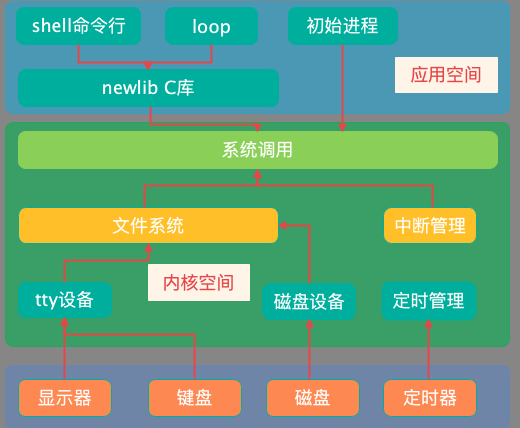

课程并不特别强调系统的功能复杂度。我相信，**对于你而言，主要问题不在于实现功能很强大的系统，而是能否实现一个可以跑起来的系统。**

所以，本课程果断抛弃了复杂的特性，例如，不涉及以下几方面的内容：
* 多核支持：对于绝大多数同学来说，设计一个单核的操作系统已经够复杂了，再上多核会人更加的晕
* 64位支持：使用64位的硬件平台，意味着更多的内核寄存器/更多汇编代码，更复杂的硬件特性。更加简单的32位已经跑以让操作系统跑起来，没有必要额外浪费时间在64位平台上。并且，64位和32位在硬件细节上相差并不是很大
* 复杂算法：在进程调度、内存管理等实现上，采用简单的实现算法，从而方便学习

有些同学没有搞清楚自己的学习目标，单纯地拿这个操作系统的功能和别的系统功能进行对比，认为这个太简单了。这种比较是不恰当的。因为，你需要的是一门教你学写操作系统的课程，而不是直接拿到一个功能复杂的系统。如果是后者是，直接用微软的Windows不是更好？

我认为学习这类课程的同学中，**99%以上面临的问题是在于学习一个操作系统是如何实现的，而不是如何将操作系统的功能设计得更为强大**。也就是，它能否帮你做什么，而不是最终做成什么样。

同时，由于操作系统开发的特殊性，代码编写不是问题，反而如何调试操作系统代码是更为关键性的问题。

因此，这个课程的主要目标是**实现一个简单易于理解的系统，并且提供一套简单好用的开发环境。**

<LinkCard icon="😀" title="感兴趣，点我订阅课程" href="https://app7ulykyut1996.pc.xiaoe-tech.com/p/t_pc/goods_pc_detail/goods_detail/course_2SxCS87KSTe0K0zRWQ2bU9HfbVR" />

## 课程内容
### 内容安排
为了便于学习者学习，在设计这门课程时，我按照学习者的角度仔细安排了各章节内容。

这些内容之间前后连续，循序渐进，不断迭代。从一个最小的代码开始，通过逐步增加功能，最终完成整个系统的设计。

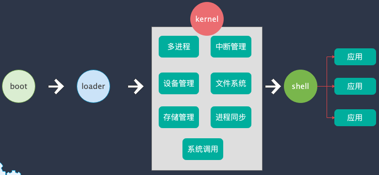

具体来说，它主要分为以下几个模块：

1. **设计引导程序**  
   在这部分中，介绍了x86架构的基础知识，实现实模式到保护模式的切换。先后设计了两级引导程序：boot和loader，实现二级加载，最终将ELF格式的操作系统加载到内核中运行。
   
2. **多进程管理**  
   在多任务操作系统中，进程管理是一个复杂但非常重要的部分。课程将深入解析进程调度、进程控制块（PCB）的设计与实现，帮助学员理解如何在操作系统中管理多个进程的执行。

   在这个过程中，还会涉及到中断的管理。通过配置定时器中断，使得内核能够支持进程之间通过时间片调度运行。

   同时，为了解决进程同步与访问资源的互斥功能，增加了信号量与互斥锁的实现。

   内存管理是操作系统的核心功能之一。课程详细讲解了如何管理内存、实现分页机制等重要概念。通过实际的代码示例，学员将能够在实践中掌握内存分配和管理的原理。

3. **虚拟内存管理**

   虚拟内在管理是操作系统的另一个项重要功能。这一部分详细介绍了利用位图管理算法，实现对物理页的管理。

   除此之外，还介绍CPU的分页机制支持，通过代码为进程创建页表，从而让每个进程拥有自己的地址空间，互不影响。进程与进程之间相互隔离，进程只能访问操作系统的。

4. **tty与文件系统**  
   文件系统是操作系统与用户交互的重要接口。这一部分介绍了编写键盘和显示器的驱动程序，从而实现读取键盘输入并在屏幕上显示输出。

   为了方便管理这些设备，引入了文件系统模块，从而使得进程能够直接调用操作系统的系统调用接口，如read(), write()等来实现文件输出。最终使用进程能够实现printf()来打印输出字符串。
   
5. **Shell的开发与用户交互**  
   最后，开发一个简单的Shell，为操作系统添加基本的用户交互功能。该shell可以接受用户输入的命令执行，同时也能够执行硬盘上的硬件程序。

   在这部分中，将涉及到硬盘驱动程序的编写，文件系统的识别/文件读写/目录遍历等多种功能的实现。最重要的是，实现了fork()/exec()等系统调用。

<LinkCard icon="😀" title="感兴趣，点我订阅课程" href="https://app7ulykyut1996.pc.xiaoe-tech.com/p/t_pc/goods_pc_detail/goods_detail/course_2SxCS87KSTe0K0zRWQ2bU9HfbVR" />

### 课程特色

这门课程有几个显著的优势，使它在众多同类课程中脱颖而出：
- **代码全程手写，非简单分析**  
  操作系统内部实现的相关代码，每一行边讲解边手写，而不是简单地拿一大段代码进行简单的分析。内容循环渐进，不断深入，例如：

  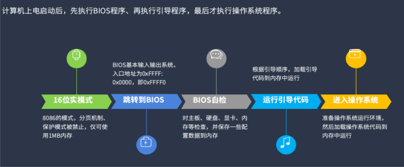

- **极少量的汇编语言，不到300行**  
  从我接触的同学来，很多同学会卡在汇编语言上。所以，在设计这门课程时，我会尽可能减少了汇编语句的数量，能用C就用C，不得已才用汇编。最终，使得汇编语句砍得了不到300行（去掉注释），极大降低学习者成本。

  即便是必须要使用汇编代码的场合，也尽可能使用简单的语句，不用复杂的逻辑。

   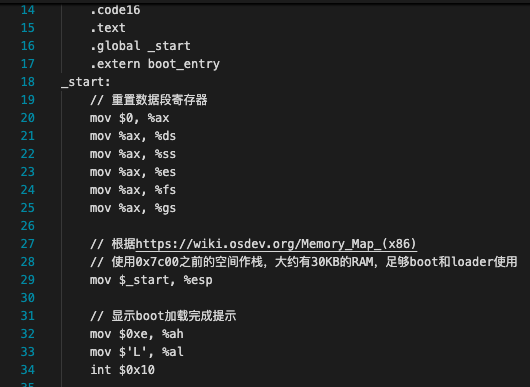

- **支持MAC/Linux/Windows平台**  
  不限制你具体所用的平台类型，无论用的是苹果（包含ARM版本）/Linux（Ubuntu）还是Windows，都可以学习该课程。
  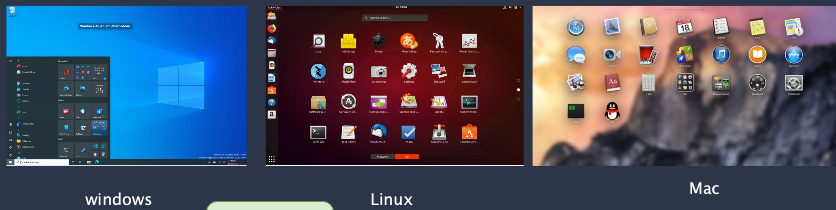

- **快速启动调试，且每一行代码均可调试**  
  在编译完成后，能非常快地启动整个调试过程，无需进行复杂的操作。可以直接在VSCode中进行编译与调试，非常方便。

  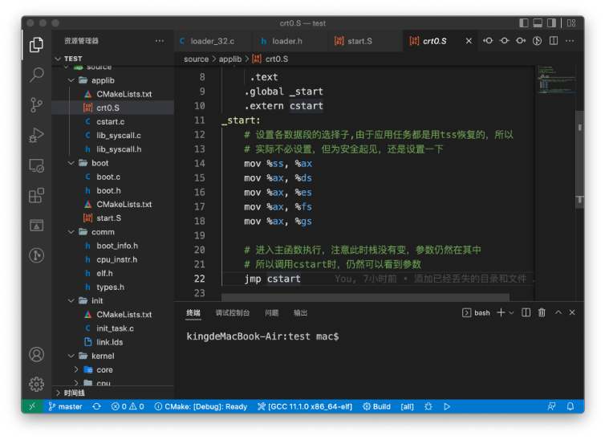

  所有代码均可调试，无论是汇编语句，还是C语句。无论是操作系统内核，还是应用程序；所有在课程中编写的代码均可以进行源码级调试，极大方便学习者。

- **高性价比与持续支持**  
  相较于市场上动辄上千元的高价课程，这门课程定价合理，性价比极高。更重要的是，学员购买课程后可以通过微信直接与作者沟通，获得一对一的答疑支持。这种直接且有效的支持对于学习效果的保障非常重要。

  

- **丰富的学习资源与精心制作的课程内容**  
  不仅提供了高质量的视频教程，还有详尽的文档和代码示例。视频和文档结合的方式，使得学员可以在学习中随时查阅所需资料，既有助于理解，又方便复习。

  精心制作的课程

   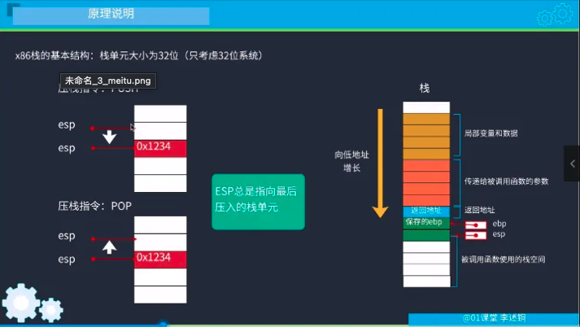

  详尽的文档
   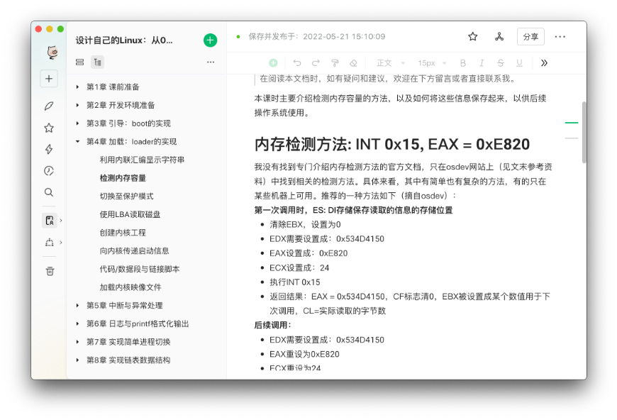

<LinkCard icon="😀" title="感兴趣，点我订阅课程" href="https://app7ulykyut1996.pc.xiaoe-tech.com/p/t_pc/goods_pc_detail/goods_detail/course_2SxCS87KSTe0K0zRWQ2bU9HfbVR" />

### 适合人群
本书适合对操作系统实现充满兴趣并具备一定编程基础的学习者。例如：
* 在校大学生，特别是计算机/软件开发相关专业的学生
* 已经工作的工程师

目前，我已经知道的有在学习这门课程的同学有来自世界各地的：在美国、新加坡、台湾的工程师和留学生；有各行各业的：搞Java开发的、做前端的、做嵌入式、大学老师、本科生和研究生，甚至有一两个江苏那边的高中生。

### 学习收益
在学习完本课程之后，你将获得多种收益。

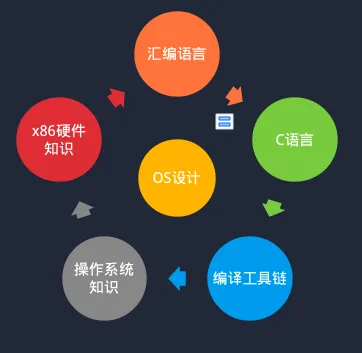

具体来说，主要包含以下几点：
1. **掌握操作系统开发的核心技能：** 从零开始构建一个x86操作系统，深入理解内存管理、进程调度、文件系统等关键技术。
2. **提升编程与调试能力：** 通过实际编写和调试代码，增强解决复杂技术问题的能力。
3. **夯实计算机底层知识：** 理解计算机硬件与操作系统的互动，为深入学习和研究计算机科学打下坚实基础。
4. **获得实战经验：** 通过完成项目，积累实际操作系统开发的经验，为未来的职业发展做好准备。
5. **增强技术自信：** 在掌握复杂技术的过程中，提升自信心，培养解决问题的思维方式。

### 学习方法
在学习本课程时，请注意参考以下方法进行学习：
1. **循序渐进，稳扎稳打：** 按照课程的模块顺序进行学习，从基础知识开始逐步深入，确保每个知识点都能扎实掌握。
2. **动手实践，代码为主：** 每学习一个概念，都要配合动手编写代码，通过实践来加深对理论的理解。
3. **及时复习，巩固知识：** 在学习过程中定期回顾之前的内容，确保自己对每个模块的理解都牢固。
4. **主动提问，寻求帮助：** 遇到不理解的地方，及时在课程提供的答疑渠道中提出问题，寻求我的帮助。
5. **对比分析，优化代码：** 在完成每个代码模块后，尝试不同的实现方式，并分析其优缺点，提升编程技巧。

最最重要提，在完成了这个课程学习之后，如果学有余力，可以尝试自行开发一个小的操作系统，这样才能更好地掌握相关内容。

正如有句话所说：“学以致用，方能融会贯通。”

<LinkCard icon="😀" title="感兴趣，点我订阅课程" href="https://app7ulykyut1996.pc.xiaoe-tech.com/p/t_pc/goods_pc_detail/goods_detail/course_2SxCS87KSTe0K0zRWQ2bU9HfbVR" />

## 内容展示

### 视频预览
部分视频预览。视频中先讲解了原理，然后再到实际的动手实践相结合。

@[bilibili p10](BV1jV4y1H7Gj 857492315 816364036)

@[bilibili p10](BV1jV4y1H7Gj 857492315 816373303)

### 配套文档
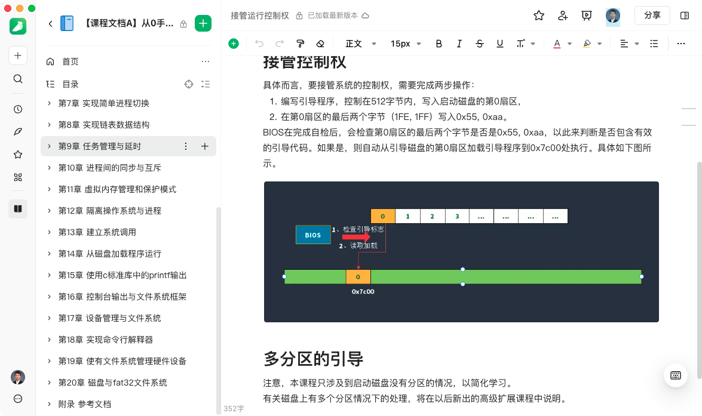

### 配套代码
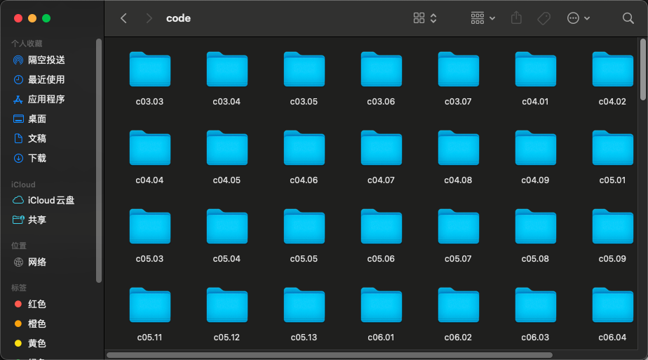

<LinkCard icon="😀" title="感兴趣，点我订阅课程" href="https://app7ulykyut1996.pc.xiaoe-tech.com/p/t_pc/goods_pc_detail/goods_detail/course_2SxCS87KSTe0K0zRWQ2bU9HfbVR" />

## 结语
《从0手写x86操作系统》不仅帮助你深入理解操作系统的原理，更通过实际操作让你掌握编写一个完整系统的能力。如果你渴望了解计算机的底层奥秘，并希望通过动手实践提升自己的技术能力，这门课程绝对是你的不二选择。快来加入我们，一起开启这段技术探索之旅吧！

<LinkCard icon="😀" title="感兴趣，点我订阅课程" href="https://app7ulykyut1996.pc.xiaoe-tech.com/p/t_pc/goods_pc_detail/goods_detail/course_2SxCS87KSTe0K0zRWQ2bU9HfbVR" />