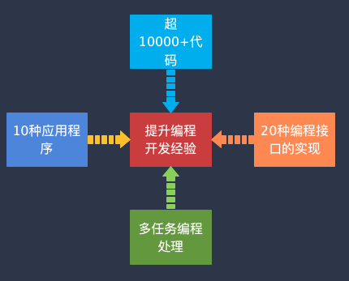

如果说[《从0手写x86操作系统》](diylinux.md)关注的是计算机底层系统的运行，是深入了解操作系统运行原理的最佳课程；那么《从0手写TCP/IP协议栈》则关注的是计算机与计算机之间的数据通信机制的实现。

如果你对TCP/IP协议栈中相关的协议知识，对其工作原理有兴趣，或者在平时的工作中有接触过网络编程相关的知识；那么，这门课程是一门非常有助于你提升对其理解的核心课程。

## 课程简介
让我用一个视频来介绍这门课程。

@[bilibili p2](BV1BL411R7vN 438614526 1054386630)

这是一门<Badge type="tip" text="从0开始" />，一步步教你操纵网卡收发数据包，然后实现自己的TCP/IP协议栈的课程。

**本课程将详细讲解TCP/IP协议中关注协议的原理，也关注如何用代码去实现这些协议。让你不仅知其然，也知其所以然。**

对课程有兴趣？请往下看（课程内容略有调整）

@[bilibili p1](BV1BL411R7vN 438614526 1054386224)

本协议栈可移移植到STM32F407（ARM内核）开发板上，以下是运行效果演示。

@[bilibili p1](BV1bz4y1v7aK 572000471 1158022222)

同时，本协议栈也可以移植到我写的《自己动手写x86 Linux操作系统》上，以下是移植效果演示。

@[bilibili p1](BV1XX4y1174W 355748940 1117778329)

<LinkCard icon="😀" title="感兴趣，点我订阅课程" href="https://app7ulykyut1996.pc.xiaoe-tech.com/p/t_pc/goods_pc_detail/goods_detail/course_2SxSAHN9yBWtLk2GseWI8CFXtBZ" />

## 课程背景
与[《从0手写x86操作系统》](diylinux.md)一样，这门课程最早源于大三-大四时间。除了对操作系统有兴趣外，对于TCP/IP协议栈也是非常有兴趣的。

不过，当时在课堂上学得并不好，学校开一门《计算机网络》的课程，我居然挂科了。不记得为什么会挂科，不过大体回忆起来，感觉老师讲得的东西吧，还是不太懂。毕竟只是停留在课本上的东西，理论居多，学得似懂非懂的。

后面偶然间在学校图书馆看到了一本书，叫做《用TCP/IP进行网际互联》，里面有讲了一些关于TCP/IP协议栈实现的内容。不是很详细，我大体看了看，然后尝试着写点C代码来实现。印像中最早是在Linux系统上弄的，因为当时用到了它一些网络相关的系统调用。在查了很多资料后，最终写了一个非常简单的版本。

这个版本实现了以太网协议/ARP/IP/UDP协议，各协议实现非常简单。然后，在UDP基础之上，写了一个TFTP客户端，居然成功了，可以进行文件传输，还是挺兴奋的。

至于TCP协议，当时能力实在是太弱了，没能力写出来。

即便如此，我还是把这个东西写到了自己的简历上；还是有不小的作用的。

工作后，接触了一些开源的协议栈，如LWIP，分析过它的一些代码。然后，就有了再次尝试去写一个类似东西的想法。

起始，用非常简单的代码写了一个超小型的协议栈，不到1500行，然后出了个课程[从0写TCP+WEB服务器-仅1500行代码](https://app7ulykyut1996.pc.xiaoe-tech.com/p/t_pc/course_pc_detail/column/p_63a68201e4b0fc5d121b2d5c?product_id=p_63a68201e4b0fc5d121b2d5c).

这个课程很受欢迎，因为它足够简单、易于理解，并且**被国内某高校用于本科生网络课程相关的辅助实验材料**。

考虑到这个协议栈代码太简单，很多功能不足；所以，我又花了很多时间来写一个更复杂的东西。然后就有了现在这门课程中所涉及的协议栈。

**从我了解到的情况来看，我的这两门课程应该是国内全网最早、也是最全讲解TCP/IP协议栈具体实现的课程。**

<LinkCard icon="😀" title="感兴趣，点我订阅课程" href="https://app7ulykyut1996.pc.xiaoe-tech.com/p/t_pc/goods_pc_detail/goods_detail/course_2SxSAHN9yBWtLk2GseWI8CFXtBZ" />

## 设计目标
本课程是要设计一个功能完整的TCP/IP协议栈，具体各项功能会在后面介绍。

### 协议架构

整个协议栈从最底层的以太网协议开始，逐层向上设计，涉及ARP/IPV4/ICMPV4/UDP/TCP/DNS协议。在这个协议栈基础之可，可以直接运行NTP客户端、TFTP客户端和服务器、HTTP服务器（注，这三者不包含在本课程中）。

### 用户层接口
除了各协议之外，还增加了用户层接口，实现了标准Linux Socket的若干接口，具体如下。利用这些接口，可以在其上开发多个应用程并可同时运行。在其上运行的程序，可以直接无需个性就可以迁移到Linux平台中。

<LinkCard icon="😀" title="感兴趣，点我订阅课程" href="https://app7ulykyut1996.pc.xiaoe-tech.com/p/t_pc/goods_pc_detail/goods_detail/course_2SxSAHN9yBWtLk2GseWI8CFXtBZ" />

## 课程内容
### 内容安排
这门课程涉及的内容很多、代码量大、细节很复杂，尽管如此，我也尽量按照初学者的角度设计了各个章节的内容。

::: warning
由于TCP/IP协议栈很复杂，所以本课程内容量也是比较大的，学习时需要花很多的时间和精力。

具体课程内容，以实际的目录中展示的内容为准。
:::

**通过循序渐进，不断迭代。从一个最小的代码开始，通过逐步增加功能，最终完成整个系统的设计。**

:::: steps
1. **概念原理和整体结构设计**
   
   介绍本课程学习时所必的基础知识，并对整体软件结构做相应的介绍，从而让初者学对相关内容有个初步的理解。

   此外，由于本课程的设计采用多线程架构，所以还会介绍多线程编程相关的基础知识。

2. **基本数据结构实现**

   为了支持协议栈的多线程运行，需要诸如存储块分配、线程间消息通信等功能，此部分仅仅基本操作系统提供的信号量功能，便实现这些功能。

3. **网络数据包结构设计**

   数据包结构是协议栈内部最为核心的结构，其接受网卡收到的数据包，并在其内部进行各种处理。应用程序也需要往外发包。高效率的数据包，有助于提升协议栈运行效率。这一部分使用链式存储，来实现一种简单高效的数据包存储方案。

4. **网络接口层和以太网协议实现**
 
    让整个系统支持多个网络接口，比如环回接口和硬件网络接口。同时，针对以太网，实现了以太网协议，可以收发数据包并进行解析处理。

5. **ARP协议实现**

    支持对ARP数据包的处理，可以响应收到的ARP包，也可以主动发起ARP请求，来将IP地址转换成MAC地址。

    增加了定时器，自动对ARP缓存表进行扫描，去掉无效的项，请求将要过期的条目。

6. **IP协议和ICMP协议实现**

    支持对IP协议包进行处理，能够响应Ping请求。对于较大的IP数据包，可以进行分片发送；而对于收到的多个分片数据包，也可以进行自动重组为完整的大数据包。内部实现了IP路由表，可以将数据包根据路由配置进行转发。

7. **实现Socket接口，创建自己的Ping命令**

    实现了自己的Socket接口，可以直接发送IP数据包。以此为基础，便可以构造出自己的Ping命令。

    这个过程，还涉及到了多线程处理相关的知识，如何利用C语言实现抽像等相关编程方法。

8. **UDP协议实现**

    支持UDP数据包的处理，同时个性了Socket接口，使其支持UDP数据包的收发。这样便可以以此为基础，创建一些基于UDP协议的应用程序。

9. **TCP协议实现**

    此部分最为复杂，由若干章节组成：

    * 支持TCP数据包的处理
    * 基于TCP状态机，实现了标准的三次握手，四次挥手。
    * 在TCP连接过程中，支持滑动窗口算法的处理，
    * 当数据收发出现问题时，能够自动超时重传
    * 支持保活机制
    * 支持Socket接口的收发超时处理
  
    基于这些特性，可以利用Socket接口创建TCP应用程序，也可以创建TCP服务器。

10. **DNS协议实现**

    在协议栈内置DNS的支持，可以调用gethostbyname()来将域名转换成IP地址。

11. **协议栈移植**

    在完成所有的代码之后，可以将协议栈移植到指定的平台上。这里主要实现了两种平台的移植：
  
    * 将协议栈移植到[《从0手写x86操作系统》](diylinux.md)中
    * 将协议植与嵌入式操作系统（RTOS）相结合，移植到开发板上

    在这部分中，会有很多同学关心的<Badge type="warning" text="网卡驱动程序" />的介绍。通过部分，你将能够更加全面的了解TCP/IP协议是如何运行在具体的硬件平台上。

::::

::: info

**全部课时加起来超300+课时，时长总共90+小时。**

:::

<LinkCard icon="😀" title="感兴趣，点我订阅课程" href="https://app7ulykyut1996.pc.xiaoe-tech.com/p/t_pc/goods_pc_detail/goods_detail/course_2SxSAHN9yBWtLk2GseWI8CFXtBZ" />

### 课程特色

这门课程有几个显著的优势，使它在众多同类课程中脱颖而出：
- **代码全程手写，非简单分析**  
  所有协议栈的实现代码，每一行边讲解边手写，而不是简单地拿一大段代码进行简单的分析。内容循环渐进，不断深入，例如：

    

- **协议栈实现完整，功能强大**

   不是简单的实现一个小型的简单的协议栈，而是实现了多种类型的协议。每种类型的协议，实现功能全面，例如：IP协议层实现了IP数据包的分片和重组，TCP实现了KeepAlive等功能。

   最主要的是，将Socket层实现出现出来，这是与应用开发相关的接口。了解这些内容，将有助于你理解Socket具体的使用细节。

   

- **支持MAC/Linux/Windows平台**  
  不限制你具体所用的平台类型，无论用的是苹果（包含ARM版本）/Linux（Ubuntu）还是Windows，都可以学习该课程。
  

- **高性价比与持续支持**  

  目前市面上极少这样完整的协议栈实现课程。相较于某些动辄数千元的高价课程，这门课程定价合理，性价比极高。更重要的是，学员购买课程后可以通过微信直接与作者沟通，获得一对一的答疑支持。这种直接且有效的支持对于学习效果的保障非常重要。

  

- **丰富的学习资源与精心制作的课程内容**  
  不仅提供了高质量的视频教程，还有详尽的文档和代码示例。提供完善的配套代码，每个小功能配套一个工程代码。

  精心制作的课程

  

<LinkCard icon="😀" title="感兴趣，点我订阅课程" href="https://app7ulykyut1996.pc.xiaoe-tech.com/p/t_pc/goods_pc_detail/goods_detail/course_2SxSAHN9yBWtLk2GseWI8CFXtBZ" />

### 适合人群
本课程是一个<Badge type="tip" text="内容多且复杂" />的课程，学习起来要花费比较多的时间和精力。特别适合以下同学：

* 在校大学生，特别是计算机/软件开发/网络工程相关专业的学生
* 已经工作的工程师，从事直接或间接TCP/IP相关开发工作

目前，我已经知道的有在学习这门课程的同学主要为公司的工程师，**有的是从事嵌入式开发相关工作，有的是做网络应用相关工作，还有部分同学从事路由器开发、网络安全相关工作**。

### 学习收益
在学习完本课程之后，你将获得多种收益。

具体来说，在学习完手写TCP/IP协议的实现课程后，可以收获以下几点：

1. **深入理解网络协议底层原理**：通过编写协议的各个部分，您将对TCP/IP协议栈的工作机制有更深刻的理解，包括数据包的生成、传输、接收、以及连接管理等。
2. **C语言的实践技能**：此课程要求使用C语言进行编程，您将因此增强对C语言的掌握能力，特别是在系统级编程方面。
3. **解决实际问题的能力**：动手实现协议涉及到很多实际中的网络编程问题，帮助培养解决问题的实际能力。
4. **调试与优化技能**：编写网络协议需要反复调试和优化代码，这有助于提升您的调试技巧和代码优化能力。
5. **理解网络安全**：通过手写协议的实现，您将更加意识到网络协议中的安全性问题，从而更好地理解如何在网络编程中保障数据的安全。
6. **拓展知识视野**：在编写协议的过程中，您会接触到很多相关的计算机网络知识，如端口和套接字等，进一步丰富您的计算机网络知识体系。
7. **逻辑思维与耐心培养**：实现复杂协议需要缜密的逻辑思维和大量的耐心，能够锻炼您的问题分析能力和细致入微的工作态度。
8. **实际项目经验**：此课程为您提供了一个实际的项目经验，在未来的工作或学习中，这种经验能够为您带来巨大的帮助。

通过这些方面的学习和实践，您将大幅提升在网络编程领域的综合能力，为今后的开发工作奠定坚实的基础。

### 学习方法
在学习本课程时，请注意参考以下方法进行学习：
1.	**逐步实现**：从基础开始，逐步实现协议的各个部分。
2.	**反复调试**：通过调试工具深入分析每一行代码的执行过程。
3.	**参考标准文档**：参阅RFC文档以确保实现的协议符合标准。
4.	**动手实践**：编写测试用例并在实际网络环境中测试代码。
5.	**反思与优化**：不断优化代码，并理解每个修改的影响。

<LinkCard icon="😀" title="感兴趣，点我订阅课程" href="https://app7ulykyut1996.pc.xiaoe-tech.com/p/t_pc/goods_pc_detail/goods_detail/course_2SxSAHN9yBWtLk2GseWI8CFXtBZ" />

## 内容展示

### 视频预览
部分视频预览。视频中先讲解了原理，然后再到实际的动手实践相结合。

@[bilibili p10](BV1BL411R7vN 438614526 1054392912)

@[bilibili p10](BV1BL411R7vN 438614526 1054399844)

### 配套代码

<LinkCard icon="😀" title="感兴趣，点我订阅课程" href="https://app7ulykyut1996.pc.xiaoe-tech.com/p/t_pc/goods_pc_detail/goods_detail/course_2SxSAHN9yBWtLk2GseWI8CFXtBZ" />

## 同学评价

面向真正的程序员，只有内行人才懂讲的多好

## 结语
本课程从0开始，详细而全面的介绍TCP/IP协议栈的详细实现。这一门有深度/也有难度的课程，如果你想深入TCP/IP内部实现，全面提升自己对相关原理的理解，那么这门课程将是非常适合你的课程！

<LinkCard icon="😀" title="感兴趣，点我订阅课程" href="https://app7ulykyut1996.pc.xiaoe-tech.com/p/t_pc/goods_pc_detail/goods_detail/course_2SxSAHN9yBWtLk2GseWI8CFXtBZ" />
