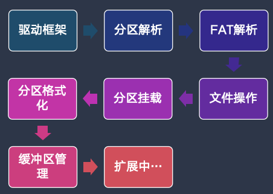
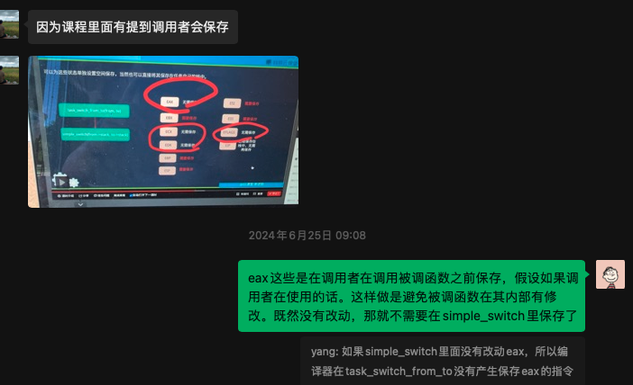
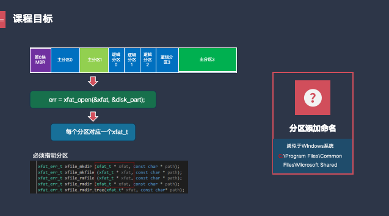
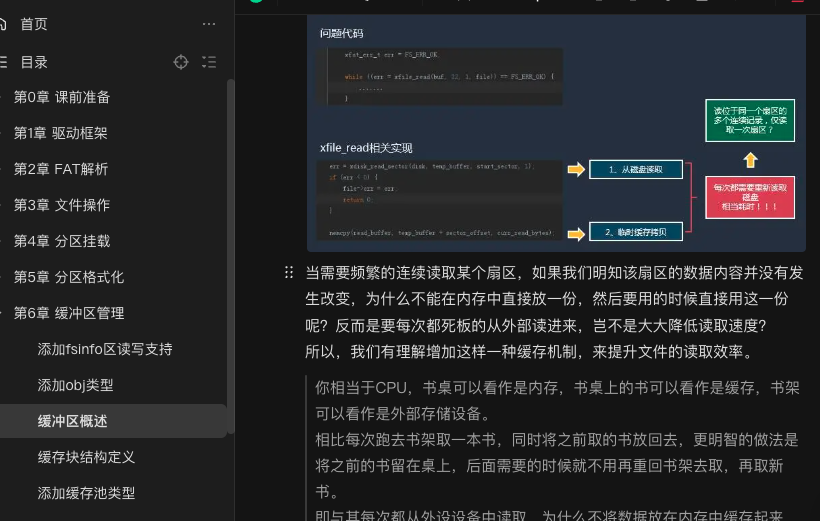
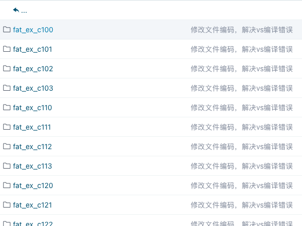

FAT32文件系统是一种广泛采用的文件系统。当我们在Windows电脑上格式化硬盘分区时，或者正在从事嵌入开发的同学尝试用MCU去读写外部的SD卡上的数据时，都会频繁使用到该文件系统。

## 文件系统简介
::: info
### FAT32文件系统简介
FAT32（File Allocation Table 32）是微软在1996年推出的文件系统，作为FAT16的升级版，旨在解决存储容量和文件大小的限制。FAT32支持更大的卷（最多可达2TB）和文件（最大4GB），并且兼容性强，被广泛应用于U盘、SD卡等设备中。尽管现代计算中更多地使用了NTFS和exFAT等更先进的文件系统，FAT32的简单性和广泛兼容性仍然使其在某些场景中具有优势。

### FAT32的发展历史
FAT32的起源可以追溯到微软的早期操作系统DOS（Disk Operating System），最初的FAT文件系统在70年代后期诞生。随着计算机硬件的发展，FAT文件系统经历了多次升级，从FAT12到FAT16，再到FAT32，每次升级都带来了更大的存储能力和更好的性能。FAT32作为最终的32位版本，为90年代末和2000年代早期的计算机提供了可靠的存储解决方案，直到更先进的文件系统如NTFS和exFAT逐渐取代它。

### 为什么要学习FAT32文件系统？
学习FAT32文件系统对于理解文件系统的基本原理和操作系统底层机制非常有帮助。通过深入学习FAT32，您将掌握以下几个方面的技能：

1.	文件系统结构：了解如何在存储设备上组织和管理文件数据，包括文件分配表（FAT）的工作原理。
2.	兼容性与优化：学习如何在资源有限的嵌入式系统中优化存储操作，这是FAT32在现代仍然重要的原因之一。
3.	操作系统原理：通过编写和操作FAT32文件系统，可以加深对操作系统如何处理文件和存储的理解，为进阶学习NTFS、ext4等更复杂的文件系统打下基础。
4.	实际应用：FAT32依然被广泛使用于可移动存储设备中，掌握其操作可以帮助解决实际生活中的存储问题。

总之，学习FAT32不仅可以为更复杂的文件系统学习打下坚实基础，还能培养实际操作和问题解决的能力。
:::

如果你对FAT32文件系统的实现感兴趣，或者想要挑战自己，深入学习文件系统的开发；那么这门《从0手写FAT32文件系统》课程绝对值得你关注。

下面，我将详细介绍这门课程的内容、特色和学习收益，希望能够帮助你全面了解并做出选择。

## 课程简介
让我用一个视频来介绍这门课程。

<!-- @[bilibili p2](BV1jV4y1H7Gj 857492315 1494902690) -->

<LinkCard icon="😀" title="感兴趣，点我订阅课程" href="https://wuptg.xetlk.com/s/1SAu05" />

## 课程背景
文件系统作为操作系统中非常重要的组成部分，用于实现对硬盘上文件的管理等功能。

在早前我刚开始学嵌入式开发的时候，就接触过一个比较简单的文件系统FATFS软件模块。它可以对SD卡上的FAT文件系统进行各种操作，如文件读写/目录遍历等。出于对底层研究的兴趣，我深入分析过它的实现代码，发觉其实现并不复杂。于是，就慢慢地尝试自己去琢磨着写一个类似的东西。

当时的考虑是，直接在某个操作系统里边去写这些，显然是不现实的，没有这样的手段可以做到。因此，就决定简单起见，做一个跑在用户态模块代码，然后修修改改，不断调试，形成了现在这个课程的代码。

至于为什么要做成课程，主要的原因在于想分享下这个开发过程。因为对于很多同学来说，他们日常只是用FATFS等软件模块，从不愿意深究或者没有能力深究其中的原理和实现。因此，正好我有这个时间和意愿，就做这个课程。

<LinkCard icon="😀" title="感兴趣，点我订阅课程" href="https://wuptg.xetlk.com/s/1SAu05" />

## 设计目标
这个课程是要设计一个可以完全独立使用的文件系统模块，可以解析硬盘上的文件进行读写等操作。

最终要能提供一些常见的文件打开、读写、目录遍历、文件创建和删除、读写文件属性等接口，可以方便用户使用。这些接口列表如下所示：
```c
xfat_err_t xfile_open(xfile_t *file, const char *path);
xfat_err_t xfile_open_sub(xfile_t* dir, const char* sub_path, xfile_t* sub_file);
xfat_err_t xfile_close(xfile_t *file);
xfat_err_t xdir_first_file(xfile_t *file, xfileinfo_t *info);
xfat_err_t xdir_next_file(xfile_t *file, xfileinfo_t *info);
xfat_err_t xfile_error(xfile_t * file);
void xfile_clear_err(xfile_t * file);

xfat_err_t xfile_mkdir (const char * path);
xfat_err_t xfile_mkfile (const char * path);
xfat_err_t xfile_rmfile (const char * path);
xfat_err_t xfile_rmdir (const char * path);
xfat_err_t xfile_rmdir_tree(const char* path);
xfile_size_t xfile_read(void * buffer, xfile_size_t elem_size, xfile_size_t count, xfile_t * file);
xfile_size_t xfile_write(void * buffer, xfile_size_t elem_size, xfile_size_t count, xfile_t * file);

xfat_err_t xfile_eof(xfile_t * file);
xfile_size_t xfile_tell(xfile_t * file);
xfat_err_t xfile_seek(xfile_t * file, xfile_ssize_t offset, xfile_orgin_t origin);

xfat_err_t xfile_size(xfile_t * file, xfile_size_t * size);
xfat_err_t xfile_resize(xfile_t * file, xfile_size_t size);

xfat_err_t xfile_rename(const char * path, const char * new_name);
xfat_err_t xfile_set_atime (const char * path, xfile_time_t * time);
xfat_err_t xfile_set_mtime (const char * path, xfile_time_t * time);
xfat_err_t xfile_set_ctime (const char * path, xfile_time_t * time);
```

**当然，最最重要的：这个课程能够帮助你去深入理解文件系统中这些功能具体是如何实现的。同时，你也能够对文件系统的具体存储原理有更深入地理解。**

<LinkCard icon="😀" title="感兴趣，点我订阅课程" href="https://wuptg.xetlk.com/s/1SAu05" />

## 课程内容
### 内容安排
为了便于学习者学习，在设计这门课程时，我按照学习者的角度仔细安排了各章节内容。

这些内容之间前后连续，循序渐进，不断迭代。从一个最小的代码开始，通过逐步增加功能，最终完成整个系统的设计。



具体来说，它主要分为以下几个模块：
:::: steps

1. **驱动框架**  
   在这部分中，介绍了整体代码的分层结构，展示了如何构造相应的硬盘读写接口，从而为后续读写硬盘提供必要的支持。
   
2. **分区解析**  
   介绍了硬盘上MBR分区格式的详细信息，实现相应的接口来解析硬盘上倒底有哪些分区，如主分区和扩展分区。

   通过这个过程，可以对让程序对整个硬盘的布局有所了解。

3. **FAT解析** 
   
   此部分介绍了如何通过代码去检测某个硬盘分区是否FAT文件系统，读取FAT分区中相关的配置信息，获得该文件系统相关的关键数据。

   同时，编写代码，对文件系统顶层目录进行解析，从而遍历出顶层目录下有哪些文件或子目录。

   通过这个过程，可以做到对FAT文件系统工作原理有个初步的理解。
   
4. **文件操作**  
   此部分介绍了文件系统各项操作接口的详细实现，如打开文件/关闭文件/读写文件等。

   除此之外，还实现了对任意路径的解析，并进行文件的创建/遍历/删除等功能。
   
5. **分区挂载**  
   一块硬盘上有可能有多个FAT分区，因此有必要支持同时对多个分区上的文件进行读写。

   通过挂载机制，可以实现对硬盘多个FAT分区的同时管理，并指定对任意分区中的文件进行读写。

6. **分区格式化**

   对于硬盘上的空白分区，需要初始化为FAT32文件系统之后，才可存储文件。

   此部分介绍了如何对空白按照FAT3文件系统的要求，进行格式化，使得该分区成为真正的FAT32分区。

::::


<LinkCard icon="😀" title="感兴趣，点我订阅课程" href="https://wuptg.xetlk.com/s/1SAu05" />

### 课程特色

这门课程有几个显著的优势，使它在众多同类课程中脱颖而出：
- **代码全程手写，非简单分析**  
  从建立工程开始，所有代码，每一行边讲解边手写，而不是简单地拿一大段代码进行简单的分析。内容循环渐进，不断深入。

  

- **全部采用C语言**  
  所有代码，全部采用标准C语言，无复杂的语法和数据结构，简单易学。

```c
  xfat_err_t add_to_mount(xfat_t * xfat, const char * mount_name) {
    memset(xfat->name, 0, XFAT_NAME_LEN);
    strncpy(xfat->name, mount_name, XFAT_NAME_LEN);
    xfat->name[XFAT_NAME_LEN - 1] = '\0';

    // 检查是否已经存在同名的挂载点
    if (xfat_find_by_name(xfat->name)) {
        return FS_ERR_EXISTED;
    }

    xfat_list_add(xfat);
    return FS_ERR_OK;
   }  
```

- **不需要额外使用开发板**  
  无需购买额外的开发板，只需要一台装有Windows系统的电脑即可。（如果你对其它系统上的C开发比较熟，可以自建工程学习）

- **高性价比与持续支持**  
  相较于市场上动辄上千元的高价课程，这门课程定价合理，性价比极高。更重要的是，学员购买课程后可以通过微信直接与作者沟通，获得一对一的答疑支持。这种直接且有效的支持对于学习效果的保障非常重要。

  

- **丰富的学习资源与精心制作的课程内容**  
  不仅提供了高质量的视频教程，还有详尽的文档和代码示例。视频和文档结合的方式，使得学员可以在学习中随时查阅所需资料，既有助于理解，又方便复习。

  精心制作的课程

   

<LinkCard icon="😀" title="感兴趣，点我订阅课程" href="https://wuptg.xetlk.com/s/1SAu05" />

### 适合人群
本书适合对文件系统实现充满兴趣的学习者，懂C语言，不需要某种特定操作系统的开发知识：

1. **计算机科学与工程学生**：希望深入理解文件系统底层原理并应用到实践中。
2. **嵌入式系统开发者**：需要在资源受限的环境中定制文件系统的人士。
3. **操作系统开发爱好者**：对构建从零开始的操作系统或文件系统感兴趣的人。
4. **高级程序员**：希望提高对底层存储管理和文件系统设计的理解，并增强解决复杂问题的能力。
5. **逆向工程与安全研究者**：希望理解文件系统结构以便于数据恢复、取证或分析的人士。

### 学习收益
在学习完本课程之后，你将获得多种收益。具体来说，主要包含以下几点：

1. **深入理解文件系统原理**：通过手写实现，您可以全面了解FAT32文件系统的结构和工作机制。
2. **实践编码技能**：提升C语言等编程语言的实际应用能力，增强代码阅读和调试的技巧。
3. **操作系统知识拓展**：深入掌握底层系统编程，对操作系统的文件管理有更深的理解。
4. **增强问题解决能力**：通过解决实现过程中的问题，培养独立思考和解决复杂技术问题的能力。
5. **职业发展**：这类深入的技术学习有助于在嵌入式系统开发、系统编程等领域获得优势。

<LinkCard icon="😀" title="感兴趣，点我订阅课程" href="https://wuptg.xetlk.com/s/1SAu05" />

## 内容展示

### 视频预览
部分视频预览。视频中先讲解了原理，然后再到实际的动手实践相结合。

<!-- @[bilibili p10](BV1jV4y1H7Gj 857492315 816364036) -->

<!-- @[bilibili p10](BV1jV4y1H7Gj 857492315 816373303) -->

### 配套文档
   

### 配套代码
   

<LinkCard icon="😀" title="感兴趣，点我订阅课程" href="https://wuptg.xetlk.com/s/1SAu05" />

## 结语
学习手写FAT32文件系统不仅能够帮助您深入理解文件系统的结构和原理，还通过动手实践，提升您在系统编程和底层开发方面的能力。如果您对存储管理有兴趣，并希望通过实际操作掌握文件系统的实现方法，这门课程将为您提供全面的技术指导。加入我们，开启这段深入技术核心的学习之旅吧！

<LinkCard icon="😀" title="感兴趣，点我订阅课程" href="https://wuptg.xetlk.com/s/1SAu05" />