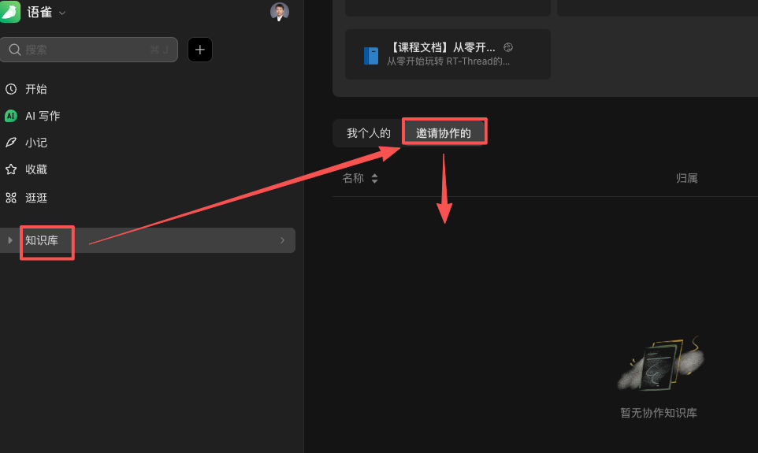

请根据自己所学课程，通过以下方式获得课程相关资料。

::: tip
不提供任何课程的课件下载！课件相关内容，请参考课程资料中相关的配套文档。
:::

## 免费课程

免费课程的所有资料，可全部免费访问及下载：

* [FATFS使用指南（含使用、移植、源码分析）三门课程](../../notes/tech/fatfs/code/intro.md)。
* [从零玩转RT-Thread（含使用、移植）两门课程](../../notes/tech/rtthread/use/c1/intro.md)。
* [用1500行代码手写TCPIP + WEB服务器](../../notes/tech/tcp_web/intro.md)。
* [深入理解RTOS任务切换机制](../../notes/tech/osswitch/intro.md)

## 付费课程
付费课程的资料，不公开，需要申请才能查看！

::: details 资料申请方法

请在购买相关课程后，将购买订单截图发给我验证，获得资料的申请链接。

在获得访问申请链接后，点击链接会提示注册自己的语雀账号，点击申请后，联系我即可。

:::

**资料申请过后，可以用自己申请资料查看权限时的语雀账号，登录[语雀官网](https://www.yuque.com)，然后在自己的知识库下找到该课程的知识库。如果在自己的知识库中找不到，也可点击以下链接直接访问：**

::: details 在语雀中查看知识库的方法

如果想在语雀客户端或者网页中查看已经获取的知识库，可以通过以下方法来找到。**（注意，需要先登陆语雀）**

:::

不再开放付费课程的相关资料链接。
