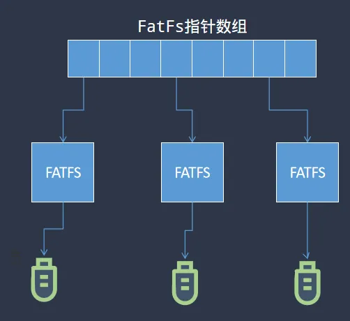
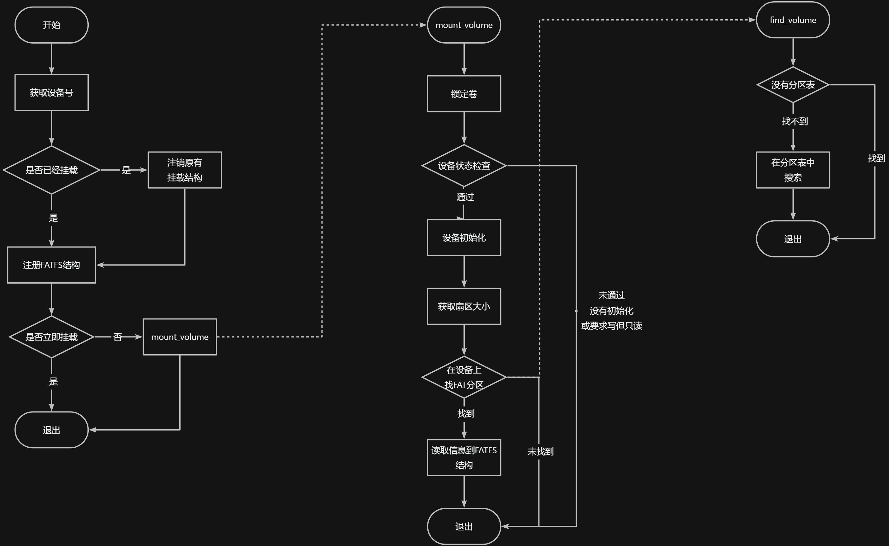
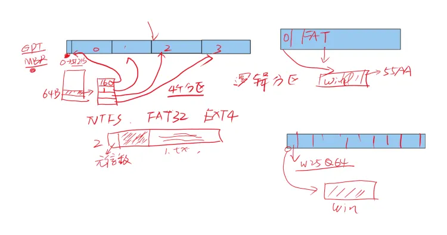

:::tip
同学，你好，欢迎学习本课程！本课程是介绍了FATFS文件系统模块的移植，该部分内容与特定硬件相关，较难。

如果你对文件系统的实现比较感兴趣，也可以关注我的《[从0到1写FAT32文件系统](https://wuptg.xetlk.com/s/VeHie)》课程。

欢迎转载本文章，转载请注明链接来源，谢谢！
:::

## 文件系统挂载是什么
在对存储设备进行文件创建、读写之前，需要先将该存储设备加入到FATFS内部进行管理。这个过程就是挂载。与挂载和卸载有关的操作包含如下两个：

```c
	res = f_mount(&disk2_fs, "1:", 1);

	f_unmount("0:");
```
简而言这，f_mount是将设备1挂载到FATFS中，而f_umount则是取消挂载。

## 挂载的实现原理
### 挂载过程
试想一下，如果是我们来实现这个挂载过程，有哪些工作应该需要做呢？


1. 首先，必定要进行存储设备的初始化。只有进行了初始化之后，才可能对存储设备进行读写。
2. 其次，需要识别存储设备上的分区排列，找到我们要挂载的那个分区。
3. 接下来，还要检测指定的分区是否是FAT格式，这就需要读取这个分区中的某些地方的信息，来进行文件系统格式的检查
4. 最后，获取的这些信息一般包含文件和数据的是如何存储的相关信息，需要将这些信息读取保存到FATFS内部，以便后续使用。

此外，如果想要支持多个分区或存储设备的挂载，那么就需要将这些信息按设备的不同，保存到不同的地方。

### FATFS的数据结构
在FATFS中，从分区上读取到的文件系统相关信息，会进行计算整理，全部存储到FATFS结构体中。

```c

typedef struct {
	BYTE	fs_type;		/* Filesystem type (0:not mounted) */
	BYTE	pdrv;			/* Volume hosting physical drive */
	BYTE	ldrv;			/* Logical drive number (used only when FF_FS_REENTRANT) */
	BYTE	n_fats;			/* Number of FATs (1 or 2) */
	BYTE	wflag;			/* win[] status (b0:dirty) */
	BYTE	fsi_flag;		/* FSINFO status (b7:disabled, b0:dirty) */
	WORD	id;				/* Volume mount ID */
	WORD	n_rootdir;		/* Number of root directory entries (FAT12/16) */
	WORD	csize;			/* Cluster size [sectors] */
#if FF_MAX_SS != FF_MIN_SS
	WORD	ssize;			/* Sector size (512, 1024, 2048 or 4096) */
#endif
#if FF_USE_LFN
	WCHAR*	lfnbuf;			/* LFN working buffer */
#endif
#if FF_FS_EXFAT
	BYTE*	dirbuf;			/* Directory entry block scratchpad buffer for exFAT */
#endif
#if !FF_FS_READONLY
	DWORD	last_clst;		/* Last allocated cluster */
	DWORD	free_clst;		/* Number of free clusters */
#endif
#if FF_FS_RPATH
	DWORD	cdir;			/* Current directory start cluster (0:root) */
#if FF_FS_EXFAT
	DWORD	cdc_scl;		/* Containing directory start cluster (invalid when cdir is 0) */
	DWORD	cdc_size;		/* b31-b8:Size of containing directory, b7-b0: Chain status */
	DWORD	cdc_ofs;		/* Offset in the containing directory (invalid when cdir is 0) */
#endif
#endif
	DWORD	n_fatent;		/* Number of FAT entries (number of clusters + 2) */
	DWORD	fsize;			/* Number of sectors per FAT */
	LBA_t	volbase;		/* Volume base sector */
	LBA_t	fatbase;		/* FAT base sector */
	LBA_t	dirbase;		/* Root directory base sector (FAT12/16) or cluster (FAT32/exFAT) */
	LBA_t	database;		/* Data base sector */
#if FF_FS_EXFAT
	LBA_t	bitbase;		/* Allocation bitmap base sector */
#endif
	LBA_t	winsect;		/* Current sector appearing in the win[] */
	BYTE	win[FF_MAX_SS];	/* Disk access window for Directory, FAT (and file data at tiny cfg) */
} FATFS;

```
每个分区对应一个FATFS结构体，所有这些结构体会在FATFS内部统一由FatFs指针数组来管理。

```c
static FATFS *FatFs[FF_VOLUMES];	/* Pointer to the filesystem objects (logical drives) */
```

所以，简而言之：**在FATFS中，f_mount的功能就是找到指定的分区号（设备号），然后定位到存储设备上的指定分区，再将其中的文件系统信息读取到某个FATFS结构体实例中，最后将该结构体实例的地址填入到FATFS的相应位置**。



## 挂载过程



## 白板笔迹


## 补充资料
* 硬盘分区表MBR：[https://blog.csdn.net/bingqingsuimeng/article/details/50585304](https://blog.csdn.net/bingqingsuimeng/article/details/50585304)
* FAT32文件系统规范：见[资料下载](../download.md)中的相关文档。