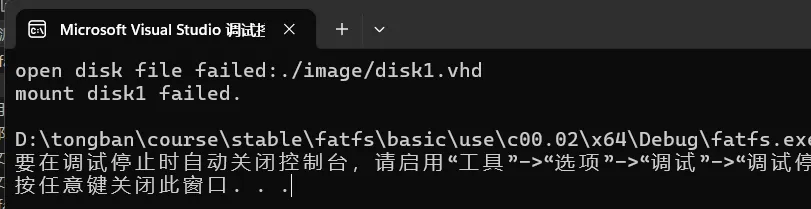
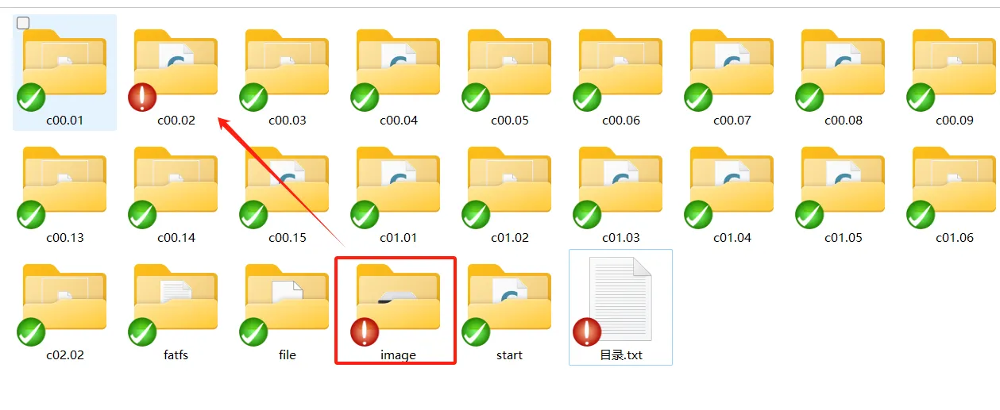

FATFS所有课程的资料均包含在下列的链接和文档中，不再单独进行区分。

## 课程源码
课程源码已经上传到gitee仓库，包含所有章节对应的源码工程。请点击下方的链接下载：

[https://gitee.com/lishutong-01ketang/fatfs](https://gitee.com/lishutong-01ketang/fatfs)

源码包里有个名为目录.txt，里面写了每个工程对应的视频课程，可以用于对照。

源码包含以下形式的工程：

- Visual Studio：可打开该链接，下载社区版即可，无需注册付费（使用VS2019以上的版本）[免费的开发人员软件和服务 - Visual Studio](https://visualstudio.microsoft.com/zh-hans/free-developer-offers/)。优先推荐使用该方式
- VSCode + CMake + C编译器：这个要求你对VSCode和CMake的使用有基础的了解，这不属于本课程内容，所以不做介绍
- Keil：在将FATFS应用于ARM芯片时的工程

注意：在运行use目录下的示例工程（除start工程之外的其它工程，如c00.02），可能会提示错误。

主要原因在于课程中使用了磁盘映像文件，由于文件太大，无法在每个工程下都放一份。所以，这些文件只留了一份，所以在运行这些工程时，请先将image目录拷贝到工程目录下（如下图，将image拷贝到c00.02）

## 参考资料
在开发此课程中，主要参考了FATFS官网的链接：[http://elm-chan.org/fsw/ff/00index_e.html](http://elm-chan.org/fsw/ff/00index_e.html)

FAT文件系统的官方文档： [FAT英文白皮书](/pdf/FAT英文白皮书.pdf)

😭可能有的同学觉得上面的英文文档比较难读，那么可以参考下面的中文文档（其中可能有些翻译错误）[FAT中文白皮书](/pdf/FAT中文白皮书.pdf)

