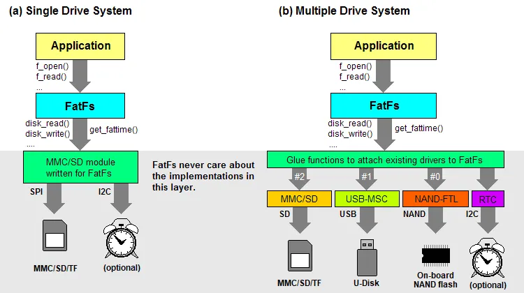

:::tip
同学，你好，欢迎学习本课程！本课程是介绍了FATFS文件系统模块的基本使用，是一门相对较简单的课程。

如果你对文件系统的实现比较感兴趣，也可以关注我的《[从0到1写FAT32文件系统](https://wuptg.xetlk.com/s/VeHie)》课程。

欢迎转载本文章，转载请注明链接来源，谢谢！
:::

## FATFS的文件
当我们从官网上下载FATFS之后，解压之后的文件组织内容如下。可以看到，其文件数量比较少。

这里我们主要关注相关的源文件：

- ff.h：包含了库的所有API函数声明、类型定义、返回码和配置选项。应用程序通过包含这个文件来访问 FATFS 提供的功能。
- ff.c：包含了 FATFS 的核心实现，包括文件操作、目录操作、文件系统管理等的所有函数。这个文件是 FATFS 功能的主体，处理文件的创建、打开、读取、写入、关闭，以及目录的遍历等。
- ffconf.h：这是 FATFS 配置文件。它允许用户根据特定的应用需求定制文件系统的功能。例如，可以通过修改这个文件来启用或禁用长文件名支持、选择工作区的大小、调整时间戳配置等。
- diskio.h：定义了底层磁盘IO操作的接口。FATFS 依赖于这些函数来访问物理存储媒体，如SD卡、硬盘或其他类型的数据存储设备。这个接口需要根据特定硬件平台被实现或适配。
- diskio.c：这不是 FATFS 库的一部分，是磁盘IO接口的实现文件，需要开发者根据目标硬件平台实现。它包含了如`disk_initialize`、`disk_read`、`disk_write`和`disk_ioctl`等函数的实现，这些函数由`ff.c`调用以执行底层的物理存储操作。
- ffsystem.c：这不是 FATFS 库的一部分，是RTOS相关接口的实现文件，在将FATFS适配到特定的RTOS时，需要根据接口规范的要求，实现ff_mutex_create、ff_mutex_delete与互斥信号量相关的操作，以及ff_memalloc、ff_memfree动态存储分配相关操作。
- ffunicode.c：主要负责处理文件名的字符编码转换功能。这个文件的存在是因为 FAT 文件系统在设计之初就考虑到了与不同操作系统的兼容性，尤其是在处理文件名时。不同的操作系统和地区可能使用不同的字符编码方案，如ASCII、UTF-8、UTF-16等。FAT文件系统本身使用的是一个简化版的字符集，因此当文件系统需要支持长文件名（LFN）时，ffunicode.c 就显得尤为重要。

这些文件中，相关之间的关系如下图所示。

其中，应用层通过调用ff.c中实现的f_oipen()等相关接口来进行文件访问操作，而ff.c中则调用具体的存储设备相关接口来对存储设备进行读写。具体的读写接口，可以在diskio.c中实现，也可以自行在其它文件中，如mm.c, spi.c中实现。
在一些简单的应用，只需要使用一个存储设备，而在有些应用中可能需要支持多个存储设备的访问；对于这两中不同的需求，FATFS都能够支持。

## 移植相关接口
通过上述分析可知，为了完成这个移植操作，主要需要实现diskio.h相关的接口函数。通过这些实现接口函数，就可以实现将存储设备纳入FATFS管理中。如果还需要实现长文件名则需要使用ffunicode.c的代码；而如果要支持多任务并发使用FATFS，则需要进一步实现ffsystem.c中相关接口。

因此，根据下表可知，我们至少需要实现disk_status、disk_initialize、disk_read三个函数。有了这三个函数，就可以实现对存储设备上已有的文件进行读写。当需要使用其它增强功能时，可以进一步实现相关函数。

| Function | Required when: | Note |
| --- | --- | --- |
| disk_status
disk_initialize
disk_read | Always | Disk I/O functions.
Samples available in ffsample.zip.
There are many implementations on the web. |
| disk_write
get_fattime
disk_ioctl (CTRL_SYNC) | [FF_FS_READONLY == 0](http://elm-chan.org/fsw/ff/doc/config.html#fs_readonly) |  |
| disk_ioctl (GET_SECTOR_COUNT)
disk_ioctl (GET_BLOCK_SIZE) | [FF_USE_MKFS == 1](http://elm-chan.org/fsw/ff/doc/config.html#use_mkfs) |  |
| disk_ioctl (GET_SECTOR_SIZE) | [FF_MAX_SS != FF_MIN_SS](http://elm-chan.org/fsw/ff/doc/config.html#max_ss) |  |
| disk_ioctl (CTRL_TRIM) | [FF_USE_TRIM == 1](http://elm-chan.org/fsw/ff/doc/config.html#use_trim) |  |
| ff_uni2oem
ff_oem2uni
ff_wtoupper | [FF_USE_LFN != 0](http://elm-chan.org/fsw/ff/doc/config.html#use_lfn) | Unicode support functions.
Add optional module ffunicode.c to the project. |
| ff_mutex_create
ff_mutex_delete
ff_mutex_take
ff_mutex_give | [FF_FS_REENTRANT == 1](http://elm-chan.org/fsw/ff/doc/config.html#fs_reentrant) | O/S dependent functions.
Sample code is available in ffsystem.c. |
| ff_mem_alloc
ff_mem_free | FF_USE_LFN == 3 |  |

