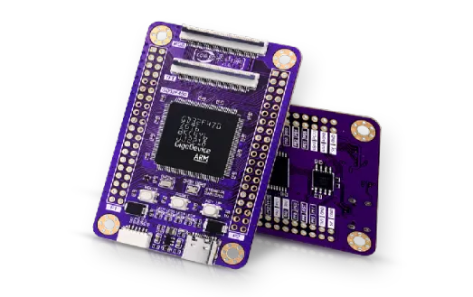
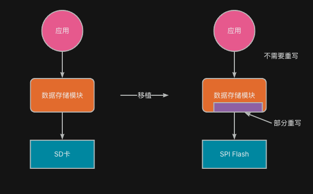
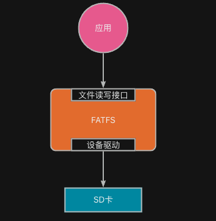
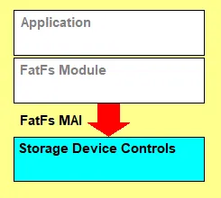
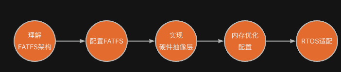

:::tip
同学，你好，欢迎学习本课程！本课程是介绍了FATFS文件系统模块的基本使用，是一门相对较简单的课程。

如果你对文件系统的实现比较感兴趣，也可以关注我的《[从0到1写FAT32文件系统](https://wuptg.xetlk.com/s/VeHie)》课程。

欢迎转载本文章，转载请注明链接来源，谢谢！
:::

## 什么是移植
嵌入式领域的最大一个特点就是平台非标准化，不同的产品中采用的硬件平台是千差万别的。

比如，在有些产品中，可能采用了x86架构的CPU，有些产品采用的则是ARM架构的MCU。有一些产品对于数据的存储采用的是SD卡存储，而有些则采用的是SPI接口的Flash。因此，在很多时候，我们开发的与业务相关的代码至少在某些部分上和底层硬件相关的。

如下图所示，当我们将原先基于SD卡存储的工程代码迁移到新的硬件平台上时；由于此时底层采用了SPI Flash存储，因此，数据存储模块中将数据存储到硬件设备上的相关代码则需要重写，而上层的应用，由于其不直接操作硬件，而只是调用数据存储模块相关的代码，因此应用程序程序无需改动。

因此，**所谓的移植，就是当你拿到一个别人或自己已经写入的软件模块之后，针对新的平台（软件或硬件）对模块做一些修修改改，或者添加一些新的代码，使用能够运行在新的平台上**。

## 移植FATFS
在本系列课程的《FATFS基本入门指南》课程中，我们已经了解了FATFS的基本使用。通过课程可知，FATFS就是一个软件模块，它能够帮助我们去按FAT32等文件系列的规范要去读写存储设备上的文件，并提供一组文件相关API接口供开发者使用。基于这些API，我们可以开发出各种不同的应用程序。

显然，由于嵌入式平台中硬件设备非常多样，FATFS无法支持所有的硬件平台，因此在设计上，作者就考虑到了可移植性，将核心逻辑与硬件抽象层（HAL）分离，这意味着在不同的硬件平台上实现FATFS主要涉及到适配或实现这些硬件抽象层的接口。

如上图所示，当我们从FATFS官网下载代码之后，就需要根据特定的嵌入式硬件平台，实现相应的存储设备控制驱动，并对FATFS相关配置进行修改，以使其适合新的硬件平台。

具体而言，我们需要做以下几部分工作：

- **理解FATFS架构和API：** 需要熟悉FATFS提供的接口和配置选项，这包括如何创建、读取、写入和删除文件，以及如何创建和管理目录。
- **配置FATFS：** 根据嵌入式系统的需求和资源限制，调整FATFS的配置。这可能涉及调整缓冲区大小、选择合适的文件系统类型（FAT12/16/32）等
- **实现硬件抽象层：** 主要包含两部分工作
   - **存储设备接口**：FATFS需要通过一个硬件抽象层与存储介质（如SD卡、NAND/NOR闪存等）进行通信。这意味着需要为存储设备实现或适配FATFS的底层初始化、读、写等接口
   - **时钟源**：在对文件进行写入等操作时，需要更新文件的相关访问时间，因此还需要为FATFS提供时间戳相关接
- **内存优化配置：** 考虑到嵌入式设备的资源限制，优化FATFS的内存使用是移植过程中的一个重要方面。这可能涉及调整FATFS的内部缓冲区大小和数量，以适应有限的内存资源。
- **实现RTOS相关适配**：在一些支持多任务同时访问存储设备的情况下，需要使用RTOS相关的互斥等功能以避免多任务同时读写存储设备造成的问题，因此，还需要针对RTOS提供相关的适合接口。

（注意，由于部分配置工作需要对FATFS相关架构有所了解，因此这些配置在本课程中不涉及，会在后续相关课程中介绍）

完成上述步骤后，FATFS应该能够在新的嵌入式硬件平台上正常工作，为应用程序提供标准的文件操作接口。由于嵌入式系统的硬件配置和性能差异较大，移植过程中可能会遇到特定的挑战和问题，因此需要根据实际情况进行调整和优化。
