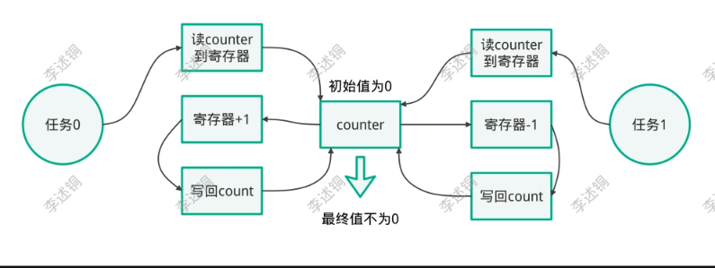
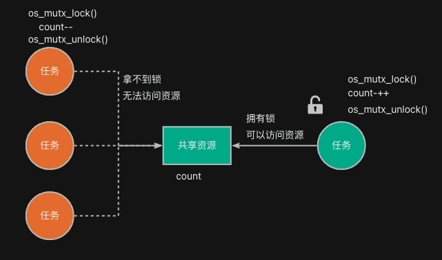
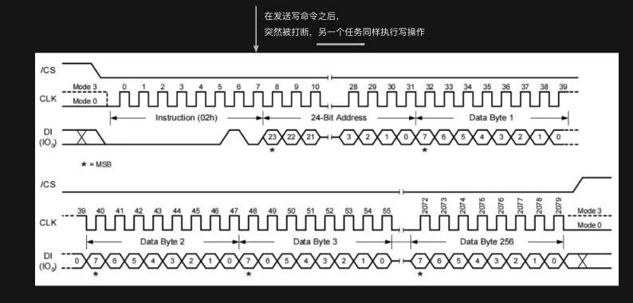
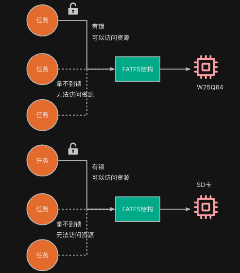

:::tip
同学，你好，欢迎学习本课程！本课程是介绍了FATFS文件系统模块的基本使用，是一门相对较简单的课程。

如果你对文件系统的实现比较感兴趣，也可以关注我的《[从0到1写FAT32文件系统](https://wuptg.xetlk.com/s/VeHie)》课程。

欢迎转载本文章，转载请注明链接来源，谢谢！
:::

## 主要问题
### 多任务环境下的资源访问问题
当我们在系统中使用了RTOS之后，整个程序的架构就由原来的单任务变成了多任务。

在多任务运行的环境中，很容易面临的一个问题是资源竞争：当多个任务同时读写一个共享的数据、设备时，很容易发生冲突的情况。例如：两个任务同时对一个全局变量counter进行访问，由于任务运行时序的问题，会导致counter的值在读写过程中出现数据被覆盖的情况，使得最终counter的不符合设计预期。



所以，多任务环境下操作共享资源时，我们需要借助RTOS中的一些任务间资源互斥的机制，如锁、互斥信号量等。其原理是在任务访问某个共享资源之前，需要先拿到锁。一旦拿到锁之后，其它任务将无法获得该锁，只能等持有锁的任务完成资源访问并释放锁之后，才能访问资源。



### FATFS中的资源访问问题
类似地，在多任务环境下，对设备的读写也存在着冲突的问题。主要表现在两点：

第一、当A任务在对设备进行读写操作时，可能B任务突然会打断这个过程对设备进行读写，此时会导致整个设备的读写时序混乱。例如，在下图中，当A任务对W25Q64进行写操作时，刚刚发送了命令0x2；此时，B打断了A，也进行写，同样发送了0x02命令。那么就会导致W25Q64连续两次收到命令0x02，写时序就完全混乱了。



第二、FATFS内部数据需要在多任务环境下进行保护，以避免冲突。如下代码所示，在使用某个存储设备之前，需要先进行挂载，在f_mount函数中需要传入一个FATFS结构的指针。后续所有对该设备上的文件进行创建、读写操作时，FATFS在内部都会用到该FATFS结构，用于设备扇区数据的缓存，属性数据的存储。
```rust
static FATFS fs;
static FIL fil;

// 挂载并初始化
FRESULT res = f_mount(&fs, "1:", 1);
if (res) {
    printf("文件系统挂载失败.\r\n");
    return;
}

typedef struct {
	BYTE	fs_type;		/* Filesystem type (0:not mounted) */
	BYTE	pdrv;			/* Volume hosting physical drive */
	BYTE	ldrv;			/* Logical drive number (used only when FF_FS_REENTRANT) */
	BYTE	n_fats;			/* Number of FATs (1 or 2) */
	BYTE	wflag;			/* win[] status (b0:dirty) */
	BYTE	fsi_flag;		/* FSINFO status (b7:disabled, b0:dirty) */
	WORD	id;				/* Volume mount ID */
	WORD	n_rootdir;		/* Number of root directory entries (FAT12/16) */
	WORD	csize;			/* Cluster size [sectors] */
#if FF_MAX_SS != FF_MIN_SS
	WORD	ssize;			/* Sector size (512, 1024, 2048 or 4096) */
#endif
#if FF_USE_LFN
	WCHAR*	lfnbuf;			/* LFN working buffer */
#endif
#if FF_FS_EXFAT
	BYTE*	dirbuf;			/* Directory entry block scratchpad buffer for exFAT */
#endif
#if !FF_FS_READONLY
	DWORD	last_clst;		/* Last allocated cluster */
	DWORD	free_clst;		/* Number of free clusters */
#endif
#if FF_FS_RPATH
	DWORD	cdir;			/* Current directory start cluster (0:root) */
#if FF_FS_EXFAT
	DWORD	cdc_scl;		/* Containing directory start cluster (invalid when cdir is 0) */
	DWORD	cdc_size;		/* b31-b8:Size of containing directory, b7-b0: Chain status */
	DWORD	cdc_ofs;		/* Offset in the containing directory (invalid when cdir is 0) */
#endif
#endif
	DWORD	n_fatent;		/* Number of FAT entries (number of clusters + 2) */
	DWORD	fsize;			/* Number of sectors per FAT */
	LBA_t	volbase;		/* Volume base sector */
	LBA_t	fatbase;		/* FAT base sector */
	LBA_t	dirbase;		/* Root directory base sector (FAT12/16) or cluster (FAT32/exFAT) */
	LBA_t	database;		/* Data base sector */
#if FF_FS_EXFAT
	LBA_t	bitbase;		/* Allocation bitmap base sector */
#endif
	LBA_t	winsect;		/* Current sector appearing in the win[] */
	BYTE	win[FF_MAX_SS];	/* Disk access window for Directory, FAT (and file data at tiny cfg) */
} FATFS;
```
所以，该结构相当于是一个全局变量。多任务访问时同样存在冲突的问题。因此，同样需要对FATFS结构中的数据进行保护。

### 解决方案
为了解决上述问题，FATFS在设置时要求如果采用了多任务，并且存在多个任务同时读写同一设备上的设备时，就必须给每个FATFS配置一个锁（互斥信号量）。

这样一来，当任务需要访问某个设备上的文件时，需要先获取锁，拿到锁之后再进行访问。



## 移植步骤
在FATFS中的ffsystem.c中提供了现成的移植代码。在使用时，先将FF_FS_REENTRANT设置成1，以开启多任务访问的支持。在文件中，与多任务访问相关的代码主要是互斥信号量（mutex)的创建、删除、上锁、解锁这四个接口的实现。

FATFS提供了多种系统的移植代码，只需要根据实际的使用情况将OS_TYPE定义成对应的数值即可。如果没有你用的系统配置项，需要自行实现相应的代码。

例如，下面的给出ff_mutex_create具体代码。
```rust
int ff_mutex_create (	/* Returns 1:Function succeeded or 0:Could not create the mutex */
	int vol				/* Mutex ID: Volume mutex (0 to FF_VOLUMES - 1) or system mutex (FF_VOLUMES) */
)
{
#if OS_TYPE == 0	/* Win32 */
	Mutex[vol] = CreateMutex(NULL, FALSE, NULL);
	return (int)(Mutex[vol] != INVALID_HANDLE_VALUE);

#elif OS_TYPE == 1	/* uITRON */
	T_CMTX cmtx = {TA_TPRI,1};

	Mutex[vol] = acre_mtx(&cmtx);
	return (int)(Mutex[vol] > 0);

#elif OS_TYPE == 2	/* uC/OS-II */
	OS_ERR err;

	Mutex[vol] = OSMutexCreate(0, &err);
	return (int)(err == OS_NO_ERR);

#elif OS_TYPE == 3	/* FreeRTOS */
	Mutex[vol] = xSemaphoreCreateMutex();
	return (int)(Mutex[vol] != NULL);

#elif OS_TYPE == 4	/* CMSIS-RTOS */
	osMutexDef(cmsis_os_mutex);

	Mutex[vol] = osMutexCreate(osMutex(cmsis_os_mutex));
	return (int)(Mutex[vol] != NULL);

#endif
}
```


