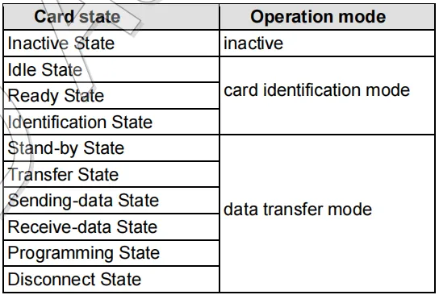

:::tip
同学，你好，欢迎学习本课程！本课程是介绍了FATFS文件系统模块的基本使用，是一门相对较简单的课程。

如果你对文件系统的实现比较感兴趣，也可以关注我的《[从0到1写FAT32文件系统](https://wuptg.xetlk.com/s/VeHie)》课程。

欢迎转载本文章，转载请注明链接来源，谢谢！
:::

本章介绍如何将FATFS文件系统移植到GD32F470（ARM Cortex-M芯片），主要介绍让FATFS支持开发板的TF卡。

:::warning
注意：TF卡的读写驱动较为复杂，本课程中不会一步步地去写这块，而是直接GD官方提供的TF卡读写驱动来进行分析，讲解如何进行移植。
:::

> 我原本打算是做一些SD卡相关驱动的讲解的，不过发现过于复杂。主要有两方面的原因：
> - 一是需要对GD32F470这颗芯片的SD控制器部分有所了解。说实话，我对这块现在没什么兴趣，主要原因是想节省时间，觉得没有必要花时间去了解这块，用官方提供的参考代码即可。
> - 二是SD卡本身的相关细节比较复杂，因为经历了那么多年的发现，有不同的版本、不同速度等级的卡。而且SD卡本身能提供的功能也较多，如读写、设置密码、锁定等，相关的命令也多。
> 
> 简而言之，就是比较懒吧。这个事情能做，但是觉得深入去做这个事情意义不大，本身就是做的免费开放的课程，没有多大的收益。
> 
> 所以，最终选择的方案是从GD网站上下载到它的SD卡驱动，直接给用起来。课程只我只做一些分析，不动手去写这块。如果你看这些驱动文件，会发现里面的细节挺多的，真讲起来确实是比较费劲。

## 硬件连接
如下图所示，梁山派开发板板载了一个TF卡插槽，可以插入一个小的TF卡。GD32F470通过SD接口连接卡，共使用了6根信号线：CLK、CMD、D0-D3。


SD卡本身支持SD接口和SPI接口，由硬件连接可知，其设计采用的是SD接口，并且使用四根信号号进行数据传输。
## 实现原理
### 移植思路
SD卡相比W25Q64这种SPI Flash在读写逻辑上要简单很多，没有复杂的块、扇区、页这种多层次的存储组织结构、此外，在SD卡上进行写操作之前，并不需要显式地执行擦除操作。通常情况下，SD卡会自动管理其存储空间的擦除和写入操作。当主机发送写入命令时，SD卡会根据需要擦除相应的块或扇区，并将新数据写入其中。

因此，在我们看来，SD卡就是由大量连续的数据块组成，数据块的大小固定为512字节。


因此，在进行移植时，只需要参考[移植到Visual Studio](visualstudio.md)中的方法，实现SD卡的初始化、块读取和块擦除这些基本的功能即可。

### 接口实现
由于GD官方已经将SD卡的初始化、块读写等驱动做好，所以这里我们只需要调用即可。

此外，这里仍然需要保留原来的W25Q64的代码，以便让FATFS同时支持板上的SD卡和该存储芯片。为了实现这种，这里为SD卡新增加了一个设备号DEV_SDCARD。

对于设备初始化，直接调用sd_io_init()完成初始化。在该函数中，会完成卡类型的检测、容量的读取等功能。

```c
DSTATUS disk_initialize (
	BYTE pdrv				/* Physical drive nmuber to identify the drive */
)
{
	if (pdrv == DEV_SPIFLASH) {
		w25q64_init_config();
	} else if (pdrv == DEV_SDCARD) {
        uint8_t res=sd_io_init();	//SD卡初始化 
        if(res == SD_OK) {
			return RES_OK;
        }
    }
	
	return RES_OK;
}
```

在读取SD卡时，在只读取一个块时，使用sd_block_read()进行读取；而当需要读取多个数据块时，使用sd_multiblocks_read读取。

```c
DRESULT disk_read (
	BYTE pdrv,		/* Physical drive nmuber to identify the drive */
	BYTE *buff,		/* Data buffer to store read data */
	LBA_t sector,	/* Start sector in LBA */
	UINT count		/* Number of sectors to read */
)
{
	if (pdrv == DEV_SPIFLASH) {
		uint32_t addr = sector * SECTOR_SIZE;

		for (int i = 0; i < count; i++) {
			W25Q64_read_sector(buff, addr, SECTOR_SIZE);
			addr += SECTOR_SIZE;
            buff += SECTOR_SIZE;
		}
		return RES_OK;
	} else if (pdrv == DEV_SDCARD) {
        //printf("sd_block_read sector: %d  count: %d \r\n",sector,count);
				
        uint8_t res;
        if (count == 1) {
            res = sd_block_read((uint32_t *)buff, sector * 512, 512);
        } else {
            res = sd_multiblocks_read((uint32_t*)buff,sector * 512, 512, count);	 
        }
        
        if(res == SD_OK) {
            return RES_OK;
        }
    }
	return RES_PARERR;
}
```

写入SD卡的代码和读取类似。

```c
DRESULT disk_write (
	BYTE pdrv,			/* Physical drive nmuber to identify the drive */
	const BYTE *buff,	/* Data to be written */
	LBA_t sector,		/* Start sector in LBA */
	UINT count			/* Number of sectors to write */
)
{
	if (pdrv == DEV_SPIFLASH) {
		uint32_t addr = sector * SECTOR_SIZE;

		for (int i = 0; i < count; i++) {
            W25Q64_erase_sector(addr);
			W25Q64_write_sector((uint8_t*)buff, addr, SECTOR_SIZE);
			addr += SECTOR_SIZE;
            buff += SECTOR_SIZE;
		}
		return RES_OK;
	} else if (pdrv == DEV_SDCARD) {
        //printf("sd_block_write sector: %d  count: %d \r\n",sector,count);
				
        uint8_t res;
        if (count == 1) {
            res = sd_block_write((uint32_t *)buff, sector * 512, 512);
        } else {
            res = sd_multiblocks_write((uint32_t*)buff,sector * 512, 512, count);	 
        }
        
        if(res == SD_OK) {
            return RES_OK;
        }
    }
	return RES_PARERR;
}
```

## SD卡补充资料

关于SD相关的规范，请见以下文档：

@[Part1PhysicalLayerSimplifiedSpecificationVer9.10Fin_20231201.pdf](/pdf/Part1PhysicalLayerSimplifiedSpecificationVer9.10Fin_20231201.pdf)


该文档从 SD卡协会官方网站上下载到的。SD卡协会是制定和管理SD卡和相关存储标准的组织，TF卡实际上是SD卡协会定义的一种卡型，其比普通的SD卡要小。该规范描述了SD存储卡使用的物理接口和命令协议。

另外，其它可供参考的链接资料：[https://zhuanlan.zhihu.com/p/610495260](https://zhuanlan.zhihu.com/p/610495260)

### SD卡简介
SD卡按照容量可以分为如下几类，一般情况下我们常见的是SDSC和SDHC。

- 标准容量SD存储卡（SDSC）：最高2 GB
- 高容量SD存储卡（SDHC）：大于2GB，最高可达32GB
- 扩展容量SD存储卡（SDXC）：超过32GB，最高可达2TB
- 超大容量SD存储卡（SDUC）：超过2TB，最高可达128TB
#### 操作接口
SD卡的驱动可以使用如下两种方式：

- SD模式：可以采用多根并行的数据线通信，传输速度更快，如上图硬件连接图所示。
- SPI模式：速度较慢
#### 速度等级
一共五个速度等级，并指示卡的最低性能 ：

- Class 0：这些等级卡不指定性能 
- Class 2 大于或等于 2 MB/秒的性能 
- Class 4 的性能大于或等于 4 MB/秒
- Class 6 大于或等于 6 MB/秒的性能
- Class 10 大于或等于10 MB/秒性能
#### 结构
以24 mm x 32 mm x 2.1 mm尺寸的SD卡为例，其引脚排列如下：


- 1号引脚：CD/DAT3（Card Detect）：卡检测线，用于检测卡是否插入，或数据线3，用于双向数据传输。
- 2号引脚：CMD（Command Line）：命令线，用于向卡发送命令。
- 3号引脚：VSS（Ground）：地线引脚，连接到系统的地线。
- 4号引脚：VDD（Power Supply）：电源引脚，连接到系统的电源（通常是3.3V）。
- 5号引脚：CLK（Clock Line）：时钟线，用于同步数据传输。
- 6号引脚：VSS（Ground）：地线引脚，连接到系统的地线。
- 7号引脚：DAT0（Data Line 0）：数据线0，用于双向数据传输。
- 8号引脚：DAT1（Data Line 1）：数据线1，用于双向数据传输。
- 9号引脚：DAT2（Data Line 2）：数据线2，用于双向数据传输。


- 控制器：负责管理数据的读取、写入、擦除和管理存储空间等功能，以及处理与主机设备（如相机、手机）之间的通信。
- 存储区域：主要存储介质，用于存储数据，通常分为扇区（Sector），每个扇区存储一定量的数据。
- 寄存器：
   -  CID（卡识别号）：128位。用于识别SD卡的唯一编号，用于卡的识别。必需。 
   -  RCA（相对卡地址）：16位。由卡动态建议并在初始化期间由主机批准的卡的本地系统地址。必需。 
   -  DSR（驱动器级别寄存器）：16位。用于配置卡的输出驱动器。可选。 
   -  CSD（卡特定数据）：128位。关于卡操作条件的信息。必需。 
   -  SCR（SD配置寄存器）：64位。关于SD存储卡特殊功能能力的信息。必需。 
   -  OCR（操作条件寄存器）：32位。操作条件寄存器。必需。 
   -  SSR（SD状态）：512位。关于卡专有功能的信息。必需。 
   -  CSR（卡状态）：32位。关于卡状态的信息。必需。 

### 工作模式
在我们进行SD卡操作时，需要注意，SD卡有两种工作模式。在进行SD驱动代码阅读时，如果对这个模式有所了解，那么将有助于理解驱动代码。两种模式如下所示：



- 卡识别模式：复位后将处理此模式，用于识别SD卡的类型
- 数据传输模式：用于进入具体的数据传输

### 上电与时钟要求
主机应向卡供电，以便在250 ms内达到最小电压，并开始向SD卡提供至少74个SD时钟，同时保持CMD线为高电平。


上电后，主机需要持续在 sdclk 上发送时钟，频率在范围 100kHz~400kHz 内 (卡初始化阶段要求的时钟频率) 。在图20的流程走完之前都不能提高到 25MHz 。

<details>
<summary>逻辑分析仪抓取的时钟图</summary>
以下是用逻辑分析仪抓取的开发板上，CMD0命令传输的时序图。可以看到，采用到的频率为400KHz。


当初始化完成之后，时钟频率进行了切换，这里切换到了12.5MHz。


</details>

### 速度模式
SD有两种不同的速度模式，可通过CMD6命令，从默认的缺省模式切换到高速模式。

两种速度模式，第一种是25MHz，可达到12.5MB/s传输速度。


第二种是50MHz，可达到25MB/s传输速度。


### 卡识别模式
在卡识别模式下，主机主要重置（reset）所有处于卡识别模式的卡，验证工作电压范围，识别卡并要求它们发布RCA地址。此操作在每张卡上的CMD线进行。完整操作状态切换图如下所示。

一般我们会在很多SD卡的驱动代码中看到对这个流程图中工作流程的实现，本课程中采用的GD官方SD驱动同样如此。


具体的流程和命令如下：

上电后，发送软复位命令（GO_IDLE_STATE（CMD0），从而强制让每个卡设置为空闲状（idle）态。复位之后，卡处理接受命令的状态，且接受的SD输入时钟频率为400KHz（速率太高，卡不接受）。

<details>
<summary>CMD0命令</summary>
CMD0是SD卡命令集中的一条命令，也称为软复位命令（Software Reset）。它的作用是将SD卡复位到初始状态，准备进行初始化和识别等操作。具体作用如下：

- 软复位：CMD0命令会使SD卡复位到初始状态，清除所有寄存器的内容，包括卡的状态寄存器、CID寄存器等，将SD卡设置为初始状态，准备接受后续命令。
- 初始化准备：在初始化SD卡之前，通常会先发送CMD0命令，将SD卡置于一个已知的状态，以确保后续的初始化命令能够正确执行。
- 启动初始化序列：发送CMD0命令后，可以继续发送其他初始化命令，如发送CMD8命令检测SD卡的接口版本和工作电压范围，然后发送ACMD41命令初始化SD卡。

总之，CMD0命令是SD卡初始化和识别过程中的第一步，用于将SD卡复位到初始状态，为后续的操作做准备。
</details>

接下来，发送SEND_IF_COND（CMD8）用于验证SD存储卡接口工作条件。卡通过分析CMD 8的参数来检查操作条件的有效性，主机通过分析CMD 8的响应来检查有效性。电源电压由参数中的VHS字段表示。卡假定VHS中规定的电压为当前提供的电压。如果卡可以在电源电压下工作，则响应回显在命令参数中设置的电源电压和检查模式。如果卡不能在所提供的电压下工作，则不返回响应并保持空闲状态。

<details>
<summary>CMD8命令</summary>
CMD8命令详解CMD8是SD卡中的一条命令，通常用于SD卡的初始化和识别过程中。其作用如下：

1. **检测卡的工作电压**：CMD8命令还用于检测SD卡的工作电压范围。通过发送CMD8命令，主机可以确定SD卡的最低和最高工作电压。
2. **验证卡的响应**：CMD8命令的响应中包含了卡的回应信息，包括卡的工作电压范围。主机可以根据这些信息来验证卡的兼容性和可用性。

需要注意的是，不是所有的SD卡都支持CMD8命令，只有符合SD卡规范版本2.0及以上的卡才会支持该命令。如果SD卡不支持CMD8命令，主机可以根据卡的响应来确定是否继续使用其他命令进行初始化和识别。


</details>

之后，需要发送SD_SEND_OP_COND（ACMD 41)，ACMD41是SD卡命令集中的一条应用命令（Application Command），用于初始化SD卡并查询其操作条件。ACMD41通常需要通过CMD55命令激活（即发送CMD55命令后才能发送ACMD41命令）。其主要作用如下：
<details>
<summary>ACMD41命令</summary>


</details>

ACMD41处理完毕后，SD卡从idle状态，切换进入ready状态。并能可识别子网三种类型的卡。
之后，发送CMD2命令，该命令用于获取SD卡的唯一标识号CID（Card Identification Number）。CID是一个包含128位的寄存器，包含了SD卡的制造商信息、产品序列号等信息。

<details>
<summary>CMD2命令</summary>


</details>

最后， 发送CMD3命令，该命令用于获取SD卡的相对地址（Relative Card Address，RCA）。RCA是一个16位的地址，用于标识SD卡在总线上的位置，从而在多卡环境下区分不同的SD卡。

<details>
<summary>CMD3命令</summary>


</details>

初始化完成之后，我们可能还想获得卡的容量等信息，此时可以发送CMD9命令（该命令在上图中未标注出来）。
<details>
<summary>CMD9命令</summary>
CMD9是SD卡命令集中的一条命令，用于获取SD卡的CSD（Card Specific Data）寄存器内容。CSD寄存器包含了SD卡的操作条件、容量信息等。CMD9命令的主要作用如下：

1. **获取CSD寄存器内容**：通过发送CMD9命令，主机可以获取SD卡的CSD寄存器内容，以便了解SD卡的操作条件和容量信息。
2. **容量信息**：CSD寄存器中包含了SD卡的容量信息，包括总容量、块大小等，可以帮助主机正确配置SD卡的读写操作。
3. **速度等级**：CSD寄存器中还包含了SD卡的速度等级信息，可以帮助主机选择合适的时钟频率和数据传输速率。
4. **写保护状态**：CSD寄存器中包含了SD卡的写保护状态信息，可以告诉主机是否可以对SD卡进行写操作。


</details>


### 数据传输模式
当执行完CMD3命令后，SD卡进入数据传输模式，之后就可以进行SD卡的数据读取。


### 命令格式
SD命令格式如下所示：

- 起始位：命令起始位是一个低电平信号，用于指示SD卡即将接收一个命令。
- 传输位：指示数据的传输方向，1 - 表示由主机发给SD卡
- 命令索引：具体的命令
- 命令参数：针对特定命令附加的参数。
- CRC：用于数据校验的CRC计算结果
- 结束位：结束位是一个高电平信号，用于指示命令传输的结束。


常见的不带数据的命令包含两种：有响应和无响应的命令，其通信过程如下：


<details>
<summary>以下是用逻辑分析仪抓取的时序波形</summary>
如下图所示，CMD0为无响应的命令，CMD8为有响应的命令


</details>

### 块读取命令
如果要进行数据块的读取，首先要发送数据读取命令（例如CMD18(READ_MULTIPLE_BLOCK)），然后等待卡的响应，之前就可以逐个块的读取数据。读取完毕之后，再发送结束传输的命令（如CMD12(STOP_TRANSMISSION)）来终止读取过程。（下面给出了多块读取SD卡的时序图）


其中CMD18命令格式如下：


其接受的是R1类型的响应，该响应格式如下：


结束传输的命令CMD12命令格式如下，其接受R1b格式的响应。该响应与R1相同，不过后面还带了忙等响应传输，用于通知需要主机需要等待数据就绪才能读取。


### 块写入命令
数据块的写入和读取流程差不多。以连续多块写为例，首先发送CMD25(WRITE_MULTIPLE_BLOCK)命令，接下来依次发送各个要写入的块，最后发送CMD12(STOP_TRANSMISSION)结束数据传输。


<details>
<summary>逻辑分析仪抓取波形图</summary>


</details>

## 时序图
为了方便部分同学理解SD卡的时序逻辑图，这里给出了课程所用的示例从启动开始的时序抓取结果。该文件可用梦源的逻辑分析仪软件DSView打开观察，软件下载地址：[https://dreamsourcelab.cn/download/](https://dreamsourcelab.cn/download/)


波形文件：[波形文件](/other/fatfs/DSLogic%20PLus-la-240503-194905.dsl)（下载后解压用DSView打开）

执行disk_initialize函数的波形文件：[初始化文件](/other/fatfs/SD_Init.dsl)

连续多块写入：[连续写入](/other/fatfs/SD_mulwrite.dsl)

连续多块读取：[连续写入](/other/fatfs/Read_mulblock.dsl)


