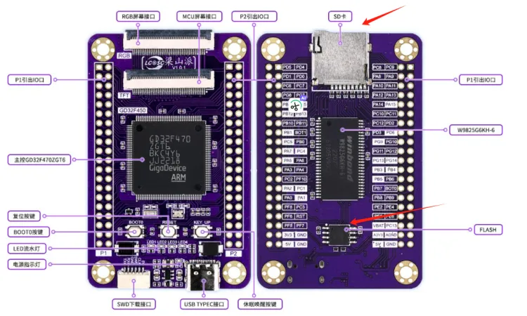
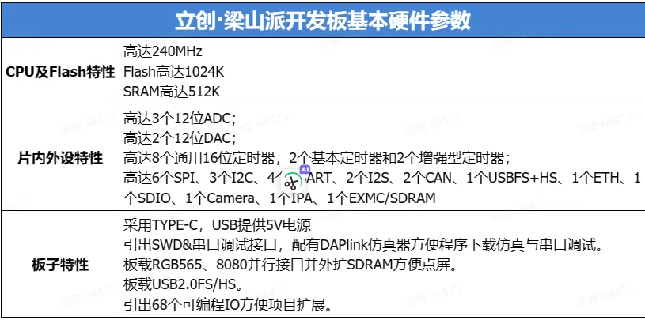
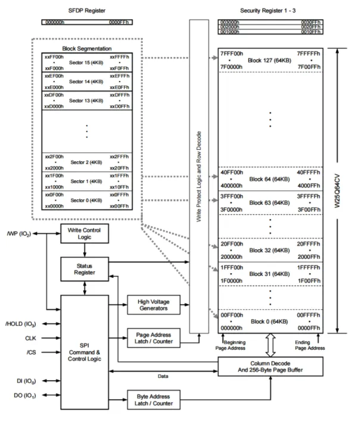
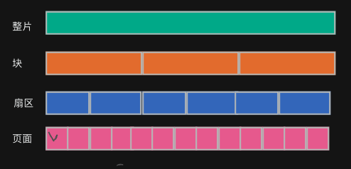
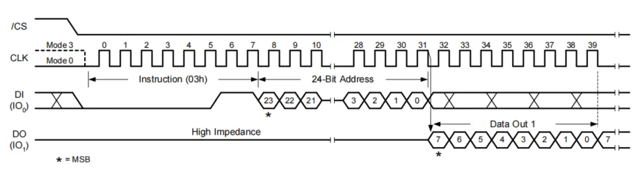
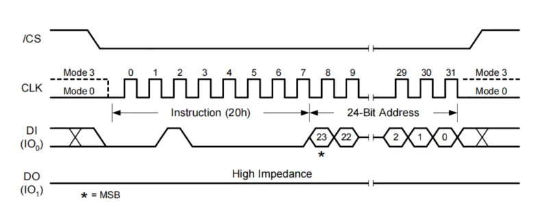
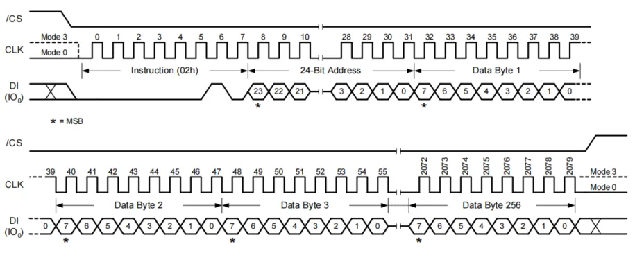
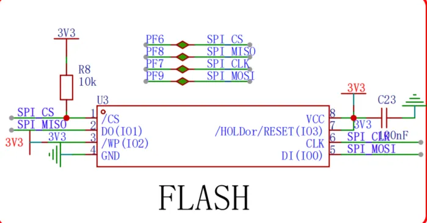

:::tip
同学，你好，欢迎学习本课程！本课程是介绍了FATFS文件系统模块的基本使用，是一门相对较简单的课程。

如果你对文件系统的实现比较感兴趣，也可以关注我的《[从0到1写FAT32文件系统](https://wuptg.xetlk.com/s/VeHie)》课程。

欢迎转载本文章，转载请注明链接来源，谢谢！
:::

本章介绍如何将FATFS文件系统移植到GD32F470（ARM Cortex-M芯片），主要介绍让FATFS支持开发板上的外部SPI Flash和。
## 开发板介绍
(你可以选择自己手上已有的开发板，然后针对性地就工程代码编写做相应的调整即可。不需要用和我完全一样的板子，因为学习目标是理解FATFS的移植)

课程采用的开发板为嘉立创设计的**立创·梁山派**，该开发板资料全部开源，并且可以很方便的购买获得，价格也便宜。

- 资料链接：[https://lceda001.feishu.cn/wiki/Xd0bwwTEsioLczk2S8Hc4hHEnRd](https://lceda001.feishu.cn/wiki/Xd0bwwTEsioLczk2S8Hc4hHEnRd)
- 购买链接：[https://item.szlcsc.com/5810323.html](https://item.szlcsc.com/5810323.html)



开发板的主要特性如下，性能上比较强劲，对我们课程的学习来说绰绰有余。我们只需要用到板上的SPI Flash和SD卡，如上图红色箭头所示。且开发板自带DAPLink仿真器，可以方便我们直接使用。



## W25Q64简介
在之前的课程中，FATFS运行在PC机上，作为普通应用程序的一部分运行。但实际上，FATFS还支持其它多种类型的存储设备，如硬盘、U盘、存储卡，spi_flash、甚至单片机内部FLASH。不同的设备有其不同的特点。

梁山派开发板上板载了一颗8M大小的基于SPI通信接口的Flash( W25Q64 )。

W25Q64是由Winbond生产的一种串行闪存芯片，具体型号通常是W25Q64FV。这种芯片广泛用于数据存储需求中，它提供了64Mbit（等于8MB）的存储空间，非常适合用在需要中等存储容量的嵌入式系统中，如笔记本电脑的BIOS芯片、路由器、DVD、无线通讯设备以及其他电子设备。

[W25Q64CV芯片手册](/pdf/W25Q64CV.PDF)

### 主要特性

- 存储容量：W25Q64提供64Mbit的存储容量，通常以字节为单位表示，即8MB。
- 接口类型：使用标准的SPI（串行外设接口），支持单SPI、双SPI和四SPI操作，使得数据传输速率可以非常灵活地从低速到高速。
- 高速读写：W25Q64支持高达104MHz的时钟频率，具有高速读取功能，例如快速读取、双输出快速读取、四输出快速读取等，这使得读取操作非常快速。这种芯片的写入操作也很高效，支持页编程和扇区/块擦除。
- 擦除和编程性能：页面大小为256字节。扇区擦除为4KB，块擦除为32KB和64KB。
- 低功耗：W25Q64具有较低的功耗，适用于便携式设备。它支持功耗降低模式，如深度功耗下降和待机模式。
- 软件和硬件保护：提供写保护功能，确保数据安全。通过状态寄存器的位设置，可以实现对写操作的锁定。
  
### 存储结构
这里，我们主要关心其内部存储组织结构，该芯片通过分层的存储架构来组织存储，包括扇区、块和页面。如下图所示。



上图中，相关的术语介绍如下：

- 扇区 (Sector)：最小的擦除单位，每个扇区大小为4KB。W25Q64具有2048个扇区。
- 块 (Block)：块是较大的存储单位。W25Q64中的块分为两种大小：32KB和64KB。每个32KB块包含8个扇区，而每个64KB块包含16个扇区。
- 页面 (Page)：页面是写入操作的最小单位，每页256字节。

在实际进行写入时，必须先执行擦除，然后再进行写入。可以对任意页面进行编程（写入），但擦除操作只能在扇区或块级别进行。这意味着如果需要修改存储在某个扇区的少量数据，通常需要读取整个扇区，修改数据，擦除整个扇区，然后重新写入修改后的数据。



### 读写时序
W25Q64支持多种类型的传输时序，这里我只用到了如下几种。

（如果你想优化传输速度，以及获取有关芯片保护相关的特性，可以自行查看下数据手册。）

#### 数据读取
为了从存储器中读取数据，可以使用最基础的数据读取命令（0x3），其具体时序如下所示：

- 步骤 1: 启动传输，通过SPI总线发送0x03命令字节。
- 步骤 2: 发送地址：主设备发送3个或4个地址字节（具体取决于芯片的存储容量和配置），这些字节指定了数据读取的起始地址。
- 步骤 3: 读取数据，芯片开始在MISO线上序列输出数据。主设备可以持续读取数据，直到其结束传输。读取的数据量由主设备控制，可以是任意长度，从几个字节到整个存储器的连续读取。



读取命令的操作速度较慢，数据传输速率通常受限于标准SPI速率。对于需要更快数据传输速率的应用，可能会使用双输出、四输出或四线串行接口命令。

#### 扇区擦除命令0x20
该命令用于擦除存储器的一个扇区4KB，将其内部全部设置成0xFF。

- 步骤 1: 发送命令：主设备（如微控制器或微处理器）通过SPI接口发送扇区擦除的命令字节0x20。
- 步骤 2: 发送地址：主设备发送3个地址字节，这些字节精确指定了需要擦除的扇区的地址。通常，地址应对齐到4KB的边界，即地址的最低12位应为0。
- 步骤 3: 等待擦除完成：扇区擦除是一个耗时操作。芯片在接收到擦除命令后，会开始内部擦除过程，这可能需要几十毫秒到几百毫秒的时间。在擦除过程中，芯片通常不响应其他命令，因此主设备可能需要查询状态寄存器，以确定擦除操作何时完成



#### 页编程命令0x02
该命令用于向闪存的单个页写入数据（256字节），具体时序如下：

- 步骤 1: 发送命令：主设备发送页编程的命令字节0x02。
- 步骤 2: 发送地址：主设备发送3个地址字节。这些地址字节定义了数据应当被写入的精确位置。地址需要在页的边界上对齐，即地址的低8位应为0。
- 步骤 3: 写入数据：主设备开始传输要写入的数据。可以一次性写入最多256字节，即一页的大小。
- 步骤 4: 等待写入完成。完成写入后，芯片将需要一定时间来将数据物理写入到存储单元中。主设备可能需要检查状态寄存器来确定写入何时完成，因为在写入完成之前，芯片不能接受其他命令。



## 硬件连接
该Flash集成了开发板上，电路原理图如下所示。可以看到，使用了标准的SPI四根管脚：CS、MISO、MOSI、CLK进行连接。具体如何连接到GD32F4，这个我们无需深究。



## 移植工作
通过前面课程的内容学习可知，FATFS被设计成用于支持在块存储设备的进行FAT文件系统的处理，而W25Q64正好也是块设备。因此，其是适合用FATFS的。

为了进行移植，我们需要完成以下工作：

- 选择块大小
- 实现W25Q64的读写访问驱动
- 将访问驱动加入到FATFS的diskio.c中
- 初始化W25Q64，建立分区，格式化分区，建立FAT文件系统分区
- 
### 块大小是多少
W25Q64支持多种不同大小的存储块访问，可以基于256字节页读取，也可以基于4KB扇区写入，4KB扇区擦除、32KB擦除、64KB擦除。同时，由于Flash本身的特性，要求在写入之前，相应地址区域的内容必须是已经擦除状态才能写入。

FATFS本身并没有包含任何进行擦除的代码，因此写入之前，必须由diskio.c中的代码进行擦除操作。

此外，由于FATFS底层的diskio.c中的disk_read和disk_write操作的基本单元为相同大小的数据块；综合来看，在这里可以选择以4KB扇区为单位进行操作。也就是说，**在FATFS看来，对W25Q64的访问，以4KB的数据块为大小进行读取和写入**。

> **为什么不选择32KB或64KB？**
> 主要原因在于W25Q64太小了，只有8MB空间。以32KB或64KB块大小进行访问，整个存储器算下来没有多少个数据块。而FATFS对于文件的存储是以簇为单位进行存储，一个簇的大小至少是32KB或64KB的大小。
> 也就是说，哪怕一个文件只有4字节大小，也会占用几十KB的空间。这样就导致存储文件时，整个Flash空间存不了几个文件。
> **为什么不选择256字节？**
> 由于W25Q64在写入之前必须擦除，而其本身并不支持256字节的页擦除，所以不能选择。

### 实现SPI驱动

这部分内容没什么可写的。

既然你能够学到这里，利用GD32F470的SPI接口读取W25Q64应该不是问题。

### 实现diskio.c驱动
diskio.c中各函数的功能在前面的课程中已经介绍过，这里简介具体的实现。

（注意，为了简单易于理解，代码中没有加入超时、错误判断等内容。这部分可自行优化）

disk_initialize的主要功能是进行SPI接口的初始化，调用了底层的w25q64_init_config()函数初始化GD32F470的相关引脚、SPI控制器。

你也可以在初始化时，加入读取芯片ID的命令，来判断硬件是否连接成功。

```c
DSTATUS disk_initialize (
	BYTE pdrv				/* Physical drive nmuber to identify the drive */
)
{
	if (pdrv == DEV_SPIFLASH) {
		w25q64_init_config();
	}
	
	return RES_OK;
}
```
disk_read()的实现主要是调用W25Q64_read_sector()读取指定的扇区。实现较为简单，代码如下。
```c
DRESULT disk_read (
	BYTE pdrv,		/* Physical drive nmuber to identify the drive */
	BYTE *buff,		/* Data buffer to store read data */
	LBA_t sector,	/* Start sector in LBA */
	UINT count		/* Number of sectors to read */
)
{
	if (pdrv == DEV_SPIFLASH) {
		uint32_t addr = sector * SECTOR_SIZE;

		for (int i = 0; i < count; i++) {
			W25Q64_read_sector(buff, addr, SECTOR_SIZE);
			addr += SECTOR_SIZE;
		}
		return RES_OK;
	}
	return RES_PARERR;
}
```
disk_write主要调用W25Q64_write_sector()进行写。由于写入之前需要先擦除，因此写之前调用了W25Q64_erase_sector()进行擦除。
```c
DRESULT disk_write (
    BYTE pdrv,          /* Physical drive nmuber to identify the drive */
    const BYTE *buff,   /* Data to be written */
    LBA_t sector,       /* Start sector in LBA */
    UINT count          /* Number of sectors to write */
)
{
    if (pdrv == DEV_SPIFLASH) {
        uint32_t addr = sector * SECTOR_SIZE;

        for (int i = 0; i < count; i++) {
            W25Q64_erase_sector(addr);
            W25Q64_write_sector(buff, addr, SECTOR_SIZE);
            addr += SECTOR_SIZE;
        }
        return RES_OK;
    }
    return RES_PARERR;
}
```
disk_ioctl中，实现了几个命令的处理，按照W25Q64的实际情况来填写即可。
```c

DRESULT disk_ioctl (
	BYTE pdrv,		/* Physical drive nmuber (0..) */
	BYTE cmd,		/* Control code */
	void *buff		/* Buffer to send/receive control data */
)
{
	if (pdrv == DEV_SPIFLASH) {
		switch (cmd)  {
			case CTRL_SYNC:			// 同步回写
				return RES_OK; 
			case GET_SECTOR_COUNT: {
				// 扇区数量
				*(DWORD * )buff = 2048;//W25Q64 有2048个大小为4k bytes 的扇区
				return RES_OK;
			}
			case GET_SECTOR_SIZE: {
				// 扇区大小
				*(WORD * )buff = 4096;//spi flash的扇区大小是 4K Bytes
				return RES_OK; 
			}
		 }
	}

	return RES_PARERR;

}
```
### 建立分区并格式化
不同于SD卡，W25Q64出厂时内部为空的，不带有分区和文件系统。我们也没有现成的第三方工具对其进行处理。因此，只能使用FATFS进行初始化。

```c
	res = f_mkfs("0:", 0, work, sizeof(work));
```

该函数在执行时，会在W25Q64上创建分区表，并创建一个FAT分区，并进行格式化。

该函数的功能为：在逻辑驱动上创建一个新的FAT文件系统。这个功能特别有用在需要准备一个新存储设备或者重新格式化现有设备以清除数据和重建文件系统结构的情况。

- path: 这是指向存储设备的路径的字符串，通常是逻辑驱动号（如 "0:"）。
- opt: 格式化选项，用于指定文件系统的一些细节，例如是FAT12、FAT16还是FAT32。此参数可以使用库中定义的宏，如FM_FAT, FM_FAT32, FM_EXFAT等。
- au: 指定每个分配单元（即簇）的大小，单位可以是字节或扇区。设置为0表示使用默认的簇大小。
- work: 指向工作缓冲区的指针，f_mkfs 使用这个缓冲区来存储临时数据。
- len: 工作缓冲区的大小，单位是字节。

格式化完成之后，就可以使用FATFS的相关接口进行读写了。

## 注意事项
### 不适合用于存储大文件
显然，由于整个存储芯片大小只有8MB，所以不合适存储大文件。

### 不合适存储太小的文件
由于W25Q64的扇区大小固定为4KB，在格式化时，FATFS也会默认将其格式化成FAT16（FAT12）文件系统，且簇大小为1个扇区。即在进行文件的空间分配时，至少是4KB大小。

因此，如果在实际存储时，每个文件的大小太小，比如只有几十字节；那么，每个文件占用一个簇，则有大量的空间浪费。

很遗憾，这个问题没有什么好的解决方法，只能在应用层调整设计，将文件大小调大一些，以提高存储空间的利用率。

### FATFS没有考虑磨损平衡
由于每个闪存单元都有有限的擦写次数（例如，有的闪存单元可以承受成千上万次擦写），因此，为了延长使用寿命，最好是通过均匀分配操作可以避免某些单元过早磨损。

但是，FAT文件系统本身在诞生之初，面向的对像主要是磁盘，所以并未考虑到后续出现的Flash设备。FATFS本身内部代码中，也没有关于磨损平衡相关的处理，所以不合适大量、频繁的等文件进行创建、删除等高频率操作。


