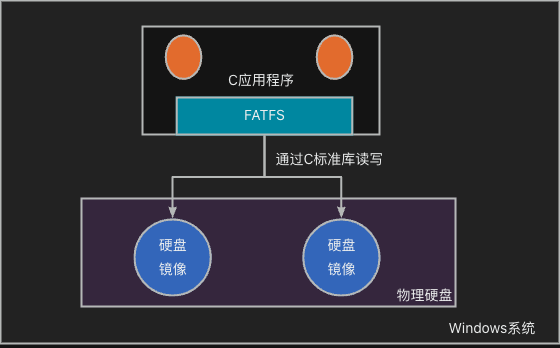
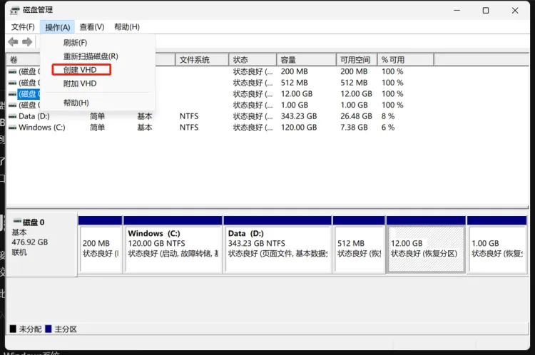
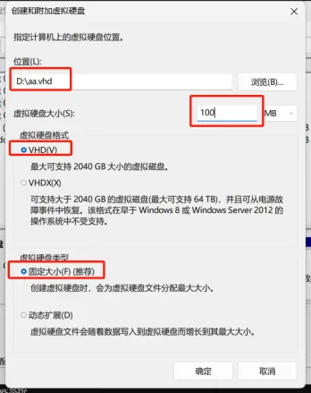
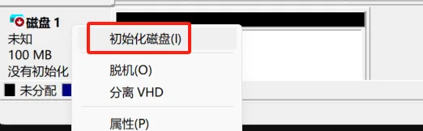
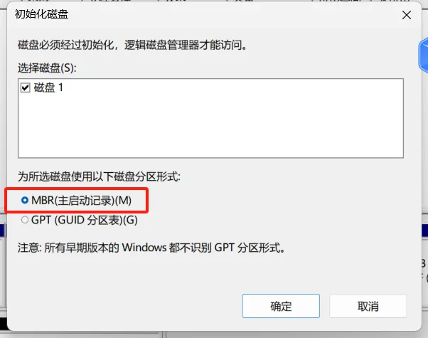
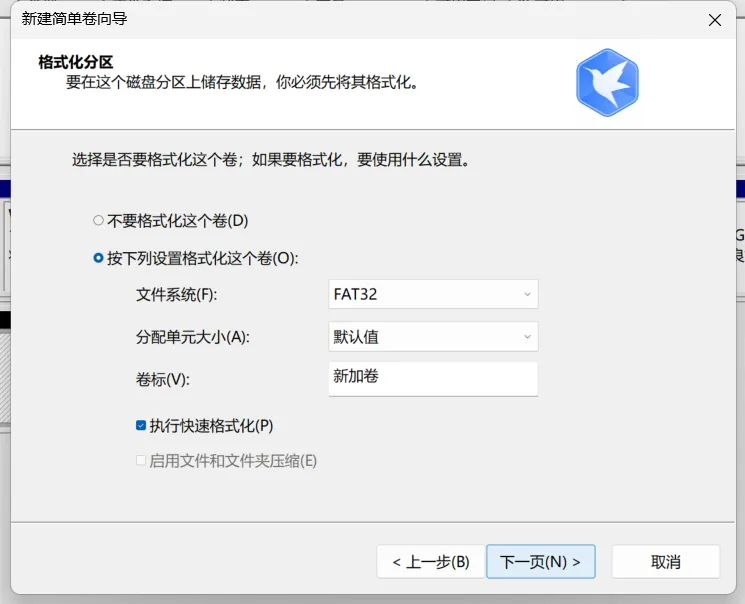
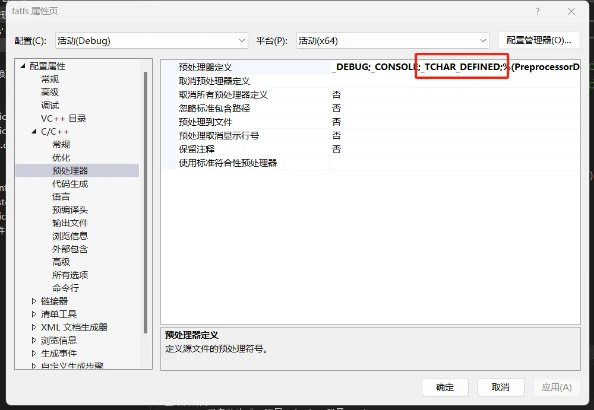

:::tip
同学，你好，欢迎学习本课程！本课程是介绍了FATFS文件系统模块的基本使用，是一门相对较简单的课程。

如果你对文件系统的实现比较感兴趣，也可以关注我的《[从0到1写FAT32文件系统](https://wuptg.xetlk.com/s/VeHie)》课程。

欢迎转载本文章，转载请注明链接来源，谢谢！
:::

本章节介绍如何将FATFS移植到PC机上。这里的移植**是将FATFS运行在用户态中，即在一个简单的C应用程序中访问硬盘映像文件中的文件系统，而不是将其融入到Windows或者Linux内核中**。

之所以选择先移植到PC机上，是因为比较简单，不需要针对具体的存储设备做寄存器写入等相关操作。

> 注意：**文件系统的挂载、读写功能，不支持分区的创建与格式化，也不支持多线程同时访问文件系统。**
> **这些功能**，会在后续章节中介绍移植到STM32平台时再做介绍。

## 整体结构简介
如下图所示，本章中所涉及的程序运行环境是在PC机中，在PC机中可能运行了Windows或者Linux系统。我们要做的工作不是将FATFS移植到Windows或者Linux系统中，而是将**其嵌入到普通的用C语言开发的应用程序中**。

这个应用程序运行时会涉及到文件的读写功能，但是它并不是直接访问物理硬盘上的文件，而是访问硬盘镜像中的文件。在本次移植中，使用了两个硬盘镜像。



硬盘镜像实际上就是普通的文件，只不过里面存放的数据有些特别，它包含了一个存储设备（如硬盘、SSD、USB驱动器等）的完整数据复制。比如，有一块物理硬盘，那么我们可以将该硬盘的全部内容读取出来存储到一个文件中，那么此时就得到了硬盘镜像文件。

有了硬盘镜像文件，我们便可以不直接去操作计算机的实际硬盘，而直接通过简单的C标准库的中文件读写接口，就可以读取其中的数据。这样便可以大大简化对数据的读写。

## 创建硬盘映像文件
硬盘映像文件的创建并不难，可以直接采用一些工具来完成。

第一种方式是直接将整个物理硬盘的内容读取出来，这显然是不合适的。因为我们的电脑往往只有一块硬盘，且硬盘容量比较大。将其中全部内容读取成硬盘映像文件，过程会比较长，且电脑上没有空间存放。

另一种方式是创建创建一个小的硬盘映像文件。具体操作步骤如下：

在Windows的磁盘管理工具中，可以创建vhd格式的硬盘映像文件，如下所示。



选择好文件存放的路径，硬盘的大小、VHD格式且固定大小分配即可。



之后，对该硬盘进行初始化，也就是在硬盘上要创建分区表。



分区表选择MBR分区（注：视频中讲错了，FATFS目前支持GPT分区）。



初始化完成之后，就可以在磁盘上进行分区的创建了。在创建分区时，需要选择FATFS支持的FAT或FAT32格式的文件系统，不要选择NTFS（FATFS不支持）。



通过上述操作，我们就得到了可以被FATFS读写的磁盘映像。

## 创建工程
本部分内容较简单，主要的问题在于解决TCHAR的重定义问题。

主要原因在于Windows的SDK开发包中自带了TCHAR的定义，因此为了避免使用自带的定义，添加了宏
_TCHAR_DEFINED，具体如下图所示。



工程创建完成后，编译即可得到一个普通的控制台应用程序。后期可以将FATFS源码集成进去，实现对前面创建的硬盘映像文件的读写。

## 实现相关的接口

由于本章中的移植只涉及到实现文件的读写功能，因此具体实现较为简单，主要实现以下几个接口。

- 磁盘相关接口：
   - disk_status：获取磁盘的工作状态
   - disk_initialize：初始化磁盘
   - disk_read：读取磁盘
   - disk_write：写磁盘
   - disk_ioctl：向磁盘发送命令
- 时间相关接口
   - get_fattime：获取当前时间

由于我们不需要直接访问物理硬件，而只需要访问磁盘映像文件；而对磁盘映像文件的访问方式很简单，直接使用标准C库<stdio.h>中相关的接口，如fopen, fwrite, fread等接口即可。
所以，与磁盘相关各接口的实现可以实现得非常简单。
> stdio.h中函数使用参考链接：[https://www.runoob.com/cprogramming/c-standard-library-stdio-h.html](https://www.runoob.com/cprogramming/c-standard-library-stdio-h.html)

### 初始化接口
初始化接口中，我们只需要打开磁盘映像文件即可。当然，打开之后还需要保存fopen返回的FILE指针，方便后续对文件进行读写。
由于目前有两个磁盘映像文件，因此根据pdrv进行了区分。不同磁盘映像打开之后，保存到不同的disk_files内部项中。
```rust
DSTATUS disk_initialize (
	BYTE pdrv				/* Physical drive nmuber to identify the drive */
)
{
	if ((pdrv != DEV_DISK1) && (pdrv != DEV_DISK2)) {
		printf("param error");
		return RES_PARERR;
	}

	disk_files[pdrv] = fopen(disk_path[pdrv], "rb+");
	if (disk_files[pdrv] == NULL) {
		printf("open disk file %s failed.\n", disk_path[pdrv]);
		return RES_ERROR;
	}
	return RES_OK;
}
```
而如果我们不需要支持多设备，只支持挂载一个磁盘，那么上述函数可以简化如下。
```rust
static FILE * disk_file = NULL;

DSTATUS disk_initialize (
	BYTE pdrv				/* Physical drive nmuber to identify the drive */
)
{
	disk_file = fopen(disk_path[pdrv], "rb+");
	if (disk_file == NULL) {
		printf("open disk file failed");
		return RES_ERROR;
	}
	return RES_OK;
}
```
### 读取接口
由于磁盘映像文件是磁盘数据空间的完整拷贝，因此可以认为磁盘映像文件由连续的多个数据块（也叫扇区）组成，数据块的大小和磁盘的大小相同。


> 当然，对磁盘映像文件由于本身是一个普通的文件；所以，它是支持从任意位置开始读取。但是，在这里我们是将其作为磁盘上完整的拷贝，因此，对其读写的处理，也要按照和真正磁盘的一样，以块为单位进行读写。
> 磁盘块的大小，一般为512字节。

如果我们要从磁盘的指定扇区开始读取；那么，就可以定位到映像文件中的指定数据块的开始处进行读，实现代码如下：
```rust
DRESULT disk_read (
	BYTE pdrv,		/* Physical drive nmuber to identify the drive */
	BYTE *buff,		/* Data buffer to store read data */
	LBA_t sector,	/* Start sector in LBA */
	UINT count		/* Number of sectors to read */
)
{
	fseek(disk_files[pdrv], sector * SECTOR_SIZE, SEEK_SET);
	size_t size = SECTOR_SIZE * count;
	size_t bytes_read = fread(buff, 1, size, disk_files[pdrv]);
	if (bytes_read == size) {
		return RES_OK;
	}

	printf("read error");
	return RES_PARERR;
}
```
如果只有一个磁盘设备，上述函数也可以简化为：
```rust
DRESULT disk_read (
	BYTE pdrv,		/* Physical drive nmuber to identify the drive */
	BYTE *buff,		/* Data buffer to store read data */
	LBA_t sector,	/* Start sector in LBA */
	UINT count		/* Number of sectors to read */
)
{
	fseek(disk_file, sector * SECTOR_SIZE, SEEK_SET);
	size_t size = SECTOR_SIZE * count;
	size_t bytes_read = fread(buff, 1, size, disk_file);
	if (bytes_read == size) {
		return RES_OK;
	}

	printf("read error");
	return RES_PARERR;
}
```
### 写入接口
写入接口用于向磁盘的指定起始扇区开始，连续写入多个数据块。其实现方式与读取类似，只不过具体操作由读取变成了写入。
```rust

DRESULT disk_write (
	BYTE pdrv,			/* Physical drive nmuber to identify the drive */
	const BYTE *buff,	/* Data to be written */
	LBA_t sector,		/* Start sector in LBA */
	UINT count			/* Number of sectors to write */
)
{
	fseek(disk_files[pdrv], sector * SECTOR_SIZE, SEEK_SET);
	size_t size = SECTOR_SIZE * count;
	size_t bytes_written = fwrite(buff, 1, size, disk_files[pdrv]);
	if (bytes_written == size) {
		return RES_OK;
	}

	printf("write error");
	return RES_PARERR;
}

```
### 操作设备
FATFS中还包含一个操纵操作的接口disk_ioctl，该接口是一个通用的接口，即它本身并没有指定要做什么，而是根据用户传进来的命令+参数，来决定具体要做什么。
```rust
DRESULT disk_ioctl (
  BYTE pdrv,     /* [IN] Drive number */
  BYTE cmd,      /* [IN] Control command code */
  void* buff     /* [I/O] Parameter and data buffer */
);
```
FATFS本身会传入以下几个命令+参数，用于在不同的场合下使用。我们需要根据自己的实际需求来实现。

- CTRL_SYNC：同步之前的写入操作。在一些存储设备上，写入操作是可以被缓存从而提升写入效率的，也就是说当执行了写操作之后，数据会被缓存在某个地方（具体哪里取决于具体设备的实现），还没有真正完全写入。因此，在某些情况下（如关闭文件时），我们可能希望强制将所有数据写入存储设备，此时FATFS就会使用CTRL_SYNC，具体这个命令如何处理取决于硬件环境。
- GET_SECTOR_COUNT：返回存储设备的扇区数量，主要用于f_mkfs()和f_disk()接口
- GET_SECTOR_SIZE：返回存储设备上扇区的字节大小，对于磁盘来说，一般是512字节

除此之外，还有一些其它的命令，本章暂时用不到，所以不做介绍。

该函数具体实现可参考如下：
```rust
DRESULT disk_ioctl (
	BYTE pdrv,		/* Physical drive nmuber (0..) */
	BYTE cmd,		/* Control code */
	void *buff		/* Buffer to send/receive control data */
)
{
	if ((pdrv != DEV_DISK1) && (pdrv != DEV_DISK2)) {
		printf("param error\n");
		return RES_PARERR;
	}

	switch (cmd) {
	case CTRL_SYNC:
		fflush(disk_files[pdrv]);
		return RES_OK;
	case GET_SECTOR_COUNT: {
		fseek(disk_files[pdrv], 0, SEEK_END);
		*((LBA_t*)buff) = (LBA_t)(ftell(disk_files[pdrv]) / SECTOR_SIZE);;
		return RES_OK;
	}

	}
	return RES_PARERR;
}
```
### 获取当前时间
在对文件进行写入、重命令等操作时，需要获取当前时间，以便将对文件创建、修改等行为发生的时间给纪录下来。这些时间会保存在文件系统内部。

FATFS要求返回一个DWORD型的数据，该数据中编码了年-月-日-时-分-秒等时间信息。

由于当前FATFS是作为Windows平台上的普通应用程序的一部分，所以可以直接使用标准C库中的time()等接口来获得当前时间，也可以直接写死，以便在一些无需关心这些时间的场合下简化该函数的实现。

```rust
DWORD get_fattime (void)
{
    time_t t;
    struct tm *stm;


    t = time(0);
    stm = localtime(&t);

    return (DWORD)(stm->tm_year - 80) << 25 |
           (DWORD)(stm->tm_mon + 1) << 21 |
           (DWORD)stm->tm_mday << 16 |
           (DWORD)stm->tm_hour << 11 |
           (DWORD)stm->tm_min << 5 |
           (DWORD)stm->tm_sec >> 1;
}
```
> 参考链接：time.h [https://www.runoob.com/cprogramming/c-standard-library-time-h.html](https://www.runoob.com/cprogramming/c-standard-library-time-h.html)

## 补充说明
### 多线程访问
本章内容中，出于简化起见，没有支持多线程运行，即不存在多个线程同时使用FATFS进行文件读写的情况，因此无需考虑线程间资源同步、互斥等问题。

FATFS往往跑在嵌入式调备上，并且有时会和RTOS一起结合使用。在这种情况下，可能会存在多个任务同时调用FATFS的相关接口进行读写，此时需要考虑互斥。在这种情况下，就需要进行进一步的移植配置。相关内容，会在后续章节中介绍。

### 未支持格式化等接口
格式化接口的支持在本章中是不必要的，因此磁盘映像文件我们已经创建好，并且手动建立了分区并格式化。

所以，在这里我们没有必要刻意去修改disk_xxx相关的底层函数，来支持这些功能。

f_disk和f_mkfs等接口的支持，会在后面有关嵌入式平台上讲移植时有所涉及。


