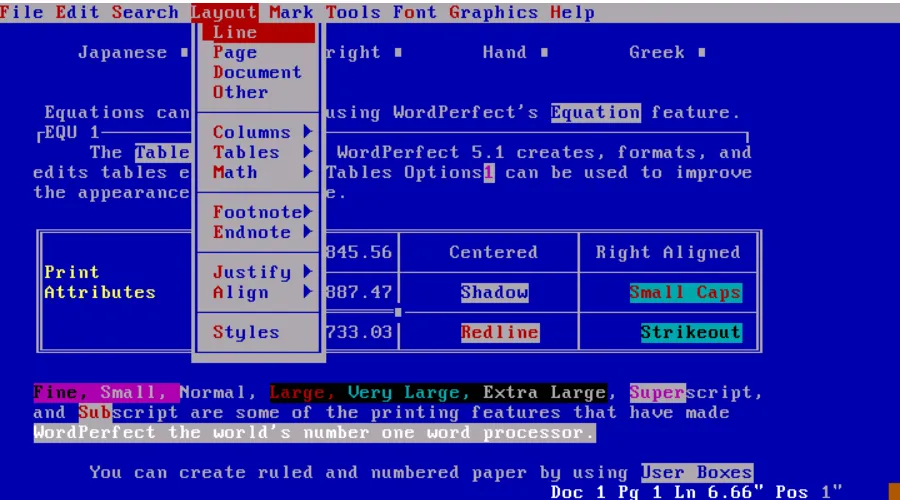

:::tip
同学，你好，欢迎学习本课程！本课程是介绍了FATFS文件系统模块的基本使用，是一门相对较简单的课程。

如果你对文件系统的实现比较感兴趣，也可以关注我的《[从0到1写FAT32文件系统](https://wuptg.xetlk.com/s/VeHie)》课程。

欢迎转载本文章，转载请注明链接来源，谢谢！
:::

为了深入地理解FATFS的使用，我们必须要对它支持哪些文件系统，以及这些文件系统的工作原理有所理解。这样才能在使用某些FATFS接口时，更好理解其特性，从而更加高效地使用这些接口。

> 注意：下面的内容仅从使用FATFS接口的角度去介绍相关的概念，不会涉及FAT文件所有的细节。详细地细节以及原理，在本系列课程的《[从0到1写FAT32文件系统](https://wuptg.xetlk.com/s/VeHie)》中有非常详细的介绍。

## FAT文件系统的起源
FAT 文件系统起源于 1980 年左右，是 MS-DOS 首先支持的文件系统。它最初是为一个简单的文件系统开发的，适用于小于 500k 字节的软盘。在发展过程中，先后经历了FAT12、FAT16、FAT32、EXFAT文件系统的发展。

目前在PC机上，FAT文件系统用得相对较少，但在嵌入式设备中仍然用得较多。
# 存储设备一般结构
FAT文件系统可用于支持不同的存储设备，常见的存储设备为块设备。这类设备在逻辑上而言就是由一系列相同大小的存储块构成，通过相应的接口可以对任意存储块进行读写，且读写时必须以块为单位。
也就是说，如果想要读取某个块中指定位置的数据，那么需要先将整个块中的数据读取出来，然后再从中提取出数据。

这样的块，一般称之为扇区。这是文件系统中一个非常重要的概念。
## FAT文件系统结构
FAT文件系统一般将整个存储区划分为若干区分，分别用于放置不同数据信息。以FAT32文件系统为例，其对存储块划分如下：

各区分说明如下：
- 保留区：存储FAT32文件系统自身相关的一些数据信息，以及启动代码
- FAT表区：存储数据区中使用情况的数据，一般有2个
- 数据区：存储目录或文件的数据。
### 保留区
该区域也被称为引导记录区，是FAT32文件系统中的一个关键部分，它位于文件系统的开头，并包含了关于文件系统的重要信息。具体来说，其中包含以下内容：

- 引导代码：这些代码用于启动操作系统
- BPB（BIOS Parameter Block）：包含关于磁盘的参数信息，如扇区大小、FAT表的大小、每簇扇区数等文件系统需要知道的信息
- 引导扇区标志：标识该扇区为引导扇区，用于操作系统的引导，0x55、0xAA

具体的信息结构可以参考本课程资料的FAT32相关文档。也可以参考我的《[从0到1写FAT32文件系统](https://wuptg.xetlk.com/s/VeHie)》

对于该区域，我们并不需要过多了解。
### 数据区
所有的文件数据和目录等数据信息，均存储在数据区。数据区在管理时为了提高管理的效率，会将数据区以簇为单位进行管理，每个簇大小相同，每簇由一个或多个扇区大小组成。例如，扇区大小为512字节时，簇可以是512字节，1024字节，2048字节等，具体是什么值初始化该文件系统时决定。

所以，从逻辑上来看，数据区就是由很多个相同大小的簇构成。
### FAT表
每个文件在具体存储时，占用数据区中的一个或多个簇。不同文件大小不同，占用的簇数据也不同。且具体给文件分配存储空间时，文件的所有簇并不一定是连续存储，如下图所示。因此，文件的数据簇在FAT文件系统中以链表的形式存储。
在具体存储时，为了提高文件访问的速度，链表的指针全部单独放在FAT表中，数据区中只放置数据部分。

因此，在对一个文件进行读写数据时，先从FAT表中查找共簇链关系表，然后用其中的簇号定位到数据区中的簇，再读取该簇中的数据。
### 目录区
在FAT32文件系统中，无论是目录还是文件，其中所有的信息都保存在director entry的结构中。该结构保存了目录或者文件的名称、创建时间、时期、大小、属性等。

目录本质上也是一个文件，不过里面保存的数据很特殊，就是很多个directory entry条目的集合。因此，如果我们想得知某个目录下有哪些文件，则只需要读取该目录的内容，解析其中的directory entry条目，即可遍历得知。

## 相关课程
如果你对深入学习FAT文件系统有兴趣，欢迎进入下面的课程，学习从0手写一个支持FAT32文件系统的软件模块。你将学到如何设计一个类似FATFS的软件。《[从0到1写FAT32文件系统](https://wuptg.xetlk.com/s/VeHie)》

