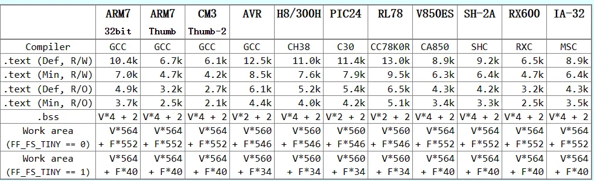
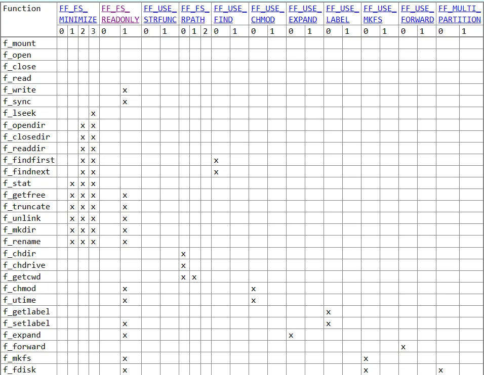
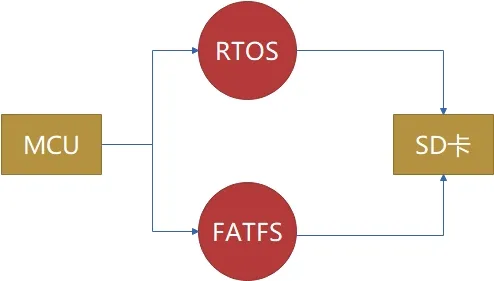

:::tip
同学，你好，欢迎学习本课程！本课程是介绍了FATFS文件系统模块的基本使用，是一门相对较简单的课程。

如果你对文件系统的实现比较感兴趣，也可以关注我的《[从0到1写FAT32文件系统](https://wuptg.xetlk.com/s/VeHie)》课程。

欢迎转载本文章，转载请注明链接来源，谢谢！
:::

## 什么是FATFS？
有的人把FATFS当做是一种文件系统，而实际FATFS并非一种文件系统，而是一种软件模块，可用于对存储设备上的FAT文件系统区域访问。其由ChaN开发，为开源项目，可以自由在产品中使用，不需要开发自己的代码。
目前该文件系统大量应用于嵌入式产品开发中，所以学习该文件系统是非常有价值的。

该软件模块的名称“FatFs”来源于“文件分配表（File Allocation Table）”，以ANSI C（C89）规范编写，并且完全独立于磁盘I/O层，具备跨平台移植性。这使得它能够轻松集成到资源有限的小型嵌入式微控制器中，如8051、PIC、AVR、ARM、Z80、RX等。此外，还提供了适用于微小型微控制器的Petit FatFs模块。
## FATFS特点
FATFS具备以下特点：
- DOS/Windows兼容的FAT/exFAT文件系统。
   - FAT（File Allocation Table）：
      - FAT12：适用于小容量媒体，最大支持16MB
      - FAT16：适用于中等容量媒体，最大支持2GB
      - FAT32：适用于相对大容量媒体，最大支持2TB
   - exFAT（Extended File Allocation Table）：提供更大的文件和卷支持，支持高性能闪存设备等
- 平台无关，易于移植，移植时只需要增加设备驱动层
- 占用非常小的程序代码和工作区空间
- 支持多种配置选项，包括： 
   - 支持ANSI/OEM或Unicode编码的长文件名（LFN）
   - 支持exFAT文件系统、64位LBA（逻辑块地址）和GPT（全局分区表）以应对大容量存储
   - 在实时操作系统（RTOS）中线程安全
   - 多卷支持（物理驱动器和分区）
   - 可变扇区大小
   - 多种字符编码，包括双字节字符集（DBCS）
   - 只读模式、可选API、I/O缓冲区等等

对于具体这些特性的理解，在本系列课程中会有相关介绍。因此，如果你暂时看不明白上面的也不用担心，随时学习过程的深入，这些特性你会很自然地理解到。
## 存储占用
在FATFS官网给出了不同处理器下的编译结果供参考。其中V代表挂载的卷的数量，F代表打开的文件数量。
具体到我们自己所用的处理器上，存储器的占用空间大小，取决于所用的编译器和FATFS配置参数。

FATFS的主要功能以函数方式提供，其设计较简单。为了能较大幅度裁剪以节省存储空间，很多函数都可以用宏来控制是否打开。

## 具体应用
在具体项目中，我们可以将其移植到MCU上，并结合RTOS，从而直接像在Windows系统上那样用相应的文件读写接口open/write/read函数来读写SD卡的文件。

其中RTOS并不是必须的，也可以直接在祼机上跑FATFS。
## 官网链接
FATFS文档及代码下载链接：[http://elm-chan.org/fsw/ff/00index_e.html](http://elm-chan.org/fsw/ff/00index_e.html)
## 注意事项
FATFS的各项接口设计，有的参考了标准C库中相关文件访问的接口，有的参考了Linux系统上的文件访问相关的系统调用接口。

