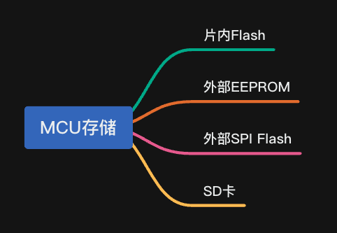
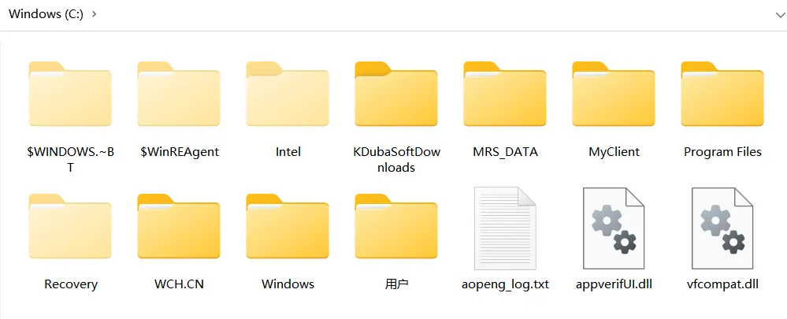
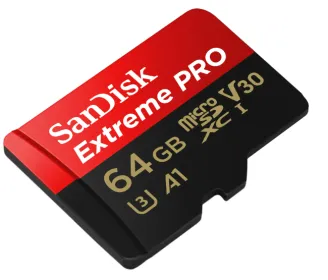
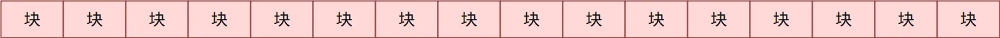

:::tip
同学，你好，欢迎学习本课程！本课程是介绍了FATFS文件系统模块的基本使用，是一门相对较简单的课程。

如果你对文件系统的实现比较感兴趣，也可以关注我的《[从0到1写FAT32文件系统](https://wuptg.xetlk.com/s/VeHie)》课程。

欢迎转载本文章，转载请注明链接来源，谢谢！
:::

 在学习FATFS之前，首先要搞清楚什么是文件系统，理解其中的基本原理、主要概念，然后再学学习如何使用。如果没有这些基础知识的理解，一上来就试图去使用FATFS；那么，在后续的使用过程中，你很有可能会遇到各种各样的问题。而实际上，这些问题往往是由于你对文件系统本身的基本概念和原理不理解导致的。

所以，我的个人建议是：**先学习和理解基本的概念和原理，有基础之后再进行实践**。
## 为什么需要文件系统
在一些嵌入式设备中，有时需要进行数据存储。对于一些较小的、简单的数据（可能由几十字节、几百字节），可以直接存储在MCU内部的Flash区域里，或者外挂一颗小的EEPROM。如果数据量更大一些，可以外挂一颗大容量的SPI接口的Flash。

在这些场合中，数据的存储要求是比较简单的，大多只要求能够将数据存储起来就行。对具体的存储格式没有什么特定的要求，数据本身的结构也比较简单，对数据的修改也较为简单。所以，我们只需要编写简单的代码就能够完成这些要求。

但是在某些情况下，对数据存储有一定的要求，此时无论是片内MCU，还是EEPROM和Flash，满足不了需求。此时，需要使用文件系统。

- 大数量数据存储：当需要存储大量的数据，包括配置文件、日志、固件升级等。MCU片内存储空间不够大，只能存储在外部存储设备，此时需要考虑数据在这些设备上如何存储。数量量大了之前，存储相对复杂
-  数据组织：文件系统提供了一种结构化的方式来组织数据，包括文件和目录。这有助于在设备上创建层次结构和分类数据，使其更易于理解和维护。 
-  数据访问：文件系统提供了通用的数据访问接口，允许应用程序方便地读取和写入文件、随时增删文件。这使得开发嵌入式应用程序更加高效。 

在这些复杂的场合中，我们就需要仔细设计数据如何在上面如何进行存储，数据的进行增删改查如何实现，然后根据需求设计相应的软件模块。这个过程，实际上就是设计一个自己的文件系统。
## 文件系统倒底是什么
文件系统倒底是什么，具体如何发挥作用。下面用一个简单的例子，让你了解文件系统倒底什么。

例如，在嵌入式系统中，如果需要将大量的数据存储到本地，可以使用到SD卡。由于没有文件系统，你就需要自己直接访问SD卡上的原始块数据。

如下所示，**SD卡在逻辑上一系列连续的存储块集合，以块为单位进行读取和写入**，每个块的大小通常为512字节。如果你只有20字节写入到指定的块中，则需要将数据所在的目的块内容读取出来，合并待写入的数据，最后再回写。不能直接只是将20字节写入到数据块中，这会导致该块中其它内部丢失。

另外，我们存储的数据往往是有不同的结构和含义的，比如日志、传感器采集结果。这些数据的具体格式、内容、大小完全不同，以及将来要对这些进行修改和删除。**为了能够方便对这些数据进行有效存储管理，因此，不能简单地直接按顺序存取，我们需要采取一定的数据组织方案。具体数据在存储设备上如何进行存储和管理，以及其具体实现相关的软件或数据结构，就是文件系统。**

> （本课程会有一节课时以FAT32文件系统为例，介绍具体的存储原理）

具体来说，它往往要完成以下功能：

1. **层次结构**：文件系统通常采用树状结构，包括目录（或文件夹）和文件。目录可以包含其他目录和文件，形成一个树状的层次结构，使文件可以有组织地存储和访问。 
2.  **文件**：文件是存储在存储媒体上的数据单元。文件可以是文本文档、图像、音频、视频、可执行程序等。每个文件通常有一个唯一的名称，以便区分和访问。 
3.  **目录**：目录是用于组织文件的容器，类似于文件夹。目录可以包含其他目录和文件，并通过路径来标识其位置。路径是一种描述文件或目录位置的层次化表示，如`/usr/documents/myfile.txt`。 
4.  **文件属性**：文件系统通常会记录文件的属性，包括文件大小、创建时间、修改时间、权限等信息。这些属性有助于文件的管理和访问控制。 
5.  **数据组织**：文件系统负责将文件数据分散存储在存储媒体上，并提供机制来定位和检索数据。这通常涉及到文件分配、簇/块管理等操作。 

通过文件系统，我们就可以轻松地在存储设备上查找、创建、修改和删除文件。
## 常见的文件系统
我们可以自己定义一种文件系统，不过更常见的做法是采用已经成熟的文件系统，一些常见的文件系统如下：

- **FAT12/FAT16/FAT32：** 适用于各种计算机和嵌入式系统，具有广泛的兼容性和适用于小至中等容量存储介质的能力，本课程中会涉及的文件系统
- **NTFS：** 微软开发的文件系统， [https://learn.microsoft.com/en-us/windows-server/storage/file-server/ntfs-overview](https://learn.microsoft.com/en-us/windows-server/storage/file-server/ntfs-overview)
- **YAFFS (Yet Another Flash File System)**：专为闪存存储介质设计的文件系统，具有优化的擦除和写入操作，适用于嵌入式设备。 [https://yaffs.net/](https://yaffs.net/)
-  **ROMFS**：一个只读的嵌入式文件系统，通常用于将文件嵌入到固件中，不支持写入操作。 [https://docs.kernel.org/filesystems/romfs.html](https://docs.kernel.org/filesystems/romfs.html)
-  **JFFS2 (Journaling Flash File System 2)**：具有日志功能的闪存文件系统，可用于提高数据的可靠性。 [https://en.wikipedia.org/wiki/JFFS2](https://en.wikipedia.org/wiki/JFFS2)
-  **EXT2/EXT3/EXT4**：通常用于Linux系统的文件系统，但也可以移植到嵌入式设备上，具有较强的性能和数据完整性保护。 [https://ext4.wiki.kernel.org/index.php/Main_Page](https://ext4.wiki.kernel.org/index.php/Main_Page)

这些文件系统具有不同的特点和适用范围，嵌入式设备的选择取决于具体需求和硬件平台。
