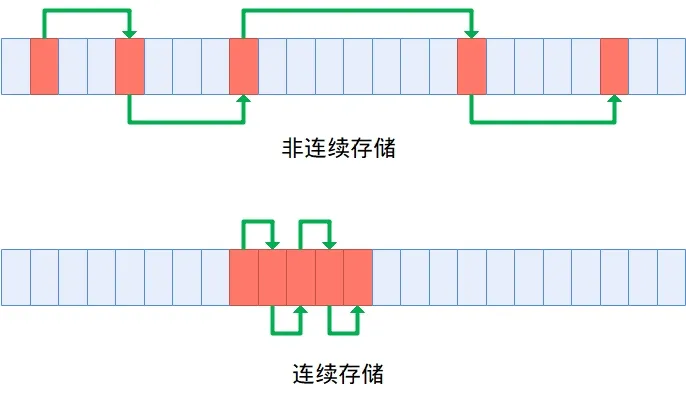

:::tip
同学，你好，欢迎学习本课程！本课程是介绍了FATFS文件系统模块的基本使用，是一门相对较简单的课程。

如果你对文件系统的实现比较感兴趣，也可以关注我的《[从0到1写FAT32文件系统](https://wuptg.xetlk.com/s/VeHie)》课程。

欢迎转载本文章，转载请注明链接来源，谢谢！
:::

本小节介绍FATFS独有的功能，即设置文件连续分配。这项功能实际上涉及到FAT文件系统本身存储特点的相关特性。因此，如果你的程序如果不是特别关注性能，可以不用了解这部分内容。

## 应用场合
在某些情况下，可能希望文件在存储设备上进行连续存储，从而提高文件的读写性能。

如下图所示，FAT文件系统在对文件存储时，使用了簇链的方式进行存储。而这个簇链中，每个簇在存储设备上的位置可能是不确定的。这样当对一个文件进行读写时，就需要在存储设备中的不同簇之间来回跳转读取，使得性能降低。

而如果这个簇链中的所有簇都在一起连续存放，那么读写就不需要跳转，直接连续存储即可，从而大大提高存储器的读写速率。



由此可见，采用连续存储可进一步提升文件读写速度。

## 接口介绍

`f_expand`的函数原型如下：
```
FRESULT f_expand (
  FIL*    fp,  /* [IN] 文件对象指针 */
  FSIZE_t fsz, /* [IN] 扩展后的文件大小 */
  BYTE    opt  /* [IN] 分配模式 */
);
```
参数：

- `fp`：指向打开的文件对象的指针。
- `fsz`：要准备或分配的文件大小（以字节为单位）。
- `opt`：分配模式。0表示暂不立即分配空间，1表示立即分配空间。

返回值为函数执行结果，可能的返回值包括`FR_OK`（成功）、`FR_DISK_ERR`（磁盘错误）、`FR_INT_ERR`（内部错误）、`FR_INVALID_OBJECT`（无效的文件对象）、`FR_DENIED`（拒绝访问）和`FR_TIMEOUT`（超时）。

出现失败时，可能由于以下原因导致：

1. 未找到空闲的连续空间。
2. 文件大小不为零。
3. 文件以只读模式打开。
4. 文件大小不可接受（FAT卷上最多支持4 GB）。

## 读取连续性文件的内容
在为整个文件分配了连续的存储空间后，如果要进行读取或写入，可以使用类似以下的代码。

```c
/* 通过低级磁盘函数访问连续文件 */
/* 获取文件数据的物理位置 */
drv = fp->obj.fs->pdrv;
lba = fp->obj.fs->database + fp->obj.fs->csize * (fp->obj.sclust - 2);

/* 一次从文件顶部写入2048个扇区 */
res = disk_write(drv, buffer, lba, 2048);
```
可以看到，该代码调用了底层的disk访问接口，并且要求访问FIL结构中内部相关的成员来获得文件数据的起始位置等信息。因此，这部分代码可能存在版本兼容性的问题。在后续FATFS版本中，可能会出现结构成员变量发生变化，而导致以上代码必须进行相应调整。

因此，从该因素考虑，在非必要的情况下，不建议使用。

## 文件大小必须为0
**在使用该函数时，要求文件的大小必须为0，这样才能分配一个存储空间全是连续性的文件。**

因此，不能对一个已经有数据的文件调用f_expand()，需要先全部截断。

## 与f_lseek()的比较
f_lseek()也有扩充文件大小的功能，但是与f_expand()函数不同。前者可以对一个大小非0的文件进行扩充，且无法保证整个文件空间的连续性。而后者要求文件大小必须为0，且保证分配出来的空间连续性。

## 是否提升f_write()和f_read()读写效率
有，但很小，在这两个函数内部，依然是采用逐个访问簇链中的簇进行读取，因此文件空间连续的优势并没有发挥出来。
