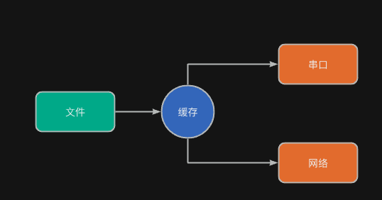
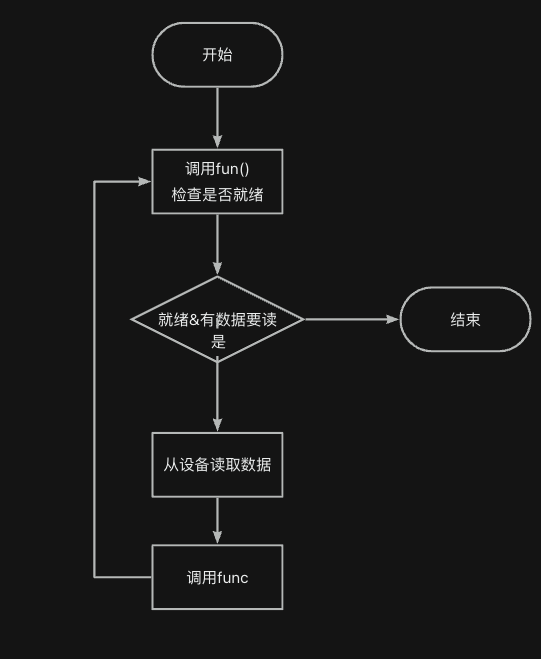
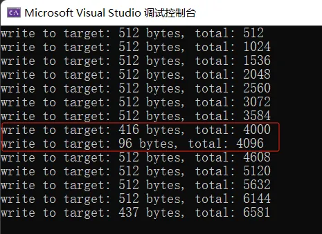

:::tip
同学，你好，欢迎学习本课程！本课程是介绍了FATFS文件系统模块的基本使用，是一门相对较简单的课程。

如果你对文件系统的实现比较感兴趣，也可以关注我的《[从0到1写FAT32文件系统](https://wuptg.xetlk.com/s/VeHie)》课程。

欢迎转载本文章，转载请注明链接来源，谢谢！
:::

本小节介绍FATFS的特有功能，边读取数据边转发数据。

## 应用场合
在某些情况下，可能需要将文件中的数据读取出来，然后转发给其它设备。例如，将文件内容读取出来，通过串口或网络发送出去。或者，将文件内容读取出来，然后进行某种处理，再写到另一个文件中。



对于以上情况，如果使用f_read()函数读取文件；那么，需要先配备一个缓存，将数据读取到缓存中，然后再进行处理。这样做在某些情况下存在一些弊端。

- 在小内存的设备中，由于内存空间有限，没有多余的空间用来做缓存。因此，使用f_read()将数据读取出来这种方式无疑会消耗太多的内存空间
- 由于f_read()会将数据从FIL结构中拷贝到外部缓存，存在拷贝开销。在对性能要求较高的场合，这部分开销需要考虑进去。

因此，在以上情况中，可以考虑使用f_forward()替代f_read()函数。

## 接口介绍
`f_forward`函数用于从文件中读取数据并将其转发到数据流设备。以下是该函数的详细信息：
```c
FRESULT f_forward (
  FIL* fp,                        /* [IN] 文件对象指针 */
  UINT (*func)(const BYTE*,UINT), /* [IN] 数据流处理函数指针 */
  UINT btf,                       /* [IN] 要转发的字节数 */
  UINT* bf                        /* [OUT] 已转发的字节数指针 */
);
```
函数参数：

- `fp`：指向打开的文件对象的指针。
- `func`：指向用户定义的数据流处理函数的指针。
- `btf`：要转发的字节数（范围在UINT内）。
- `bf`：指向存储已转发的字节数的UINT变量的指针。

返回值：`FR_OK`（成功）、`FR_DISK_ERR`（磁盘错误）、`FR_INT_ERR`（内部错误）、`FR_INVALID_OBJECT`（无效的文件对象）、`FR_DENIED`（拒绝访问）和`FR_TIMEOUT`（超时）。

该函数内部具体的执行流程如下图所示：


其具体流程描述如下：
- 每次转发之前，先调用fun()检查是否就绪（参数为0、0）。如果就绪，则func()应当返回1；否则返回0。
- 如果没有数据或者未就绪，则退出函数。
- 如果有数据要读且就绪，则从存储设备中读取数据FIL文件结构中的缓存中，然后将调用func()来处理数据。
- 反复执行上述过程，直到已经读取并处理所要求字节量的数据，或者已经读取到文件尾部。

**从上述流程，可以看到：**

- f_forward()会直接调用函数func来对数据进行转发或处理。这个过程不需要外部缓存，而是使用FIL结构中的内部缓存，从而节省缓存空间
- f_forward()本质上可以看作f_read()函数的升级版本，其结合了文件读取和处理两种功能。
- func()函数需要根据传递的参数完成两种功能：
   - 返回设备是否忙
   - 对数据进行处理

## 具体示例
FATFS官网给出一个例子。这个例子中，从文件中读取1000字节，然后读取到的文件写到外部的FIFO端口。
```c
/*------------------------------------------------------------------------*/
/* Sample code of data transfer function to be called back from f_forward */
/*------------------------------------------------------------------------*/

UINT out_stream (   /* Returns number of bytes sent or stream status */
    const BYTE *p,  /* Pointer to the data block to be sent */
    UINT btf        /* >0: Transfer call (Number of bytes to be sent). 0: Sense call */
)
{
    UINT cnt = 0;


    if (btf == 0) {     /* Sense call */
        /* Return stream status (0: Busy, 1: Ready) */
        /* When once it returned ready to sense call, it must accept a byte at least */
        /* at subsequent transfer call, or f_forward will fail with FR_INT_ERR. */
        if (FIFO_READY) cnt = 1;   // 设备是否就绪
    }
    else {              /* Transfer call */
        do {    /* Repeat while there is any data to be sent and the stream is ready */
            FIFO_PORT = *p++;
            cnt++;
        } while (cnt < btf && FIFO_READY);
    }

    return cnt;
}


/*------------------------------------------------------------------------*/
/* Sample code using f_forward function                                   */
/*------------------------------------------------------------------------*/

FRESULT play_file (
    char *fn        /* Pointer to the audio file name to be played */
)
{
    FRESULT rc;
    FIL fil;
    UINT dmy;

    /* Open the audio file in read only mode */
    rc = f_open(&fil, fn, FA_READ);
    if (rc) return rc;

    /* Repeat until the file pointer reaches end of the file */
    while (rc == FR_OK && !f_eof(&fil)) {

        /* some processes... */

        /* Fill output stream periodicaly or on-demand */
        rc = f_forward(&fil, out_stream, 1000, &dmy);
    }

    /* Close the file and return */
    f_close(&fil);
    return rc;
}
```
## 注意事项
### 每次读取的字节量不固定
实际测试发现，f_forward()对func()函数的次数，以及func()调用时的参数中字节量是不固定的。具体原因是什么呢？



这是因为数据读取是放在FIL结构中，FATFS对FIL结构的缓存管理有其自己内在的处理逻辑。所以无法保证每次func()中获得的数据量是存储设备扇区大小或者簇的大小，并且无法保证读者的数据内容总是从扇区或簇起始地址开始读取的。


