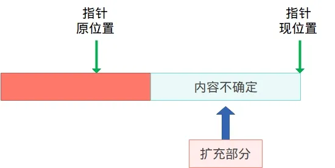

:::tip
同学，你好，欢迎学习本课程！本课程是介绍了FATFS文件系统模块的基本使用，是一门相对较简单的课程。

如果你对文件系统的实现比较感兴趣，也可以关注我的《[从0到1写FAT32文件系统](https://wuptg.xetlk.com/s/VeHie)》课程。

欢迎转载本文章，转载请注明链接来源，谢谢！
:::

本小节介绍FATFS的读写定位接口，可参考C标准库中的fseek和rewind：
* [https://cplusplus.com/reference/cstdio/fseek/](https://cplusplus.com/reference/cstdio/fseek/)
* [https://cplusplus.com/reference/cstdio/rewind/](https://cplusplus.com/reference/cstdio/rewind/)

## 应用场合
在对文件读写时，并不总是从文件的最开始进行。在有些情况下，我们可能需要从文件的中间某个位置开始读写，因此，需要能够控制当前文件读写位置的函数。

## 接口介绍
### f_lseek()函数
f_lseek函数可用于移动文件的读/写指针，也可以用于扩展文件大小（预分配簇）。
```c
FRESULT f_lseek (
  FIL*    fp,  /* [IN] File object */
  FSIZE_t ofs  /* [IN] Offset of file read/write pointer to be set */
);

```
**参数：**

- `fp`：指向已打开文件对象的指针。
- `ofs`：设置要移动的文件读/写指针的字节偏移量，该偏移相对文件开头进行计算

**返回值：**

- `FR_OK`：操作成功。
- `FR_DISK_ERR`：磁盘错误。
- `FR_INT_ERR`：内部错误。
- `FR_INVALID_OBJECT`：无效的对象。
- `FR_TIMEOUT`：操作超时。

**描述**

f_lseek函数可移动文件的读/写指针，而不进行实际的读/写操作。所以，其相比通过读取来调整文件指针位置要快很多。

### f_rewind()函数
另一用于辅助实现指针定位的函数是f_rewind()，它的功能是将读写指针重置到文件的最开始位置。
```c
FRESULT f_rewind (
  FIL*    fp   /* [IN] File object */
);
```
## 示例
以下是上述接口使用的示例：
```c
// 将读/写指针设置为5000
res = f_lseek(fp, 5000);

// 将读/写指针设置到文件末尾以附加数据
res = f_lseek(fp, f_size(fp));

// 向前移动读/写指针3000字节
res = f_lseek(fp, f_tell(fp) + 3000);

// 向后移动读/写指针2000字节（注意处理溢出）
res = f_lseek(fp, f_tell(fp) - 2000);

// 调整到文件开头
res = f_rewind(fp)
```
# 注意事项
## 定位到文件尾部
如果希望打开文件时，直接定位到文件尾部进行修改，可以修改f_open()中mode的参数，使用`FA_OPEN_APPEND`。当然也可以使用f_lseek()手动定位来完成。

## 超出文件大小
在写模式下，有可能出现超出文件大小的偏移量，即文件大小只有100字节，但是f_lseek()控制指针的位置要移动到200字节。显然，此时就超出了已有文件的大小。此时，指针位置的移动仍然能进行，在f_lseek()内部会主动扩充文件的大小，增加到200字节。至于扩充的数据是什么，则是未定义的。


