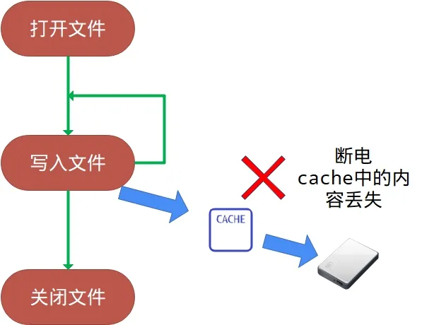

:::tip
同学，你好，欢迎学习本课程！本课程是介绍了FATFS文件系统模块的基本使用，是一门相对较简单的课程。

如果你对文件系统的实现比较感兴趣，也可以关注我的《[从0到1写FAT32文件系统](https://wuptg.xetlk.com/s/VeHie)》课程。

欢迎转载本文章，转载请注明链接来源，谢谢！
:::

本节介绍FATFS的文件刷新写入功能，该功能类似C标准库的fflush():
[https://cplusplus.com/reference/cstdio/fflush/](https://cplusplus.com/reference/cstdio/fflush/)

## 应用场合
在某些情况下，可能希望在调用f_write()后，数据能够立刻写入到驱动器，以避免数据丢失等问题。

例如，对于一个日志存储的软件模块，可能在系统初始化时打开存储日志的文件，然后在整个系统运行期间保持打开以便随时写入。由于FATFS为了写提高效率，可能会对写入的数据进行缓存，所以最后写入的日志数据在调用f_write()之后有可能不会立即写入到驱动器里，而是暂时写入到FIL对像中的内部缓存。如果中途发生断电、系统崩溃等情况；那么最后的文件数据，就会丢掉。



因此，为了解决这个问题，可以在每次写入文件数据之后，使用f_sync()函数强制将缓存的数据也写入到驱动器里。

## 接口介绍

f_sync函数用于刷新正在写入的文件的缓存信息，从而将缓存信息写入到磁盘中。

```c
FRESULT f_sync (
  FIL* fp     /* [IN] 文件对象 */
);
```
参数:

- `fp`：指向要刷新的打开文件对象的指针。

返回值:

- `FR_OK`：操作成功。
- `FR_DISK_ERR`：磁盘错误。
- `FR_INT_ERR`：FAT文件系统内部错误。
- `FR_INVALID_OBJECT`：无效的文件对象。
- `FR_TIMEOUT`：操作超时。
- 
## 应用示例
在FATFS官网，有一个使用f_sync的示意图。

```c
Case 1. 普通正常写序列

                                Time -->                                     ↓Normal shutdown
OwwwwwwwwwwwwwwwwwwwwwwwwwwwwwwwwwwwwwwwwwwwwwwwwwwwwwwwwwwwwwwwwwwwwwwwwwwwC <Power off>

上述操作中，所有数据都正常写入，文件大小也正常。

Case 2. Without using f_sync()

                                Time -->                             ↓System crush
Owwwwwwwwwwwwwwwwwwwwwwwwwwwwwwwwwwwwwwwwwwwwwwwwwwwwwwwwwwwwwwwwwwww
 |<--------------- All data written will be lost ------------------>|
上述操作中，由于没有及时回写缓存，前面所有的数据都将丢失。
    

Case 3. Using f_sync()
                                Time -->                             ↓System crush
OwwwwwwwwSwwwwwwwwSwwwwwwwwSwwwwwwwwSwwwwwwwwSwwwwwwwwSwwwwwwwwSwwwww
                            Data after last f_sync will be lost |<->| 
O - f_open()
C - f_close()
w - f_write()
S - f_sync()

上述操作中，使用了sync()之前的所有写入数据都未丢，而最后的小部分数据发生了丢失。
```

## 注意事项
### 无需在文件关闭之前调用f_sync()
在f_close()中已经包含了对f_sync()的调用，因此可以确保文件正常关闭后，数据是被写入到磁盘的。

### 除非特殊需要，否则不要频繁调用f_sync()
对f_sync()的调用涉及到对存储设备的写入操作，因此频繁的调用，将会对存储设备进行频繁的写入。而写入操作相对读取是比较耗时的。
因此，除非特殊需要，不要频繁地调用f_sync()，以免因过多的写入操作造成系统运行效率过低。

### 文件元数据也会进行缓存，必要时需要调用f_sync()
在打开文件时，文件相关的元数据（文件大小、起始簇号）也会进行缓存，具体缓存到FIL结构中。

在后续对文件进行写入操作时，文件大小和簇号等并不会立即从FIL结构写入到存储器，也会临时缓存。因此，有可能出现打开文件之后，写入了大量数据，中途系统崩溃。再去打开存储器时，会发现文件大小为0。

这实际是就是的元数据并没有回写到磁盘中导致的，并且实际上已经有部分文件的数据写入到了磁盘。这里就会导致部分数据簇出来丢失的情况（不影响后续对文件系统的操作）。

