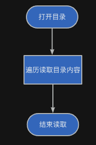

:::tip
同学，你好，欢迎学习本课程！本课程是介绍了FATFS文件系统模块的基本使用，是一门相对较简单的课程。

如果你对文件系统的实现比较感兴趣，也可以关注我的《[从0到1写FAT32文件系统](https://wuptg.xetlk.com/s/VeHie)》课程。

欢迎转载本文章，转载请注明链接来源，谢谢！
:::

本小节介绍目录遍历相关的接口。在Linux系统上，目录遍历相关接口请见：
* [https://linux.die.net/man/3/opendir](https://linux.die.net/man/3/opendir)
* [https://linux.die.net/man/3/readdir](https://linux.die.net/man/3/readdir)
* [https://linux.die.net/man/3/rewinddir](https://linux.die.net/man/3/rewinddir)
* [https://linux.die.net/man/3/closedir](https://linux.die.net/man/3/closedir)

## 应用场合
在某些情况下，可能出于以下原因，想要了解指定目录下有哪些文件。此时，就需要对指定的目录进行遍历。例如：

1. 浏览目录内容：需要列出目录中的所有文件或获取目录结构
2. 搜索文件或目录：在指定的目录下进行遍历，搜索满足要求的文件名或目录
3. 获取文件信息：查找指定文件或目录的信息，如文件名、大小、创建日期等

**目录实际上也可以看作一种文件，不过比较特殊，它存储了这个目录下所有文件或目录的元信息（大小、名字、修改日期等）**。因此，在对目录进行遍历时，实际就是读取这个特殊文件的内容。并且，与文件读取类似，FATFS在对目录读取时，也会在内部维护相关的读取指针，以记录当前读到了目录文件中的哪个位置。

具体流程和文件读取流程类似，如下图所示。



## 接口介绍
### 打开目录f_opendir
在读取目录之前，首先需要打开目录，可以使用`f_opendir`函数。该函数原型如下：
```
FRESULT f_opendir (
  DIR* dp,           /* [OUT] 指向目录对象结构的指针 */
  const TCHAR* path  /* [IN] 目录路径 */
);
```
函数参数

- `dp`：指向打开的目录结构的指针
- `path`：指定要打开的目录路径。

返回值包括`FR_OK`（成功）、`FR_DISK_ERR`（磁盘错误）、`FR_INT_ERR`（内部错误）、`FR_NOT_READY`（未准备好）、`FR_NO_PATH`（路径不存在）、`FR_INVALID_NAME`（无效的名称）、`FR_INVALID_OBJECT`（无效的对象）、`FR_INVALID_DRIVE`（无效的驱动器）、`FR_NOT_ENABLED`（未启用）、`FR_NO_FILESYSTEM`（无文件系统）、`FR_TIMEOUT`（超时）、`FR_NOT_ENOUGH_CORE`（内存不足）、`FR_TOO_MANY_OPEN_FILES`（打开文件过多）。

### 读取目录f_readdir

目录是一种特殊的文件，也是可以进行读取的。你可以将目录理解为存储了很多文件信息条目的文件，每次读取时时，总是读取出一个文件或目录的信息条目。当使用f_opendir打开目录后第一次读取时，将返回目录中的第一条条目；反复读取时，可将所有条目都读出，直到读取到目录文件的尾部。

通过使用f_readdir()可以从中读取出目录相关的信息。

```
FRESULT f_readdir (
  DIR* dp,      /* [IN] 目录对象 */
  FILINFO* fno  /* [OUT] 文件信息结构 */
);
```
函数参数：

- `dp`：指向已打开目录对象的指针。
- `fno`：指向文件信息结构以存储有关已读取项目的信息

返回值包括`FR_OK`（成功）、`FR_DISK_ERR`（磁盘错误）、`FR_INT_ERR`（内部错误）、`FR_INVALID_OBJECT`（无效的对象）、`FR_TIMEOUT`（超时）。

在使用f_readdir()进行读取时，如果所有项目都已读取且没有要读取的项目时，fno->fname[0]的值将为0，即fno->fname存储的是一个空字符串。

### 重置读取位置f_rewinddir
与文件读写指针重置的函数f_rewind()函数类似，对目录读取指针的重置也有相应的接口完成。该接口如下所示：

```c
#define f_rewinddir(dp) f_readdir((dp), 0)
```

### 关闭打开的目录f_closedir
在完成对目录的读取访问之后，就可以使用f_closedir关闭。

```
FRESULT f_closedir (
  DIR* dp     /* [IN] 指向目录对象的指针 */
);
```
函数参数：

- `dp`：指向要关闭的已打开目录对象的指针。

返回值包括`FR_OK`（成功）、`FR_INT_ERR`（内部错误）、`FR_INVALID_OBJECT`（无效的对象）、`FR_TIMEOUT`（超时）。


## 目录必须已经存在
不同于f_open()，f_opendir()要求目录必须已经存在。

## 列表的顺序
f_readdir()返回的列表顺序依赖于文件系统内部在存储设备上存储信息的具体顺序。因此，上层使用f_readdir()获得的目录列表的顺序并不遵循某种特殊的规律（如按文件名排序、创建日间、大小等）。

如果你想对获得的列表进行排序，则需要自己完成。


