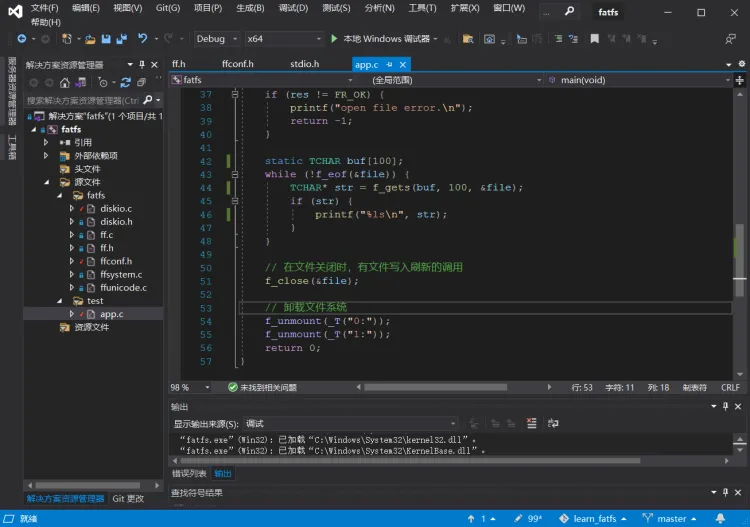

:::tip
同学，你好，欢迎学习本课程！本课程是介绍了FATFS文件系统模块的基本使用，是一门相对较简单的课程。

如果你对文件系统的实现比较感兴趣，也可以关注我的《[从0到1写FAT32文件系统](https://wuptg.xetlk.com/s/VeHie)》课程。

欢迎转载本文章，转载请注明链接来源，谢谢！
:::

同学，你好！欢迎参加FATFS基本入门指南课程！

FATFS（File Allocation Table File System）是一个轻量级的文件系统，广泛用于嵌入式系统和嵌入式设备中。在开发中应该是用得挺多的。

不过，目前市面应该没有什么由浅入深地去讲解FATFS的教程。所以，我花了不少时间深入研究FATFS，同时考虑到学习者的特点，制作了这样一套完整系列的课程。从基本的使用入手，再到更深入地使用，涉及移植、配置等，还会深入到源码的分析。由于课程较大，所以分成多个分课程。

> 本课程属于该系列课程的第一部分，且为免费课程。主要讲解FATFS基本接口的使用。目的让你能够了解FATFS最常用的接口函数以及如何配置。其余课程为收费课程，如果你觉得我的课程质量不错，欢迎支持订阅我的后续课程。

> 注意：本课程采用的版本为FatFs R0.15。 

## 内容安排
主要分四章，各章的整体内容大致如下：

- 基本概念与原理：学习什么是文件系统、介绍FAT文件系统的结构和原理，简介FATFS文件系统模块
- 文件访问接口的使用：详解f_mount()，f_open()，f_read()，f_write()等基本的文件访问接口的使用
- 目录与文件管理：详解f_readdir()、f_mkdir()、f_state()等目录遍历、创建、删除等相关接口的使用
- 卷管理与系统配置：详解如何查询卷的空闲空间、卷标的设置和获取，以及常用的系统配置项

整体内容比较简单，适合对FATFS完全不了解的同学学习。

## 适用对象

- 嵌入式开发者
- 在校计算机、自动化、通信等大学生
- 对FATFS感兴趣的技术爱好者

## 先修知识
虽然这门课程比较简单；但是建议在学习之前，必须具备以下知识：

- 熟悉掌握C语言开发
- 了解基础的嵌入式系统开发知识

## 课程要求
为了方便课程的学习，本课程不要求必须配合某种开发板！所有学习工作完全可以在PC机上完成。

我觉得配开发板是个很麻烦的事情。很多同学上都有不同的开发板，型号和硬件配置千差万别。如果我选择一种开发板来介绍课程的话；那么你为了和课程一致，也不得不购买一款同型号的开发板。

结合这门课程的特点，我发现完全不需要开发板，所有的内容均在PC机上完成。所以，你只需要一台电脑就可以学习了！

视频中采用的是Windows + Visual Studio开发环境（VS2019）进行实验录制。**配套源码包中提供了Visual Studio 2019的工程，也提供基于CMake + VSCode的工程配置**。如果你采用的是其它类型的操作系统，可使用后者的工程。

## 支持和答疑
在学习中如何有与本课程内容相关的问题，可与我取得联系，获得相关支持和帮助。

::: warning
但如果是其它的问题，比如你的个人项目的问题，由于时我的时间和精力有效，无法提供帮助，请自行查找问题的解决方案。
:::

## 课程收益
在学习完本课程后，你将能够对FATFS各API的使用有深入的理解，同时学习了解了FAT文件系统相关的知识。
有这些知识后，你将能够熟练地在实际开发中使用这些接口完成文件管理、读写等操作。

当然，这些只是基础的要求。如果你想对FATFS的使用能够做得更加地熟练，对其工作机理理解的更为深入，欢迎学习我的完整系列课程。

