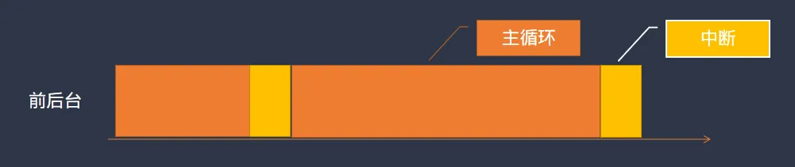
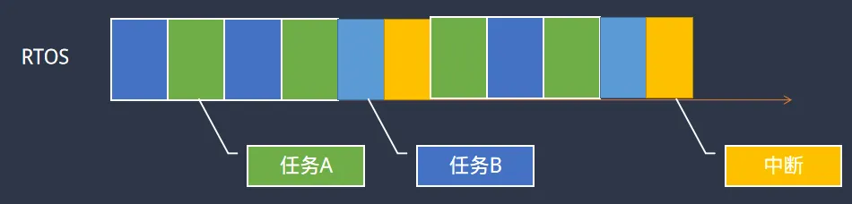

> 为了更好地使用RTOS，我们需要深入理解RTOS工作原理，最好的方法是动手写一个RTOS。
>
> 如果你希望写一个类似RT-Thread/FreeRTOS的系统，欢迎关注这门课程：[【RTOS内核开发】从0手写嵌入式操作系统](https://zw8ls.xetlk.com/s/H2F1Y)
>

# 使用前后台结构
在采用前后台系统时，整个系统的软件结构大致表现为如下所示。

```c
void isr1 (void) {
  .... 处理中断 ....
}

void isr2 (void) {
  ...... 处理中断....
}

void main (void) {
	.... 初始化 ....
    for (;;) {
        .... 做某些工作 ...
        .... 做其它工作 ...
    }
}
```

可以看到，在该结构中，CPU启动后将进入main函数，完成必要的初始化之后，开始进入无限循环for (;;)中去处理一些事情。除了main之外，系统中还往往有一个或多个中断处理程序，用于当相应的中断发生之后，进入中断处理程序中去处理相应的事件。



在一些简单的应用中，采用前后台结构是非常合适的，因为其逻辑简单、实现简单资源占用更少。因此，在很多功能要求不多、资源非常有限的场合，使用该结构是非常合适的。

# 使用RTOS
当系统中所要求实现的功能越来越复杂时，如果仍然采用上述前后台结构，则会导致整个的实现变得较为复杂。换言之，开发者此时需要投入更多地精力，去仔细设计整体的软件结构来实现整体功能。

如果前后台结构类似于我们在工作中独自一人处理所有的事情，在工作内容较简单时，还能处理完成。而当工作内容增多、复杂时，再要求独自一人抗下所有会让人越来越力不从心。为了解决这个问题，可以考虑在工作中增加人员，共同分担工作。这样整体的工作内容会更简单、高效地完成。

类似地，与前后台结构相比，采用RTOS后，整个的软件结构如下。

```c
void isr1 (void) {
  .... 处理中断 ....
}

void isr2 (void) {
  ...... 处理中断....
}

// 任务0
void task0 (void) {
    for (;;) {
        .... 做某些工作 ...
    }
}

// 任务1
void task1 (void) {
    for (;;) {
        .... 做某些工作 ...
    }
}

void main (void) {
	.... os初始化 ....
    .... 启动os ....
}
```

可以发现采用RTOS后，系统中多了两个task任务函数。这些任务函数每个都包含一个for(;;)循环。整个系统运行起来之后，我们会感觉到相当于有2颗CPU在运行，一颗CPU运行task0，一颗运行task1。这样就相当于原来只由一颗CPU执行main中的代码，现在有两颗分别执行不同的task函数。通过RTOS的相关的接口，我们还可以在整个系统中增加更多的任务函数去执行，如task2、task3.......每个任务函数似乎都有一颗对应的CPU在专门执行。



通过这种机制，原本采用前后台系统难以实现的复杂功能，此时可以通过任务分解的方式，将其划分成多个任务函数去分别执行。这样可以大大简化整体软件的设计难度。

# RTOS如何实现多个任务函数同时运行
RTOS的引入，使得整个系统中看起来有多颗CPU运行不同的任务函数。而在实际设备中，CPU往往只有一颗，CPU内部核心也只有一个。当该CPU核心正在运行task0中的for(;;)代码时，由于其中是一个死循环；task1中的代码似乎永远不会执行。而实际却是task0和task中的代码都是可以执行的。那么RTOS究竟采用了什么样的方式来实现这个功能？

```c
// 任务0
void task0 (void) {
    for (;;) {
        .... 做某些工作 ...
    }
}

// 任务1
void task1 (void) {
    for (;;) {
        .... 做某些工作 ...
    }
}
```

在接下来的一系列文章里，我将带领一步步通过代码展示任务切换的核心原理及其具体实现。

整个内容的学习全部在Windows系统上安装ARM公司的Keil软件完成，无需任何其它的开发板等硬件设备。

在完成整个系列内容的学习后，你除了能够深入理解RTOS任务切换这一核心机制外，同时也会对Cortex-M3的体系结构有更加深入地理解。

