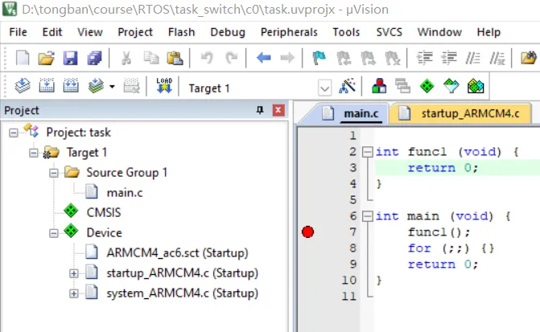
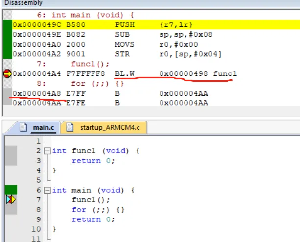
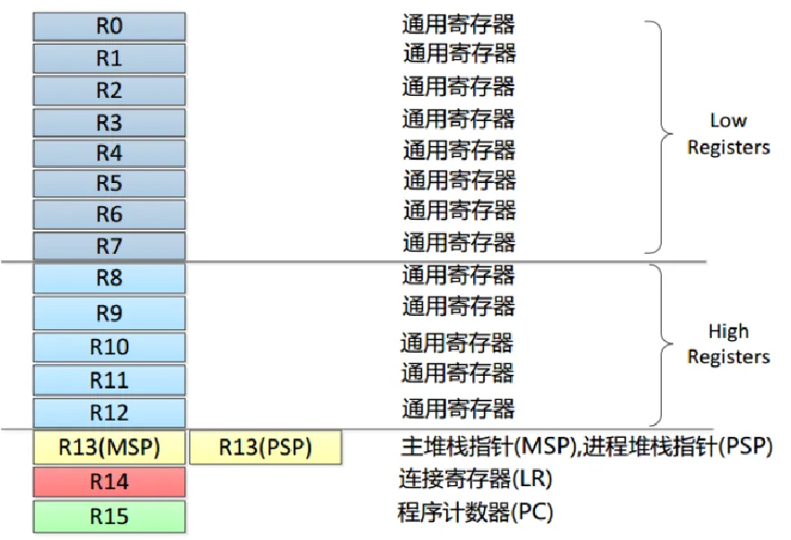
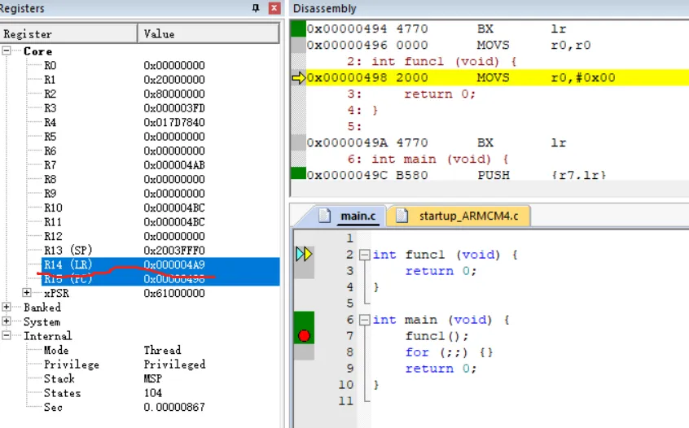
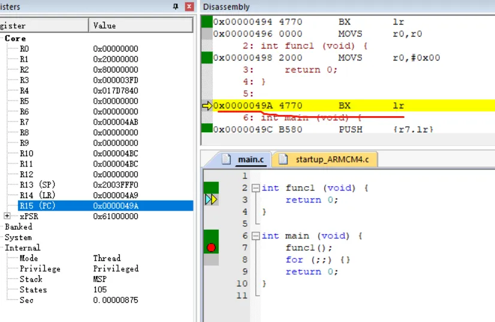

> 为了更好地使用RTOS，我们需要深入理解RTOS工作原理，最好的方法是动手写一个RTOS。
>
> 如果你希望写一个类似RT-Thread/FreeRTOS的系统，欢迎关注这门课程：[【RTOS内核开发】从0手写嵌入式操作系统](https://zw8ls.xetlk.com/s/H2F1Y)
>

为了能更好地理解RTOS中任务切换的原理，我们将以非常简单的函数调用为例，分析函数调用与返回是如何实现的。在理解了这个原理之后，再逐步地以此为基础实现RTOS的任务切换功能。

# 测试代码
为了方便地理解函数调用的机制，首先需要使用Keil创建一个工程。工程选用Cortex-M3为目标芯片，使用内置模拟器仿真。



工程创建完毕后，添加main.c代码，其中的测试代码如下。可以看到，功能非常简单：在main函数中调用了func1()，fun1返回0值。

```c
int func1 (void) {
    return 0;
}

int main (void) {
    func1();
    for (;;) {}
    return 0;
}

```

# 函数调用返回原理
编译、调试，打开反汇编窗口。程序运行到func1()调用处，可以看到该语句被编译成BL.W 0x00000498语句，0x498即为func1()函数的入口地址。按照正常的执行流程，在func1()执行完成后，应当返回到BL.W 0x00000498指令的下一条语句执行，即返回到0x4A8。

问题来了，当执行完func1()时，CPU怎样知道应该返回到0x4A8处执行呢？



答案就在于Cortex-M3处理器内核中有一个专门的内核寄存器LR（Link Registers），该寄存器用来保存函数的返回地址。当执行func1()调用时，返回地址0x4A8会临时保存到LR寄存器中。如下图所示，LR的寄存器已经变成了0x4A9，其值与0x4A8相比，最低位为1。为什么会出现这种情况？



原因于：Cortex-M3会自动将LR的最低位设置成1，以表示处理器的需要运行在Thumb模式。这点是内核工作特点要求的，我们简单地了解即可。



之后，当func1()执行到从函数返回的指令BX lr时，由于此时lr寄存器已经保存了返回地址。因此，CPU将从lr中取出该地址并跳转到该位置继续往下运行。如此一来，就实现了函数执行完成后，能够顺利返回到函数调用的下一条语句执行。



# 这告诉了我们什么
通过上述分析可以得出以下结论：**如果想让CPU在执行某个函数的过程中，中断暂停转而去执行其它函数，并且执行完该函数返回到中断处继续往下执行；那么可以将返回地址给存起来，待函数执行完成之后再跳转到该地址运行。**

该原理后续将应用到RTOS的任务切换机制的具体实现中。当然实际要比这个要更加复杂一些，我将带你一步步地去了解更多原理和实现细节。

