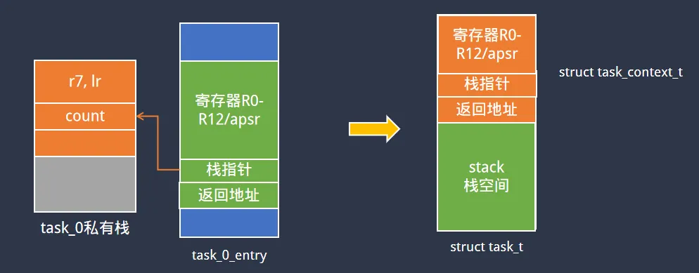

> 为了更好地使用RTOS，我们需要深入理解RTOS工作原理，最好的方法是动手写一个RTOS。
>
> 如果你希望写一个类似RT-Thread/FreeRTOS的系统，欢迎关注这门课程：[【RTOS内核开发】从0手写嵌入式操作系统](https://zw8ls.xetlk.com/s/H2F1Y)
>
通过前面的内容，我基本上可以算是理解了RTOS多任务切换的机制。接下来，对现有代码做一些小的改动，使其代码具备多一些通用性。

# 添加task结构
如果你看过各种不同的RTOS源码，就会发现其内部对于任务都会采用一种结构来表示这任务，具体名称可能为os_task_t，thread_t等不同。在这个结构中，可以包含多途中不同类型的字段，如任务的名称、优先级、所属队列等各种信息。



因此，我们也可以借鉴这种方式，增加一个结构体来描述任务。

```c
struct task_context_t {
    unsigned int r0, r1, r2, r3, r4, r5, r6, r7, r8, r9, r10, r11, r12; // 13 
    unsigned int return_addr;  // r14
    unsigned int stack_addr;   // r13
    unsigned int apsr;
};

struct task_t {
    struct task_context_t context;
    unsigned int stack[80];
}task0, task1;

```

# 初始化task结构
接下来，针对task_t结构，原有的任务context初始化代码转移到task_init()中。即后续我们如果想添加新的任务，只需要针对该任务增加task_t，然后调用task_init即可完成任务的初始化工作。

```c
void task_init (struct task_t * task, void (*entry)()) {
    task->context.r0 = 0x0;
    task->context.r1 = 0x1;
    task->context.r2 = 0x2;
    task->context.r3 = 0x3;
    task->context.r4 = 0x4;
    task->context.r5 = 0x5;
    task->context.r6 = 0x6;
    task->context.r7 = 0x7;
    task->context.r8 = 0x8;
    task->context.r9 = 0x9;
    task->context.r10 = 0x10;
    task->context.r11 = 0x11;
    task->context.r12 = 0x12;
    task->context.apsr = 1 << 31;
    task->context.return_addr = (unsigned int)entry;
    task->context.stack_addr = (unsigned int)(task->stack + 80);
}
```

# 修改task_switch调用代码
通过以上设置，每个任务都有一个task_t结构与其对应。所有与任务有关的操作，都需要通过该任务的task_t结构进行处理，比如task_switch()中就需要从task_t结构中取出contex结构地址，然后完成任务切换。

```c
void task_0_entry (void) {
    int count = -1;
    
    for (;;) {
        count++;
        task_switch(&task0.context, &task1.context);
    }
}
```


