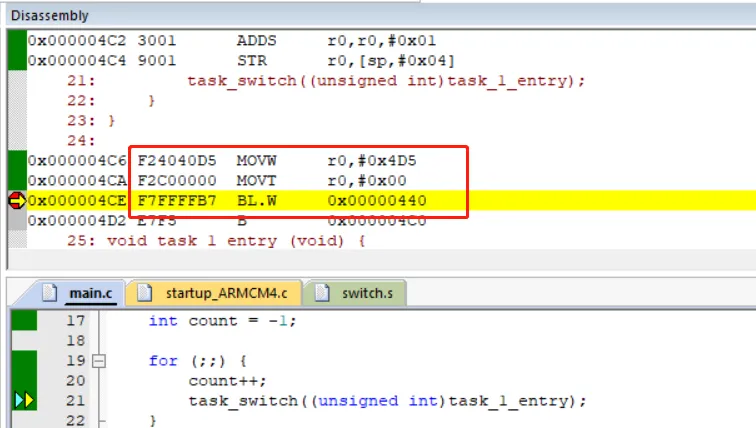

> 为了更好地使用RTOS，我们需要深入理解RTOS工作原理，最好的方法是动手写一个RTOS。
>
> 如果你希望写一个类似RT-Thread/FreeRTOS的系统，欢迎关注这门课程：[【RTOS内核开发】从0手写嵌入式操作系统](https://zw8ls.xetlk.com/s/H2F1Y)
>
在前一节课时中，可以看到直接采用任务函数相互调用存在两个问题：每次都只能从任务函数入口执行、栈溢出程序崩溃。这两个问题解决起来较为复杂，我们需要使用三个小的课时来解决。

本课时主要介绍Cortext-M3上使用Keil开发时，函数参数是如何传输的，以及如何使用汇编定义重写函数。该知识点将用于后续代码的实现中。

# 设计目标
在本课程最开始的小节中已经提到过，RTOS会提供一些诸如类似sleep()，wait()等函数，让CPU暂停执行当前正在运行的任务，转而去执行另一个任务。如果我们深入去了解这些函数的实现，会发现其最终都会调用一个函数实现任务的切换。这类函数的一般形式为：

```c
void task_switch (os_task_t * from, os_task_t * to);
```

当然，具体到某个RTOS，该函数的名称、参数列表、返回值均可能不同，但基本的功能是一样的。

本课程最终也是要实现这样的一个函数。不过由于该函数的具体实现较为复杂，因此将分若干课时具体的讲解。在这节课时中，我们将实现一个初级版本：

```c
void task_switch(unsigned int to_addr)
```

这个版本可以完成这一功能，即控制CPU跳转到to_addr执行。这个函数我们将通过汇编代码实现。

# task_switch参数如何传递
如果查看task_switch()调用的反汇编，可以看到如下图红框中所示内容。可以看到，在执行BL 0x440指令之前，有两条MOV指令，这两条MOV指令的功能是将数值0x000004D5写入r0寄存器。而0x000004D5这个值恰好就是task_1_entry函数的入口地址。

而结合task_switch(task1_entry)这个函数调用可知，task_switch函数执行时，其需要的参数正是通过r0寄存器去传递。



# 实现到目标地址的跳转
接下来，我们要需要用汇编实现task_switch()函数。该函数的实现其实较简单，只需要在工程添加一个汇编文件，如switch.s，然后定义一个代码段，并在其中添加task_switch的符号及其代码即可。

```basic
.text
.global task_switch
task_switch:
bx r0
```

由于跳转的目标函数地址已经在task_switch调用前写入r0，因此只需要以r0中存储的内容为跳转地址即可。可以使用跳转指令bx r0进行直接跳转。BX与BL指令的不同之处于在，BL除了跳转外，还会将返回地址保存到LR寄存器；BX指令是直接跳转，不保存返回地址。

# 内容总结
通过这样的实现，可以实现两个任务之间的来回跳转执行，即运行效果上和前一节课时中的一样。前一节课时虽然没有得到任何解决，但是这里已经将通过汇编代码单独实现了一个任务切换函数task_switch()。这样为后续的内容修改打下基础。


