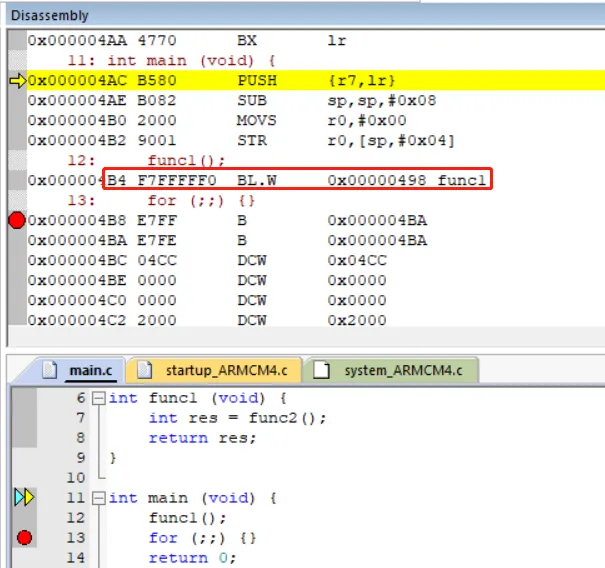
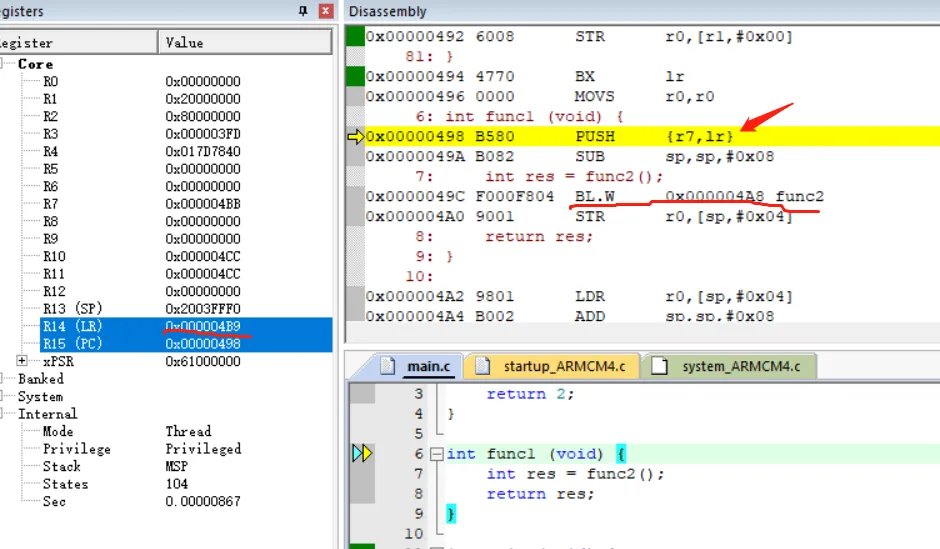
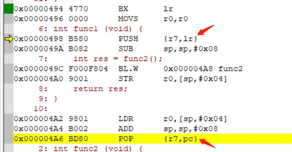
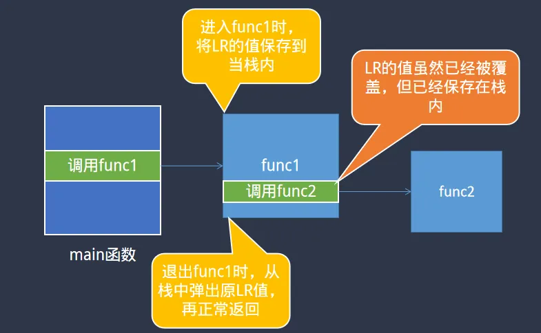

> 为了更好地使用RTOS，我们需要深入理解RTOS工作原理，最好的方法是动手写一个RTOS。
>
> 如果你希望写一个类似RT-Thread/FreeRTOS的系统，欢迎关注这门课程：[【RTOS内核开发】从0手写嵌入式操作系统](https://zw8ls.xetlk.com/s/H2F1Y)
>
前一节内容介绍单层函数调用的具体实现原理，接下来让我们更深入地去研究一下多层函数调用时的处理。我们会发现具体实现略有不同。通过本节课程的学习，你将能够更加深入地理解计算机中“栈”的作用。

# 测试代码
修改main.c中的代码如下所示。可以看到整体的函数调用流程与前一节区别在于：在func1()中增加了对func2()的调用。

```c
int func2 (void) {
    return 2;
}

int func1 (void) {
    int res = func2();
    return res;
}

int main (void) {
    func1();
    for (;;) {}
    return 0;
}

```

按照前一节内容所介绍的，当main调用func1时，返回地址（用A来代称）会存储在Cortex-M3内核寄存器LR中。那么，当func1()调用func2()时，func2()调用完成后的返回地址（用B来代称）也会保存在LR中。那么，前一次保存在LR中的A地址则会被B地址给覆盖掉。

<font style="color:#DF2A3F;">由于发生了覆盖，那么是否只能实现func2()调用后正常返回，而func1()调用完成后，由于A地址已经被丢掉，所以无法从func1()返回的情况？</font>

很显然，现实并不是这样的。我们会发现无论是func1()还是func2()的调用都能正常执行并返回；那么究竟发生了什么来保证这点？

# 多层函数调用返回原理
结合反汇编仔细查看，观察func1()的调用，可以看到和前一节课程内容相同，生成了BL.W   func1入口地址的调用语句，并且该函数调用后的返回地址是0x4B8。



执行该函数调用语句，可以看到0x4B8确实已经保存到了LR寄存器中。同时在fun1()中也用对func2()的调用，使用同样的指令BL来完成，具体指令为BL.W 0x0000004A8。



按照目前的处理逻辑，当连续两次执行BL指令时，LR的值会被连续写入两次，这确实会导致第一次写入LR的值被覆盖，可能会导致无法返回到main函数。为了解决这样的问题，编译器做了如下处理：

+ 在函数入口处，将LR的寄存器保存到栈中。在func2()的入口开头处，存在一条特殊的指令push {r7, lr}。push指令用于向栈中压入寄存器的内容。push {r7, lr}指令的作用为将r7和lr寄存器的内容压到栈中，临时暂存起来。
+ 当执行BL.W 0x4A8时，虽然LR寄存器的值被覆盖成0x4A0，但是由于lr寄存器的值在此前已经通过push指令保存起来，因此func1()的返回地址并未丢掉，只是保存在栈里，而不是在LR寄存器中。
+ 退出函数前，从栈中恢复先前保存的LR值。在func2()的出口处，存在一条特殊的指令pop {r7, lr}，该指令用于将之前保存在栈中的r7和lr地址恢复到r7和pc。也即将之前保存的func1()返回地址直接写到pc寄存器，实现从func1()的返回。



用更加一般性的图形表示如下，在进入函数时用栈保存LR的值，在退出时恢复LR的值。这样在函数内部无论进行多少次函数调用，LR的值无论被改写多少次；由于退出函数时都能从栈中恢复原始的LD的值，函数fun1都能正常返回。



# 这告诉了我们什么
通过以上示例可以看到：**函数的返回地址，优先保存在LR寄存器中；为了避免之前已经保存在LR寄存器中的值被覆盖，可以先将其保存到其它地址，等后续需要时再恢复（如使用push/pop存储在栈中）。**


