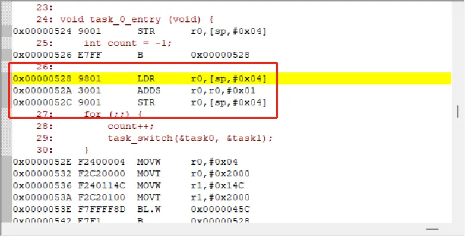
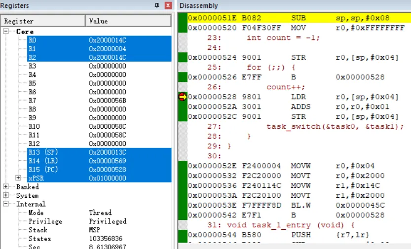

> 为了更好地使用RTOS，我们需要深入理解RTOS工作原理，最好的方法是动手写一个RTOS。
>
> 如果你希望写一个类似RT-Thread/FreeRTOS的系统，欢迎关注这门课程：[【RTOS内核开发】从0手写嵌入式操作系统](https://zw8ls.xetlk.com/s/H2F1Y)

上一小节课时仅解决了栈空间溢出和局部变量私有化的问题。这一节我们来看一个新的问题，即CPU内核寄存器的保存和恢复问题。

# 主要原理
如果打开task_0_entry的反汇编，会看到count++这条语句被编译成了3条指令。这3条语句分别实现从栈中取出count的值，然后用add指令将值+1，最后将计算结果回写到栈中。

由此可知，任务的当前的运行状态，并不仅仅只由当前任务的运行的地址、栈指针来决定，其当前所使用内核寄存器的内容也会影响到任务的运行状态。

就好比一个小学生正在写暑假作用，我们如果想知道他的作业完成状态，除了要知道他当前写到了第几页之外，还需要知道他给每一道题的解决。这样才完整反映当前他的当前作业完成状态。



类似地，我们在任务切换之前，除了保存当前任务运行的指令地址、栈指针地址，还需要保存CPU内核寄存器的值。这样寄存器的值反应了当前任务正在执行的状态，比如正在用哪些数据进行某种运算等。

这样当从其它任务切换回来时，RTOS才能将内核寄存器的值恢复成原来任务执行的值，原来的任务才能够继续往下运行计算。如果值发生变化，那么这个任务运行结果就不确定了。



# 具体实现
综上所述，我们需要在struct task_context_t结构中增加保存cpu内核寄存器值的字段，包含通用寄存器r0-r13，以及程序运行的状态寄存器apsr。

```c
struct task_context_t {
    unsigned int r0, r1, r2, r3, r4, r5, r6, r7, r8, r9, r10, r11, r12; // 13
    unsigned int return_addr;  // r14
    unsigned int stack_addr;   // r13
    unsigned int apsr;
}task0, task1;
```

然后，我们可以在必要的时候进行初始化，例如在在main中对task0进行初始化。

```c
    task0.r0 = 0x0;
    task0.r1 = 0x1;
    task0.r2 = 0x2;
    task0.r3 = 0x3;
    task0.r4 = 0x4;
    task0.r5 = 0x5;
    task0.r6 = 0x6;
    task0.r7 = 0x7;
    task0.r8 = 0x8;
    task0.r9 = 0x9;
    task0.r10 = 0x10;
    task0.r11 = 0x11;
    task0.r12 = 0x12;
    task0.apsr = 1 << 31;
    task0.return_addr = (unsigned int)task_0_entry;
    task0.stack_addr = (unsigned int)&task0_stack[80];
```

当task0需要运行时，可以利用汇编代码，从task_context_t结构中加载所有的值。如此一来，初次运行该任务时就获得了一个有效的初始化运行状态。

```c
mtask_run_first:
    // load sp
    ldr sp, [r0, 4*14]

    // load apsr
    ldr r2, [r0, 4*15]
    msr apsr, r2

    // load r0-r12
    ldmia r0, {r0-r12, pc}
```

注意，这里并没有像之前的代码中那样使用bx r0，而是使用了ldmia r0, {r0-r12, pc}。该代码可实现task_context_t中lr的值直接加载到pc中，效果上和bx r0完全相同。

# 内容总结
通过上述内容可以看出，CPU内核寄存器实际上体现了任务的运行状态，其中包含了用于数据运算的通用寄存器R0-R12，存储返回地址的LR、存储栈指针的R13寄存器。

现在我们已经给每个任务分配了私有的栈空间用于存储其局部变量，并分配了task_context_t结构用于存储使用CPU时内核寄存器的状态值。这样后续每个任务运行时，我们就可以将任务之间隔离开来，只需要将内核寄存器全部恢复成该任务的值即可，这样任务可以使用其私有的栈空间来放局变量，继续用之前的内核寄存器的状态值进行计算。

不过，在本节课时中，只实现了如何将保存在task_context_t结构中的CPU内核寄存器值恢复，可实现task_0_entry的运行。下一节课时中，我们将修改task_switch函数，CPU内核寄存器值的保存，从而实现两个任务切换运行。


