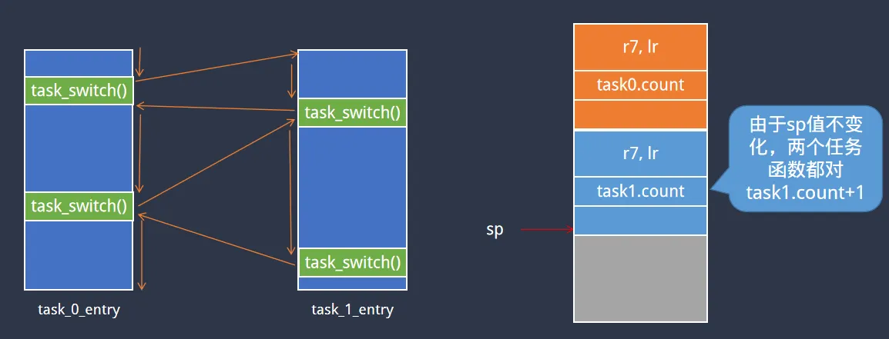
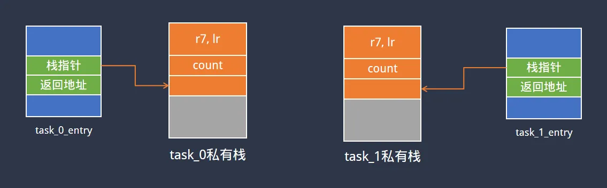

> 为了更好地使用RTOS，我们需要深入理解RTOS工作原理，最好的方法是动手写一个RTOS。
>
> 如果你希望写一个类似RT-Thread/FreeRTOS的系统，欢迎关注这门课程：[【RTOS内核开发】从0手写嵌入式操作系统](https://zw8ls.xetlk.com/s/H2F1Y)
>
上一节课时已经解决了运行地址的问题，这一节课时解决栈相关的问题。

# 主要原理
在前面的内容中可以看到，整个程序仍然存在问题，即当程序长时间运行时，有可能因为栈溢出而导致程序溢出。另外虽然通过task_switch能够实现任务切换，每个任务私有的count值仍然是有问题的，似乎所有任务共享的是同一个count变量。

具体原因在于count变量是存放在栈中，既然每个任务需要拥有自己的count；那么我们就应当为每个任务分配其私有的栈。



当task_0_entry运行时，应当将当前所用的栈切换成task0私有的栈；而当task_1_entry时，应当切换当前栈为task1私有的栈。



# 具体实现
为了给每个任务私有的栈，可以在文件中添加两个栈空间。具体的栈大小取决于任务函数中局部变量的大小，调用的函数层次等因素影响。当局部变量数量较多、占用内容较大、函数调用层次较深时，需要的栈空间更多。

本课程中task_0_entry和task_1_entry代码简单，所以需要的栈空间较小，只分配80个栈单元。

```c
unsigned int task0_stack[80];
unsigned int task1_stack[80];
```

接下来，为每个任务单独定义一个struct task_context_t结构体，用于存储任务的相关信息。之前的task_x_return_addr也放在该结构体中。同时添加了一个stack_addr，保存当前任务的切换出去之前，所用的栈寄存器的值。

```c
struct task_context_t {
    unsigned int return_addr;
    unsigned int stack_addr;
}task0, task1;
```

接下来，在main函数中，针对这两个结构进行初始化。设置return_addr为任务函数的入口地址，这样任务启动时可直接进入该地址运行，并且任务运行所需要的栈可通过task?.stack_addr获取。

```c
int main (void) {
    task0.return_addr = (unsigned int)task_0_entry;
    task0.stack_addr = (unsigned int)&task0_stack[80];
    task1.return_addr = (unsigned int)task_1_entry;
    task1.stack_addr = (unsigned int)&task1_stack[80];
    task_run_first(&task0);
    for (;;) {}
    return 0;
}
```

那么，当整个系统启动时，使用task_run_first切换至第一个任务运行，在该函数中从struct task_context_t获取栈指针写入sp, 并从中获得初始的入口地址。这样就可以进入任务函数中执行，并且当前的栈指针使用该任务的栈中地址。

```c
task_run_first:
    // load sp
    ldr sp, [r0, 4]

    // load pc
    ldr pc, [r0, 0]
```

而当进行任务切换时，在task_switch中可以将当前任务后续继续运行的地址（保存在LR中）、栈指针存储其struct task_context_t结构中，然后再加载下一个任务的运行的地址、栈指针。

```c
    .text
    .global task_switch
    .global task_run_first
task_switch:
    // save to from_addr
    str lr, [r0]
    
    // save sp
    str sp, [r0, 4]
    
    // load sp
    ldr sp, [r1, 4]
    
    // load pc
    ldr pc, [r1, 0]

```

# 内容总结
可以看到，通过为每个任务配置了其私有的玫，这样两个任务在运行时，其局部变量就变成了真正自己私有的。与此同时，也能够避免栈溢出的问题。

另一方面，前面也提到了：任务运行时有相应的运行状态。除了当前任务执行的地址位置之外，其所用的栈指针值也属于任务运行状态的一部分，需要进行保存。本课时就完成了对栈指针的保存。


