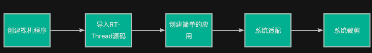
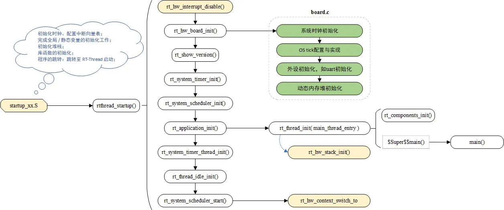
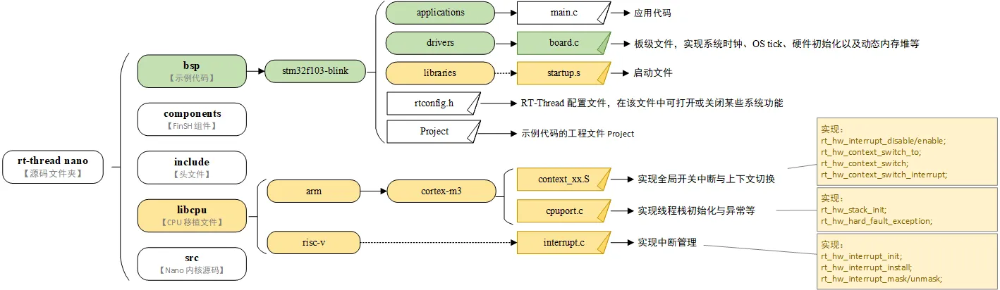

:::tip
🔥 想从零开始理解RTOS原理、手写可运行RTOS内核？
👉 [点击了解课程详情](https://lishutong1024.cn/article/ceok23ne/)
:::
注意：本知识库仅用于视频内容的补充，部分在视频中讲的内容不会在该知识库中重复给出。因此，该知识库并不能完全替代视频内容。

此外，本课程为免费开放的课程，不提供任何形式的答疑和支持。

学习者必须具备ARM Cortex-M相关的基础开发知识和技能！

本课程介绍如何移植RT-Thread，即如何将该系统移植到特定的MCU上运行。开发工具使用的是Keil MDK。

# 注意事项
对于绝大多数不熟悉RT-Thread内部实现的应用开发者来说，他们所做的移植工作并不涉及如何将该系统成功运行到特定的体系架构CPU这一工作，而只是在RT-Thread开发者已经完成这一工作的基础之上，将该系统适配到特定的MCU中。例如，如何RT-Thread开发者没有将该系统成功运行到Cortex-M3体系结构上，那么应用开发者很难自行成功将该系统移植到STM32F103（基于Cortex-M3体系）芯片中。

这是由于RT-Thread的运行与CPU体系结构密切相关，开发者需要非常熟悉该体系结构的工作特点，进而编写相关的代码（部分需要用汇编实现）。

本课程仅从应用开发者角度，介绍如何将该系统适配到特定的MCU。

# 工作流程
整个移植过程如下所示。初步的想法是导入RT-Thread之后，跑起来一个简单的应用，验证系统能够正常运行。之后，再根据应用的实际需要进行功能的裁剪。

上述流程中，部分过程比较简单，本文档不做简介。

移植过程中，主要参考以下原理图示：

摘自：[https://www.rt-thread.org/document/site/#/rt-thread-version/rt-thread-nano/nano-port-principle/an0044-nano-port-principle](https://www.rt-thread.org/document/site/#/rt-thread-version/rt-thread-nano/nano-port-principle/an0044-nano-port-principle)

同时，参考了如下的源码组织结构图：

摘自：[https://www.rt-thread.org/document/site/#/rt-thread-version/rt-thread-nano/nano-port-principle/an0044-nano-port-principle](https://www.rt-thread.org/document/site/#/rt-thread-version/rt-thread-nano/nano-port-principle/an0044-nano-port-principle)

其余部分并不复杂，参考视频中的操作步骤即可，略。

