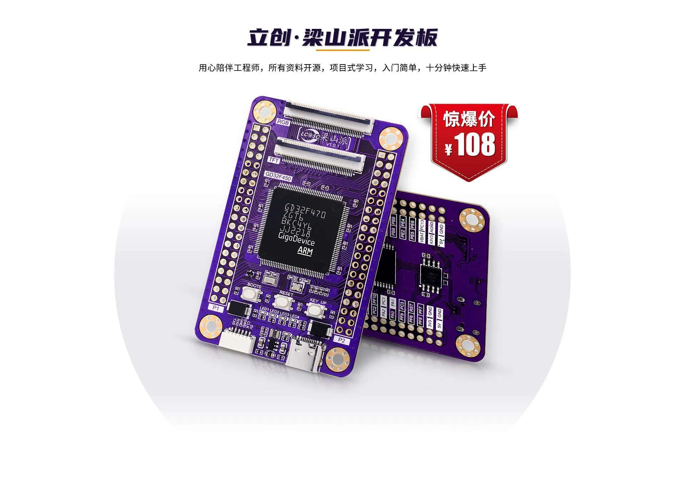
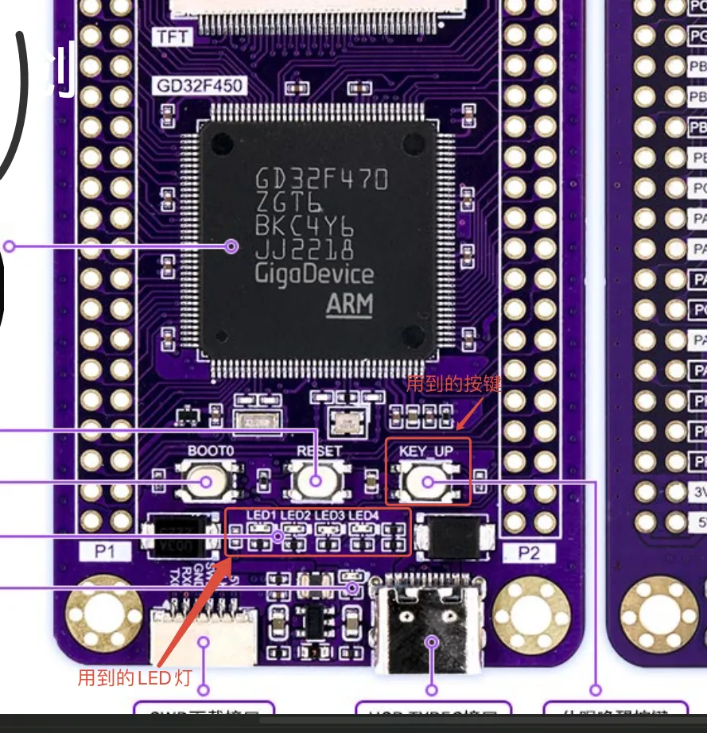
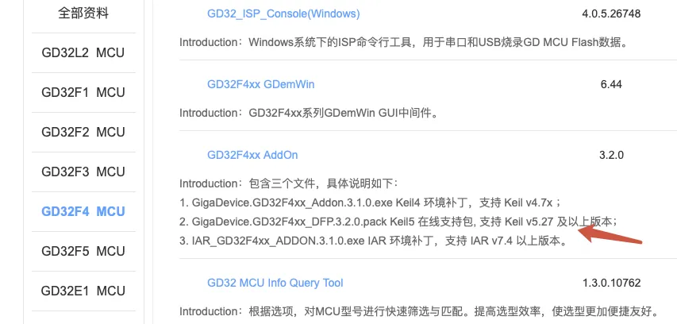
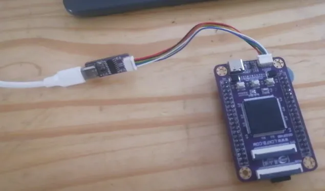
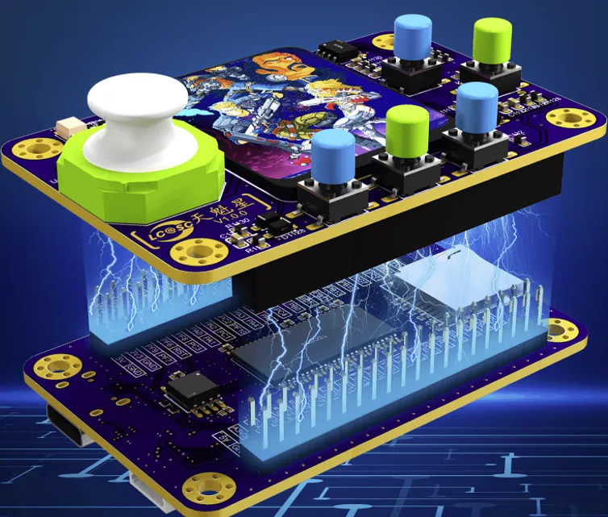

> 为了更好地使用RTOS，我们需要深入理解RTOS工作原理，最好的方法是动手写一个RTOS。
>
> 如果你希望写一个类似RT-Thread/FreeRTOS的系统，欢迎关注这门课程：[【RTOS内核开发】从0手写嵌入式操作系统](https://zw8ls.xetlk.com/s/H2F1Y)
>

## 开发环境准备
:::danger
注意，本课程的主要关注点在RT-Thread。因此，不会将有限的视频内容浪费在开发板硬件的使用细节等内容中。

也就是说，我不会介绍MCU本身如何使用，如UART外设工作方式、固件库函数的调用等内容。

我假定在学习这门课程的同学，已经有基本的开发经验，如使用过STM32等芯片。

:::

### 主控板（必需）
本课程采用的是嘉立创的开源梁山派开发板，产品链接请见：[https://lckfb.com/project/detail/lckfb_lspi?param=baseInfo](https://lckfb.com/project/detail/lckfb_lspi?param=baseInfo)。

该产品使用了GD32F470主控芯片，该芯片基于Cortex-M4内核。该芯片的相关资料、应用示例、固件库等可以从原厂网站下载：[https://www.gd32mcu.com/cn/download/5?kw=GD32F4](https://www.gd32mcu.com/cn/download/5?kw=GD32F4).

除开发板之外，商家还会附带DAPLink调试器，可连接Keil等软件进行开发。本课程中，将使用DAPLink和Keil演示RTOS的功能使用。

> 注：在视频中我还会基于个人喜好使用VSCode进行调试。
>

注意！课程中主要用到了板上的4个LED灯和按键，具体位置请参考下图！

### 扩展板（可选购买）
此外，还可以购买游戏机扩展板，产品链接见：[https://lckfb.com/project/detail/lspi_tkx?param=baseInfo](https://lckfb.com/project/detail/lspi_tkx?param=baseInfo)

该板可与上述开发板一起制作成一个小的游戏机。在课程中，可能（实际未用）会使用到其中的一些外设，来演示RTOS功能的具体使用（课程中，不介绍游戏机程序的开发。感兴趣的同学可自行研究）。

### Keil软件
开发软件使用的是Keil，下载地址为：[https://www.keil.com/demo/eval/arm.htm](https://www.keil.com/demo/eval/arm.htm)。

除Keil之外，还需要安装器件支持包，下载地址：[https://www.gd32mcu.com/cn/download/5?kw=GD32F4](https://www.gd32mcu.com/cn/download/5?kw=GD32F4)

## 搭建开发环境
### 硬件连接
只需要用USB连接自带的DAPLink调试器，再连接至主控板即可。

扩展板的连接，请参考下图

### 软件安装
请参考课程视频中给出的详细步骤：1、先安装Keil；2、再安装器件支持包。

> 注：学习本课程的同学应当具备基本的嵌入式开发知识，也就说大概率已经用过Keil这种主流开发软件。
>
> 如果你还不具备基本的嵌入式开发知识，请暂时不需要学习本课程。
>

如需器件支持包，请自行从官网下载。

## 运行演示程序
演示程序对应的工程，位于课程配套代码仓库的demo目录下。请按照视频中的介绍，下载并测试。

