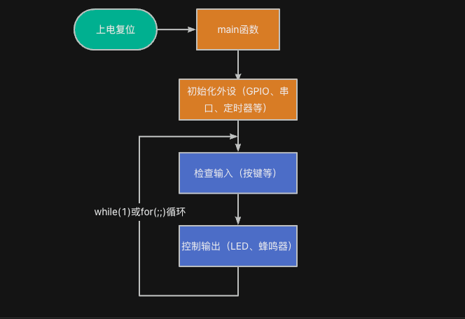

> 为了更好地使用RTOS，我们需要深入理解RTOS工作原理，最好的方法是动手写一个RTOS。
>
> 如果你希望写一个类似RT-Thread/FreeRTOS的系统，欢迎关注这门课程：[【RTOS内核开发】从0手写嵌入式操作系统](https://zw8ls.xetlk.com/s/H2F1Y)
>

## 祼机开发的概念
祼机开发是一种在没有操作系统支持的情况下，直接对硬件进行编程的嵌入式开发方式。其核心特点包括高实时性、低资源占用和直接硬件控制。这种方式的特点表现为：

+ 没有任务调度器
+ 没有线程、进程概念
+ 所有功能和流程都由开发者自己管理

<font style="color:#2F4BDA;">简单来说，就是无操作系统支持，我们需要编写所有代码直接控制硬件来实现设计目标。</font>这种方式也是大多数同学学习嵌入式最早接触到的一种开发方式。

这种方式的典型逻辑结构框图如下所示：



<font style="color:#2F4BDA;">从该框图可以看出：除初始化以外的所有操作，均在main函数中的主循环内顺序反复执行。</font>

## 裸机开发示例：点灯 + 接收串口数据
下面是一个典型的裸机代码片段。该代码的功能为：根据按键，来控制LED灯的亮灭。

```c
#include "../base.h"

int main(void) {
    hardware_init();

    while (1) {
        if (key_pressed()) {
            led_set(LED0, 1);
        } else {
            led_set(LED0, 0);
        }
    }
}
```

对于祼机开发而言，所有的逻辑都在 while(1) 或for(;;))主循环中轮询处理。这种开发方式的优点有：简单、直观、资源占用小，比较适合简单功能的项目，但一旦系统复杂，就会遇到瓶颈和挑战。

