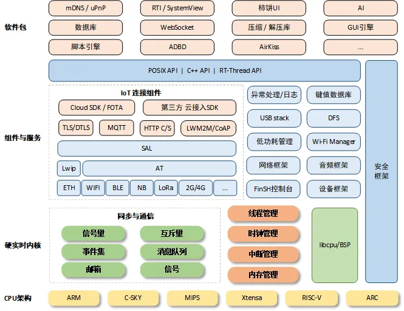
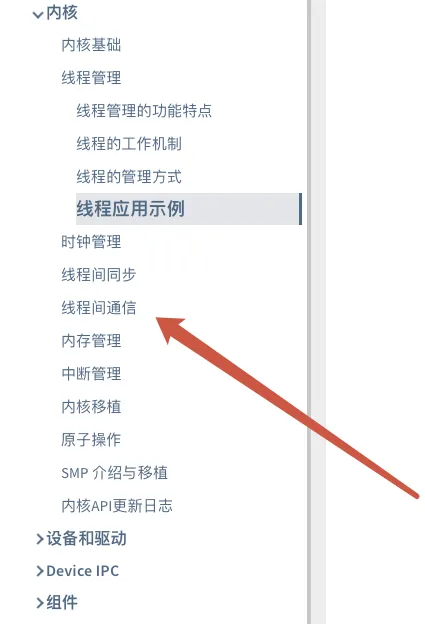
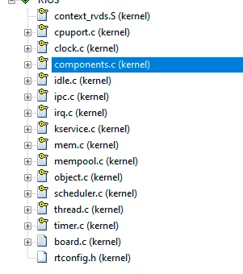
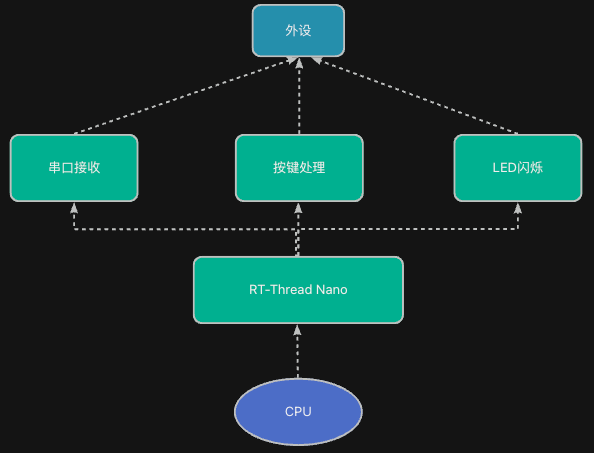

> 为了更好地使用RTOS，我们需要深入理解RTOS工作原理，最好的方法是动手写一个RTOS。
>
> 如果你希望写一个类似RT-Thread/FreeRTOS的系统，欢迎关注这门课程：[【RTOS内核开发】从0手写嵌入式操作系统](https://zw8ls.xetlk.com/s/H2F1Y)
>

本课时从比较直观的角度来介绍什么是RT-Thread（Nano版本）。如果你想对RT-Thread有更深入的了解，请查看官网上的内容：[https://www.rt-thread.org](https://www.rt-thread.org)。

## 主要功能及特点
RT-Thread 是一个小型、快速的实时操作系统，专门为嵌入式设备设计。

主要采用C语言编写，针对资源受限的微控制器（MCU）系统，可通过方便易用的工具，裁剪出仅需要 3KB Flash、1.2KB RAM 内存资源的 NANO 版本。虽然 32 位 MCU 是它的主要运行平台，实际上很多带有 MMU、基于 ARM9、ARM11 甚至 Cortex-A 系列级别 CPU 的应用处理器在特定应用场合也适合使用 RT-Thread。

整体结构如下图所示（本课程只涉及其中关于硬实时内核部分）



其中，对于Nano版本，具体的功能包含如下几部分：



该RTOS的主要特点有：

+ **轻**量级：很小巧，适合单片机用。
+ 实时性好：对重要事件能快速响应，不会卡顿。
+ 简单易用：结构清晰，代码好读，主要用C语言编写。
+ 模块化：用什么加什么，不用的功能可以不编译进来。
+ 活跃社区：文档多，例子多，新手也容易上手。

## 文件组织
RTOS有很多种具体的实现，其中RT-Thread是其中一种，其文件组织结构如下图所示。


可以看到，它并不是什么非常特别的东西。本质上来说，就是一组软件代码而已。我们可以将其加入到自己的工程中一起编译运行。

## 具体使用
我们可以基于上述文件代码，利用RT-Thread的任务管理等功能，创建多个任务完成目标功能。这些任务既可以调用RT-Thread提供的相关接口，也可以自行直接访问各种硬件外设。整体结构示意如下：



在上图结构中，包含以下几部分：

+ 外设（外部设备）：包括串口、按键、LED 等。
+ 任务层：如串口接、按键处理、LED 闪烁等，是你写的功能代码。
+ RT-Thread Nano：作为中间层，协调任务执行。
+ CPU：硬件执行者，真正跑代码的核心。

如果落实到具体代码，则内容如下：

```c
#include <rtthread.h>
#include "../base.h"

#define STACK_SIZE 512
#define PRIORITY_LED 10
#define PRIORITY_UART 11
#define PRIORITY_KEY 12

/* LED线程：每500ms闪烁一次 LED0 */
static void led_thread_entry(void *parameter)
{
    led_init(LED0);

    while (1)
    {
        led_toggle(LED0);
        rt_thread_mdelay(500);  // 延迟500ms
    }
}

/* 串口线程：有数据就读取并回显 */
static void uart_thread_entry(void *parameter)
{
    uart_init(115200);  // 初始化串口

    while (1)
    {
        if (uart_available())
        {
            uint8_t ch = uart_read();
            uart_write(ch);  // 回显
        }
        rt_thread_mdelay(10);  // 稍微延时避免占用过多CPU
    }
}

/* 按键线程：扫描按键，按下就点亮LED1，未按下熄灭 */
static void key_thread_entry(void *parameter)
{
    key_init();
    led_init(LED1);

    while (1)
    {
        if (key_pressed())
        {
            led_set(LED1, 1);  // 点亮LED1
        }
        else
        {
            led_set(LED1, 0);  // 熄灭
        }

        rt_thread_mdelay(50);  // 扫描周期
    }
}

/* 主函数，创建线程并启动 */
int main(void)
{
    hardware_init();  // 初始化硬件基础配置

    rt_thread_t tid_led = rt_thread_create("led",
                                           led_thread_entry, RT_NULL,
                                           STACK_SIZE, PRIORITY_LED, 10);
    rt_thread_t tid_uart = rt_thread_create("uart",
                                            uart_thread_entry, RT_NULL,
                                            STACK_SIZE, PRIORITY_UART, 10);
    rt_thread_t tid_key = rt_thread_create("key",
                                           key_thread_entry, RT_NULL,
                                           STACK_SIZE, PRIORITY_KEY, 10);

    if (tid_led) rt_thread_startup(tid_led);
    if (tid_uart) rt_thread_startup(tid_uart);
    if (tid_key) rt_thread_startup(tid_key);

    return 0;
}

```

其中，RT-Thread就像一个总调度员，让 CPU 有条不紊地在多个任务之间切换，从而实现各个任务都能在自己的while(1)循环中执行。最终的结果就是多个while(1)循环同时跑了起来。


