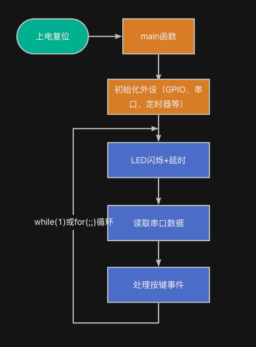
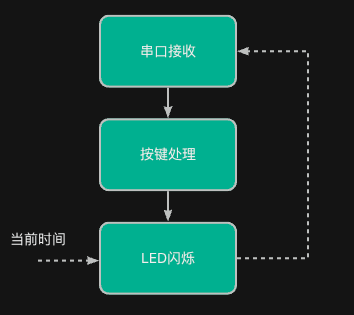

> 为了更好地使用RTOS，我们需要深入理解RTOS工作原理，最好的方法是动手写一个RTOS。
>
> 如果你希望写一个类似RT-Thread/FreeRTOS的系统，欢迎关注这门课程：[【RTOS内核开发】从0手写嵌入式操作系统](https://zw8ls.xetlk.com/s/H2F1Y)
>

虽然祼机开发比较简单和直观；但是，当需要实现的功能比较复杂时，会面临诸多问题和挑战。下面，将给出这些内容的介绍。通过这些内容，我们将能理解为什么在这些场合中，需要寻求一种更为高效的开发方式。

:::info
注意，在下面介绍的这些场合中，并不是说祼机开发不能解决问题，只是相比使用RTOS等其它方式来说，会更加麻烦。

所以，我们不能全盘否定祼机开发，而是要根据实际情况来决定是否使用祼机开发。

:::

下面给出祼机开发中面临的一些问题和挑战。通过修改程序的逻辑结构，在祼机环境下是可以解决这些问题，只不过会复杂一些。

## 挑战一：多任务冲突
当系统需要同时控制 LED 闪烁，接收串口数据，扫描按键输入时，会导致系统无法有效地完成预定目标。

例如，对于下述代码，LED需要每隔一段时间（如500ms）闪烁，但如果串口阻塞接收，则延误闪烁。同时，也会导致按键按下的事件无法及时处理。

```c
#include "../base.h"

void key_scan (void) {
    if (key_pressed()) {
        led_set(LED1, 1);
    } else {
        led_set(LED1, 0);
    }
}

int main(void) {
    hardware_init();

    while (1) {
        led_toggle(LED0);         // 每隔一段时间闪烁
        uart_read();       // 读取串口数据
        key_scan();           // 检查按键
    }

}
```

出现该问题的原因在于：三个任务抢占同一个主循环，本质上是轮询，无法真正并发（并行处理），CPU只能顺序处理各个任务。



为解决该问题，可以采用以下几种解决方法：

### 方法一：改成非阻塞式
这种方法的具体做法是：把每个任务拆成状态机或非阻塞逻辑，放进主循环中轮流执行。这样一来，就不会出现上述，程序卡在串口数据读取的过程中。参考代码：

```c
#include "../base.h"
#include <stdio.h>

void led_task(void) {
    static uint32_t last_tick = 0;
    if (millis() - last_tick >= 500) {  // 每 500ms 切换一次
        led_toggle(LED0);
        last_tick = millis();
    }
}

void uart_task(void) {
    if (uart_available()) {
        char c = uart_read();
        uart_write(c);  // 回显，或者进行某种处理
    }
}

void key_task (void) {
    if (key_pressed()) {
        led_set(LED1, 1);
    } else {
        led_set(LED1, 0);
    }
}

int main(void) {
    hardware_init();

    while (1) {
        led_task();     // 检查是否到闪烁时间，到就执行一次
        uart_task();    // 检查是否有数据到达，有就处理
        key_task();     // 检查是否有按键按下，有就响应
    }
}
```

**这种方式的缺点：需要将每个函数改成非阻塞式的，从而导致程序变得比较难写。**

### 方法二：利用中断+标志位
不在主循环中检查事件，而是由只检查事件是否发生（接收到串口数据）的标志位，并在主循环中进行处理。这样也可以保证uart_task()的执行不会出现阻塞的情况。

```c
volatile uint8_t uart_flag = 0;

void USART_IRQHandler(void) {
    uart_flag = 1;
}

void uart_task(void) {
    if (uart_flag) {
        uart_flag = 0;
        char c = uart_read();
        uart_write(c);
    }
}
```

:::danger
其实，方式一中的uart_available()函数实现，本质上也是检查标志位，即查询UART相关寄存器的标志位。

:::

**这种方式的缺点：需要使用硬件中断。**

## 挑战二：实时响应不及时
在主循环中顺序处理各个任务，会导致在某些情况下，系统无法对某些事件进行实时处理。

:::info
实时系统是指能够及时响应外部事件并在严格的时间限制内完成指定任务的计算机系统。

这些系统特别适用于对时间敏感的应用场景，如工业控制、航空航天和医疗设备等。

实时系统分为硬实时和软实时，前者任务必须在截止时间内完成，否则可能导致严重后果；后者则允许一定程度的延迟，但需尽量及时完成。

实时系统的核心特性包括严格的实时性、可靠性和确定性，确保任务的及时可靠执行。

:::

常见的实时事件包括：

+ 串口接收数据中断（如上位机持续发送数据）
+ 按键按下产生事件（如用户输入请求）
+ 外部传感器中断信号

这些事件可能在任意时刻发生，但裸机代码由于主循环或阻塞逻辑可能不能及时处理，从而造成数据丢失、响应滞后等问题。

例如，上位机每隔30ms向MCU发送一个字符，要求MCU 接收并立即回显。

```c
#include "../base.h"
#include <stdio.h>

int main () {
    hardware_init();
    
    while (1) {
        char c = uart_read();     // 阻塞直到收到数据
        uart_write(c);            // 回显
        led_toggle(LED0);      // 由于某些原因，执行了一些比较耗时的操作，或者在等待某些事件
        delay_ms(50);
    }
    return 0;
}

```

对于上述代码，当接收到一个字符后，由于某些原因（如LED间隔闪烁），MCU延迟了50ms才继续下一次数据的接收，这可能会导致上位机发送的字符丢失。

为了解决这个问题，我们可以对程序进行修改，例如：(以下仅为示例代码，不在课程开发板上可运行)

```c
#include "../base.h"
#include <stdio.h>

volatile char recv_char;
volatile uint8_t recv_flag = 0;

void USART_IRQHandler(void) {
    if (usart_flag_get(USART1, USART_FLAG_RBNE) != RESET) {
        recv_char = usart_data_receive(USART1);
        recv_flag = 1;  // 设置标志
    }
}
void led_task(void) {
    static uint32_t last_tick = 0;
    if (millis() - last_tick >= 500) {  // 每 500ms 切换一次
        led_toggle(LED0);
        last_tick = millis();
    }
}
int main() {
    hardware_init();
    
    while (1) {
        if (recv_flag) {
            recv_flag = 0;
            uart_write(recv_char);  // 回显
        }

        led_task(); // 非阻塞处理其他任务
    }
    return 0;
}
```

注意，在上述代码中，需要将耗时的led_toggle()修改为非阻塞式的led_task()，从而保证程序能够顺利接收后续数据。

## 挑战三：程序结构臃肿
项目逐步扩展，while(1)中要处理的任务越来越多，代码越来越长，这将导致主循环膨胀。

```c
while (1) {
    led_task();     // 检查是否到闪烁时间，到就执行一次
    uart_task();    // 检查是否有数据到达，有就处理
    key_task();     // 检查是否有按键按下，有就响应
    ..........
    file_task();	 // 写文件
}

```

从上述代码可以看出，

+ 所有任务平铺式堆在主循环中
+ 添加一个功能，需要修改多个已有代码逻辑
+ 日志、定时、LCD、传感器混在一起

如果再结合挑战一和挑战二的内容，会发现任务之间的冲突、实时响应不及时会加剧。

## 挑战四：**无法区分任务优先级**
在某些情况下，我们可能希望多个任务同时需要执行时，某个任务能够优先执行。例如，我们可能希望能够优先处理串口接收，从而避免出现数据丢失的情况。

当串口接收到数据、用户按下按键、LED闪烁同时需要处理时，程序能够优先处理串口事件，再去处理按键事件，最后再处理不重要的LED闪烁事件。


然而，在祼机环境中，任务只是“先写谁先执行”，没有优先级机制。即便我们在循环中按优先级编写代码，仍然可能会出现问题。例如，当程序正准备执行LED闪烁时，正好串口接收到数据、按键按下；此时，程序会仍然先执行完LED闪烁，再去处理串口数据的接收。



所以，这就导致了：高优先级任务可能被低优先级任务“拖后腿”

## 挑战五：系统可维护性差
从前面的内容也可以看出，通过在主循环中依次执行任务，再通过中断相配合的方式，能够完成项目的设计目标。但是，这种方式会导致缺少“模块边界”和“任务解耦”，使得多个功能模块（如LED、蜂鸣器、按键）紧耦合，代码复用困难。

## 内容小结
从以上内容可以看出，采用祼机开发，在实际项目中可能会面临一些问题。总结如下表所示：

| 挑战 | 表现 | 导致的问题 |
| --- | --- | --- |
| 多任务冲突 | 各功能轮询 | 反应慢、效率低 |
| 响应不及时 | 中断丢失、数据丢失 | 实时性差 |
| 程序结构混乱 | 主循环庞大 | 可读性、维护性差 |
| 无优先级 | 所有任务地位相等 | 关键任务可能延误 |
| 模块耦合 | 功能混杂写死 | 无法复用，难扩展 |


特别是随着系统的功能越来越复杂，以上问题和挑战会更加突出。于是，需要实现一种机制，能把这些任务独立管理、能并发运行、能定义优先级，还要能实时响应。


