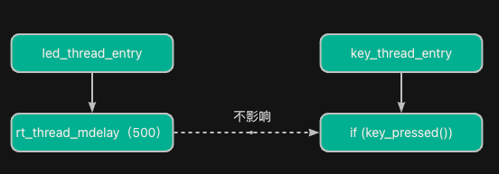
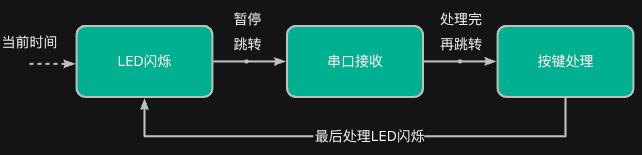

> 为了更好地使用RTOS，我们需要深入理解RTOS工作原理，最好的方法是动手写一个RTOS。
>
> 如果你希望写一个类似RT-Thread/FreeRTOS的系统，欢迎关注这门课程：[【RTOS内核开发】从0手写嵌入式操作系统](https://zw8ls.xetlk.com/s/H2F1Y)
>

相比之下，使用RTOS能够提升系统结构与响应能力，从而在一定程序上解决祼机开发中面临的各项挑战。

## 示例代码
我们可以将祼机中的示例代码，面向RT-Thread进行修改，得到的代码如下：

```c
#include <rtthread.h>
#include "../base.h"

#define STACK_SIZE 512
#define PRIORITY_LED 2
#define PRIORITY_UART 0
#define PRIORITY_KEY 1

/* LED线程：每500ms闪烁一次 LED0 */
static void led_thread_entry(void *parameter)
{
    while (1)
    {
        led_toggle(LED0);
        rt_thread_mdelay(500);  // 延迟500ms
    }
}

/* 串口线程：有数据就读取并回显 */
static void uart_thread_entry(void *parameter)
{
    while (1)
    {
        if (uart_available())
        {
            uint8_t ch = uart_read();
            uart_write(ch);  // 回显
        }
        rt_thread_mdelay(10);  // 稍微延时避免占用过多CPU
    }
}

/* 按键线程：扫描按键，按下就点亮LED1，未按下熄灭 */
static void key_thread_entry(void *parameter)
{
    while (1)
    {
        if (key_pressed())
        {
            led_set(LED1, 1);  // 点亮LED1
        }
        else
        {
            led_set(LED1, 0);  // 熄灭
        }

        rt_thread_mdelay(50);  // 扫描周期
    }
}

/* 主函数，创建线程并启动 */
int main(void)
{
    hardware_init();  // 初始化硬件基础配置

    rt_thread_t tid_led = rt_thread_create("led",
                                           led_thread_entry, RT_NULL,
                                           STACK_SIZE, PRIORITY_LED, 10);
    rt_thread_t tid_uart = rt_thread_create("uart",
                                            uart_thread_entry, RT_NULL,
                                            STACK_SIZE, PRIORITY_UART, 10);
    rt_thread_t tid_key = rt_thread_create("key",
                                           key_thread_entry, RT_NULL,
                                           STACK_SIZE, PRIORITY_KEY, 10);

    if (tid_led) rt_thread_startup(tid_led);
    if (tid_uart) rt_thread_startup(tid_uart);
    if (tid_key) rt_thread_startup(tid_key);

    return 0;
}

```

## 挑战一：无法处理多个任务并发执行
针对祼机开中的两种问题：所有任务串行执行，容易互相阻塞；无法响应多个“实时事件”，如 LED 闪烁与串口读取互相拖延。RTOS将每个功能用独立线程运行，任务由调度器分配 CPU，从而使得每个任务独立，互不干扰，响应快，可并发。

我们只需要针对每个任务创建一个线程，然后由单独的线程去处理。

```c
rt_thread_t tid_led = rt_thread_create("led",
                                       led_thread_entry, RT_NULL,
                                       STACK_SIZE, PRIORITY_LED, 10);
rt_thread_t tid_uart = rt_thread_create("uart",
                                    uart_thread_entry, RT_NULL,
                                    STACK_SIZE, PRIORITY_UART, 10);
rt_thread_t tid_key = rt_thread_create("key",
                                       key_thread_entry, RT_NULL,
                                       STACK_SIZE, PRIORITY_KEY, 10);

```

在每个任务中，只需要专注在自己的while(1)循环中处理相关操作，例如：

```c
static void led_thread_entry(void *parameter)
{
    while (1)
    {
        led_toggle(LED0);
        rt_thread_mdelay(500);  // 延迟500ms
    }
}

```

## 挑战二：响应实时事件困难
在RTOS中，对于延时或者阻塞，任务调度器会自动进行任务切换，从而让CPU去执行其它线程。这可使得系统能够有更高响应精度，不卡主循环，不漏掉关键事件。

例如，当LED任务正在延时时，使用rt_thread_mdelay()延时函数会触发CPU切换至key_thread_entry()执行。此时，在该任务中，能够及时地去检查按键是否按下，而不会像祼机程序那样必须等待延时完成之后，才有机会去检查。


## 挑战三：结构臃肿、代码难以维护
由于RTOS将每个任务模块封装为线程（任务），逻辑清晰，这使得程序易于添加、调试、管理，从而增强可维护性。当需要添加新的功能时，很多时候只需要创建新的线程（任务）来完成。例如：

```c
// main.c 中注册新线程
rt_thread_create("motor", motor_ctrl, ...);
rt_thread_create("sensor", sensor_proc, ...);
```

## 挑战四：无法区分任务优先级
在祼机环境，所有任务看起来是平等的，而在RTOS环境中，可以为每个任务指定优先级，从而让CPU优先去执行高优先级的任务。

例如，在上述示例代码中，三个任务的优先级分别如下（对RT-Thread来说，数值越小，优先级越高。）

```c
#define PRIORITY_LED 2
#define PRIORITY_UART 0
#define PRIORITY_KEY 1
```

即优先级顺序如下图所示：


当程序正准备执行LED闪烁时，正好串口接收到数据、按键按下；此时，CPU会转而优先处理串口数据、再处理按键按下，最后回到LED闪烁任务。



## 小结
下面给出两种开发方式的对比，如下表所示。

| 对比项 | 裸机开发 | RTOS 开发 |
| --- | --- | --- |
| 任务组织方式 | 单一主循环串行处理 | 多线程并发执行 |
| 是否支持优先级 |  所有任务地位平等 | 每个线程可分配不同优先级 |
| 实时响应能力 | 弱，易被阻塞 | 强，高优先级任务可随时抢占 |
| 系统可扩展性 | 差，任务多时代码混乱 | 好，结构清晰，每个任务独立管理 |
| 资源占用 | 少，适合资源极少的芯片 | 多，占用 RAM、调度器需运行 |
| 学习/开发难度 | 低，适合初学者 | 中等，需学习线程/同步机制 |
| 调试复杂度 | 增加任务后难排查 | 支持线程调试、日志打印，较易定位问题 |
| 典型应用 | 简单控制器（如温控、电风扇） | 复杂嵌入式系统（如智能音箱、无人机控制） |


**不要盲目使用RTOS！！！**

在实际项目中要特别注意，并不是说用了RTOS就显得你的项目有多么高大上，或者说用了RTOS后系统性能会更高、更易开发。实际上，<font style="color:#DF2A3F;">RTOS的引入会带来额外的资源开销以及其它问题。在使际使用时，需要进行权衡</font>。

:::info
建议在系统逻辑简单、可预测、任务少时，使用裸机可以更直接、资源占用更小。而当系统逻辑复杂、有多个实时任务、存在抢占需求，推荐使用RTOS。RTOS能够提供更清晰、可靠的解决方案。
:::

