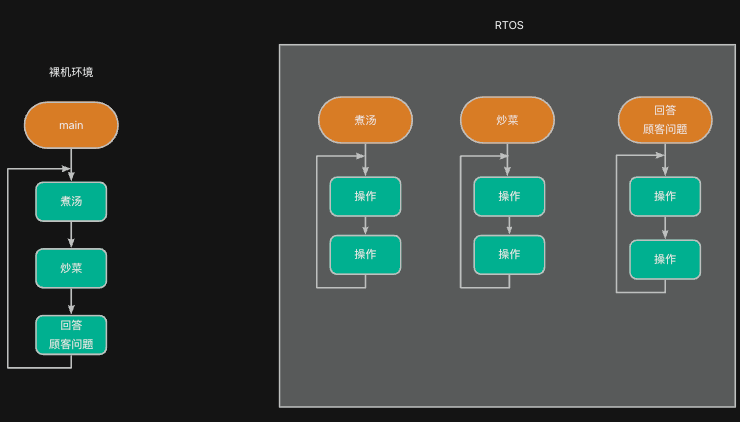

为了解决祼机开发中面临的一系列问题和挑战，那些有智慧的人类设计出了一种软件系统：RTOS。使用RTOS，可以更加方便地在项目中完成开发工作，维护等相关工作也更易展开。

## 什么是RTOS
下面从生活中的例子入手，帮助理解什么是RTOS。

## 生活案例对比
###  情景 1：**裸机开发就像一个人管饭店**
祼机开发就像是你给只一位工作人员的饭店安排如何完成工作。在这样的环境中，假设该工作人员需要完成以下三件任务：

1. 煮汤（5 分钟搅一次）
2. 炒菜（随时翻炒）
3. 回答顾客问题（不定时）

在最简单的祼机开发中，这些任务只能一件件事情轮流去做，例如

```plain
int main (void) {
  while (1) {
      煮汤();            // 煮好汤
      炒菜();            // 炒好菜
      回答顾客问题();     // 招待完顾客
  }
}
```

显然，如果只能轮流去做，就可能导致出现诸多问题：

+ 汤可能烧焦（来不及搅）
+ 顾客可能等太久（没空搭理）
+ 炒菜也不够熟（没时间持续炒）

为了解决这个问题，你可能会想：既然一个人忙不过来，那干脆多请几个人，每个人专门负责一项工作。

### 情景 2：**RTOS就像是多人管饭店**
现在你雇了几个人，准备重新安排饭店的工作。在这样的环境下，可以安排每个人专职做一件任务：

+ 一人搅汤，每 5 分钟自动动一次
+ 一人专门炒菜，火候刚好
+ 一人接待顾客，随叫随到

当你将这些工作安排好之后，每个人按照这种安排自动完成工作。此时，整个工作流程代码如下：

```plain
/* 任务1：搅汤，每5分钟搅一次（我们用5秒模拟） */
static void 煮汤(void *parameter)
{
    while (1)
    {
        rt_kprintf("搅汤一次...\n");
        rt_thread_mdelay(5000);  // 延时 5000 ms（模拟5分钟）
    }
}

/* 任务2：炒菜，持续处理（这里用短延时模拟忙碌） */
static void 炒菜(void *parameter)
{
    while (1)
    {
        rt_kprintf("炒菜中...\n");
        rt_thread_mdelay(1000);  // 模拟操作
    }
}

/* 任务3：接待顾客，随叫随到（用事件模拟） */
static void 回答顾客问题(void *parameter)
{
    while (1)
    {
        rt_kprintf("顾客来了，去接待！\n");
        rt_thread_mdelay(7000);  // 模拟顾客不定时来
    }
}

int main (void) {
   ..............
}
```

相比祼机环境，使用RTOS之后，我们相当于拥有了三个可以同时执行的while(1)循环，而原祼机环境中只有一个位于main()中的while(1)循环。

这样一来，我们可以在每个while(1)循环中分别执行各个任务，RTOS会保证这些循环能够独立执行。


## RTOS的功能
### 任务概念
在 RTOS（实时操作系统）中，任务（有的地方叫线程）是系统中可独立运行的最小执行单元。每个任务就像一个“**正在执行的函数**”，它拥有自己的执行逻辑、栈空间和运行状态。

```c
static void led_thread_entry(void *parameter)
{
    led_init(LED0);

    while (1)
    {
        led_toggle(LED0);
        rt_thread_mdelay(500);  // 延迟500ms
    }
}

```

:::info
我们可以看将RTOS 中的每个任务像一个小程序，这些程序可以独立运行。

:::

在实际应用中，我们往往会根据需要创建多个任务，每个任务分别用于实现不同的功能。例如，我们可以创建以下三个不同的任务分别用于处理串口数据接收、按键处理和LED闪烁。


### 主要功能
下面给出常见RTOS中一般具备的工作，以表格的形式给出。

| 功能模块 | 作用 | 解决的关键问题 |
| --- | --- | --- |
| 任务管理 | 创建和切换任务 | 支持多任务并发执行 |
| 时间管理 | 精准延时、定时 | 避免阻塞，提升时间控制能力 |
| 任务调度 | 合理安排CPU执行权 | 保证高优任务及时运行 |
| 通信机制 | 数据和消息的安全传递 | 多任务协作 |
| 同步机制 | 避免资源竞争 | 保护共享资源 |
| 内存管理 | 创建对象、任务、数据缓存等 | 灵活分配资源 |
| 软件定时器 | 延迟执行任务 | 非阻塞式定时功能 |


## 总结
从上述内容可以看出，**RTOS是一种软件结构，可以帮助我们在工程中创建多个while(1) 循环**。这些循环可以**相互独立执行，彼此之间互不干扰**，每个循环对应一个“任务”，由RTOS根据优先级和调度策略进行管理和切换。

这种方式的好处是：

+ 每个任务专注处理自己的工作，逻辑清晰、职责单一；
+ RTOS负责调度，**无需人为安排谁先谁后**，避免了繁琐的轮询代码；
+ 多个任务可以“并发”运行，**实时性大大提升**；
+ 通过设置任务优先级，还可以保证关键任务优先响应；
+ 可扩展性强，增加新功能只需添加新任务，不会干扰现有逻辑。


