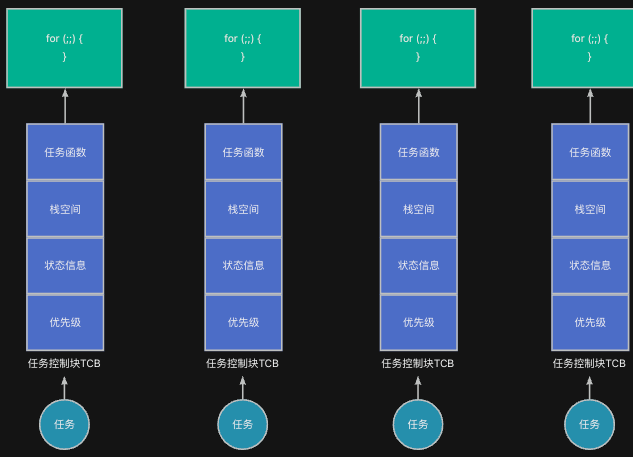
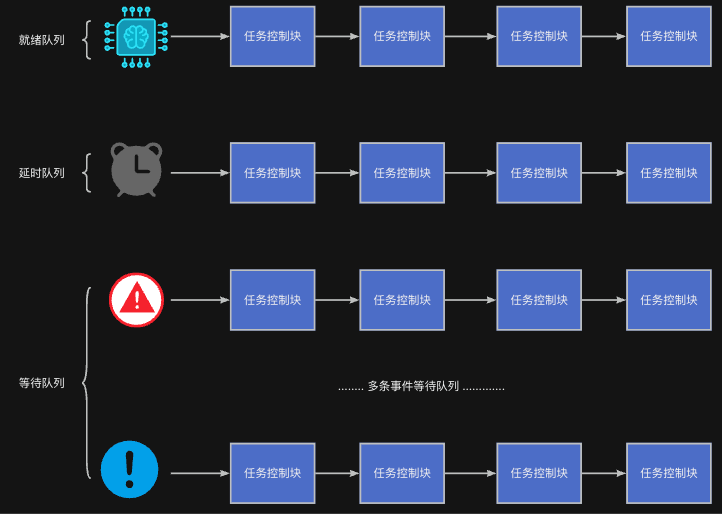
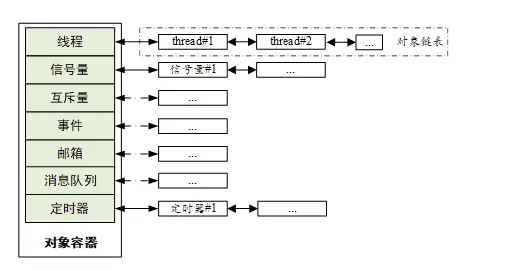
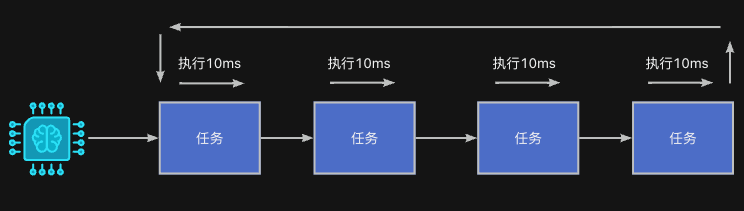
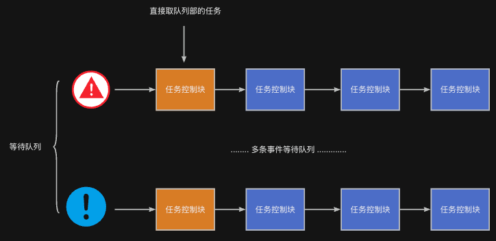
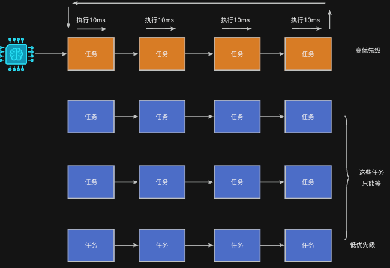

我们已经了解了任务是什么，在接下来将介绍RTOS是如何标识一个任务、如何将众多任务进行组织、按照何种策略选定任务运行。

## RTOS 如何标识每个任务？——使用任务控制块（TCB）
为了唯一标识任务，RTOS内部为每一个任务都分配一个**任务控制块（TCB, Task Control Block）**，可以理解为一个“任务档案”。



这份“档案”记录了这个任务的所有重要信息，例如前一节课时介绍的：

+ **任务函数**：任务的入口函数（逻辑体）
+ **栈空间**：保存任务运行时的临时数据和上下文
+ **状态信息**：就绪、运行、挂起、阻塞等
+ **优先级**：决定任务执行的先后顺序

具体而言，不同的RTOS会使用不同的结构体来表示任务控制块，结构体中包含不同字段来存储任务的信息。例如，对于RT-Thread，任务控制块结构定义如下：

```c
struct rt_thread
{
    /* rt object */
    char        name[RT_NAME_MAX];                      /**< the name of thread */
    rt_uint8_t  type;                                   /**< type of object */
    rt_uint8_t  flags;                                  /**< thread's flags */

    rt_list_t   list;                                   /**< the object list */
    rt_list_t   tlist;                                  /**< the thread list */

    /* stack point and entry */
    void       *sp;                                     /**< stack point */
    void       *entry;                                  /**< entry */
    void       *parameter;                              /**< parameter */
    void       *stack_addr;                             /**< stack address */
    rt_uint32_t stack_size;                             /**< stack size */

    /* error code */
    rt_err_t    error;                                  /**< error code */

    rt_uint8_t  stat;                                   /**< thread status */

    /* priority */
    rt_uint8_t  current_priority;                       /**< current priority */
    rt_uint8_t  init_priority;                          /**< initialized priority */
#if RT_THREAD_PRIORITY_MAX > 32
    rt_uint8_t  number;
    rt_uint8_t  high_mask;
#endif
    rt_uint32_t number_mask;

#if defined(RT_USING_EVENT)
    /* thread event */
    rt_uint32_t event_set;
    rt_uint8_t  event_info;
#endif

    rt_ubase_t  init_tick;                              /**< thread's initialized tick */
    rt_ubase_t  remaining_tick;                         /**< remaining tick */

    struct rt_timer thread_timer;                       /**< built-in thread timer */

    void (*cleanup)(struct rt_thread *tid);             /**< cleanup function when thread exit */

    rt_uint32_t user_data;                              /**< private user data beyond this thread */
};
typedef struct rt_thread *rt_thread_t;

```

## RTOS如何组织这些任务
### 不同类型的队列
RTOS会把系统中的所有任务控制块组织成不同的**队列（通常用链表）**。常见的任务列表有：

+ **就绪队列**：排队当前可以运行的任务
+ **挂起/阻塞队列**：排队等待事件或资源的任务
+ **延时队列**：排队等待超时的任务



:::info
任务在执行过程中，会随着其运行状态的改变而从当前所处的队列脱离，并插入到另外的队列中。当任务终止运行时，才会不处于任何队列。

:::

RTOS 就是通过这些队列，来跟踪每个任务的“当前状态”。

RT-Thread内部的队列示意图如下：


### 为什么要使用队列
之所以要使用队列，主要原因有如下几点：

#### 就绪队列：**CPU资源有限，只能运行一个任务**
+ 大多数嵌入式系统中，**只有一个 CPU**，同一时间只能运行一个任务。
+ 其他任务必须等待，因此需要一个**就绪队列**来存放那些“已经准备好，但还没轮到”的任务。

#### 等待队列：**任务可能等待资源或事件**
+ 有些任务会因为**等待按键、等待串口接收数据、等待定时器超时**等原因而不能马上执行。
+ 这些任务就必须进入**等待队列**（也叫挂起队列、阻塞队列）。
+ 等待条件满足后（如数据来了），再唤醒它们，重新放入就绪队列。

**延时队列：****任务等待时间到达**

+ 很多任务在运行过程中，需要延时（睡眠），或者在等待资源或事件的过程中需要加上超时机制，以避免长期死等
+ RTOS会定时检查这些任务是否时间到达。为了方便管理这些任务，所有的任务加入到延时队列中。

从述内容可以看出：**通过这些队列，RTOS 就可以像一个智能的调度中心，管理每一个任务的状态与位置，确保**实现如下功能：

+ 有资源时，任务能够马上安排执行；
+ 没资源时，任务被合理安排等待；条件满足后自动唤醒继续干活。

## 当有可用资源或者事件发生时，选取哪个任务去占用处理
无论是CPU，还是串口数据等，都可以看作是某种资源；而像外部中断等，则可以看作是某种事件。任务在执行过程中，既需要占用资源，也需要等待某些事件的发生。

那么，如果多个任务同时希望占有某个资源，或者等待事件的发生时；RTOS应该采用何种策略来决定资源应该分配给谁，或者事件由谁去处理？

常见的三种策略：

### 时间片轮转
**这种策略主要用在CPU运行时间的安排上，其主要特点有**：

+ 优先级相同的任务之间，RTOS会**分时执行**，每个任务获得一个时间片。
+ 时间片用完就换下一个任务，循环调度。

如果用生活中的例子来类比，可以理解为孩子轮流玩同一个玩具，每人玩10分钟。

而对于CPU也是一样的道理，由于每个任务里面都有while(1)循环，会长期占用CPU。所以，RTOS为了避免某个任务长期占用CPU而导致其它任务无法运行，会强制让CPU轮流在每个任务上执行一小段时间，如10ms。



### 先来先服务（FCFS/FIFO）
**这种策略主要用在资源的占用和事件的等待上，其主要特点有**：

+ 谁先请求资源，谁先获得资源或先被唤醒。
+ 和排队买票一样，**先到先服务**。

**应用场景**：

+ 对公平性要求高，但对实时性要求不高的系统。



---

### 优先级
**这种方式往往时间片轮转相结合，其主要特点如下**：

+ 任务根据“紧急程度”设置不同的优先级。
+ RTOS 总是选择**优先级最高的就绪任务来执行**。
+ 如果一个高优先级任务准备好了，会**立即抢占**正在运行的低优先级任务（前提是抢占式内核）。

**类比现实生活中的场景**：像急诊病人优先看病，不管你排了多久。




