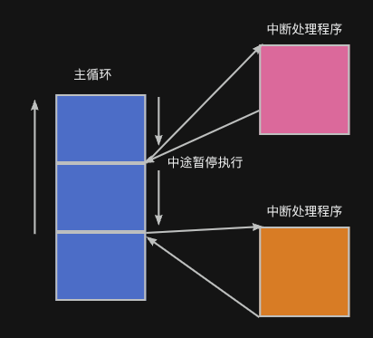
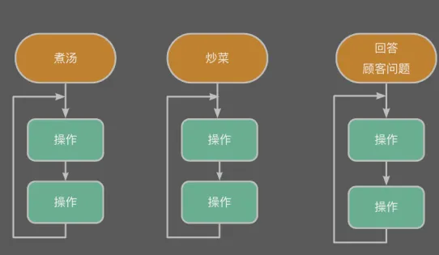
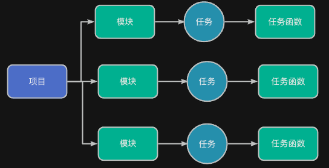
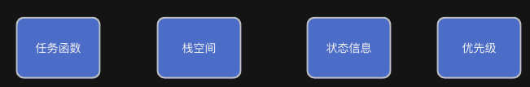
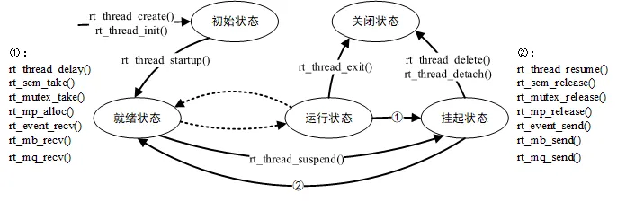

> 为了更好地使用RTOS，我们需要深入理解RTOS工作原理，最好的方法是动手写一个RTOS。
>
> 如果你希望写一个类似RT-Thread/FreeRTOS的系统，欢迎关注这门课程：[【RTOS内核开发】从0手写嵌入式操作系统](https://zw8ls.xetlk.com/s/H2F1Y)
>

本章给出RTOS重要概念和原理的一般性介绍，这些内容独立于特定的RTOS。也就是说。该内容几乎适用于所有的RTOS。在后面的章节中，将针对RT-Thread展开介绍这些概念和原理的实际表现。

## 中断
为了更好地理解任务，先回顾下中断的工作机制。

:::info
**中断**是嵌入式系统中的一种重要机制，用来**响应外部事件**。当某些硬件事件（比如串口收到数据、按键被按下）发生时，CPU 会**立即打断当前正在执行的程序**，去执行一个专门的中断服务函数（ISR）。

当CPU执行完中断处理程序之后，将回到原来被打断的地方继续往下执行。

:::

如果用图来表示，其工作机制流程如下所示：



在整个系统中，可能有零个或多个会执行。当中断发生时，分别执行其对应的中断处理程序。

<font style="color:#2F4BDA;">但是，中断一个缺点：不能长期运行，只能由外部事件触发并由硬件自动调用，且必须快速执行完返回。</font>

## 任务的概念
在 RTOS 中，“任务”是一段可以被单独调度、独立运行的程序逻辑。

**每个任务都有自己的执行流程、运行状态和资源空间。**

**它就像一个小程序，可以并发地与其他任务同时运行（由 RTOS 管理）。**

如果用之前的例子进行类比，可以认为：**任务就像饭店里的员工**。在饭店里，每个员工负责一件事：

+ 👨‍🍳 厨师炒菜
+ 🧑‍🔧 后厨搅汤
+ 👩‍💼 前台接待顾客

这些工作互不干扰、同时进行，而不是一个人轮流做。这就好比 RTOS 中的“<font style="color:#2F4BDA;">多个任务并发执行</font>”。


下面给出中断与任务的比较：

| 比较角度 | 中断（Interrupt） | 任务（Task / Thread） |
| --- | --- | --- |
| 本质 | 执行一个函数（ISR） | 执行一个函数（任务函数） |
| 生命周期 | **一次性完成**，执行完立即返回 | **可以长期运行**，通常是一个while(1)循环 |
| 调用方式 | 由外部事件触发，系统自动调用 | 由RTOS调度机制决定哪个任务获得CPU |
| 运行时间 | 非常短，只做最关键的工作 | 可以较长，适合处理流程性或持续性工作 |
| 依赖系统支持 | 不需要 RTOS，也可使用 | 需要一个 RTOS 内核作为支撑 |


如果从项目开发的角度来说：

<font style="color:#DF2A3F;">我们在写项目时，会把一个系统拆成几个工作模块，每个模块的功能就对应一个任务，这些任务由 RTOS 统一管理和执行。</font>


## 组成部分
在 RTOS 中，任务需要以下组成部分：

+ **任务函数**：任务的入口函数（逻辑体）
+ **栈空间**：保存任务运行时的临时数据和上下文
+ **状态信息**：就绪、运行、挂起、阻塞等
+ **优先级**：决定任务执行的先后顺序

针对不同的RTOS，其任务包含的具体信息有所不同，但是大体上都包含了上述的信息。



### 任务函数
任务函数就像一份菜谱，**<font style="color:#2F4BDA;">它详细描述了任务要完成的工作内容和步骤，也就是任务倒底要干什么</font>**。在 RTOS 中，任务就像是一位厨师，而任务函数就是这位厨师的工作流程说明书。

下面以RT-Thread为例，给出任务函数的举例，其它RTOS的任务函数基本类似。

```c
// 一个简单的LED闪烁任务
static void led_blink(void *parameter) {
    while (1) {
        led_toggle(LED0);       // 切换LED状态
        rt_thread_mdelay(500);  // 延时500ms
    }
}

```

注意：这里的while(1)就是任务的主循环，它会一直运行，除非被挂起或删除。

也就说：

+ **任务 = 厨师**：负责完成某项工作（如炒菜、搅汤）
+ **任务函数 = 菜谱**：说明这项工作怎么做，一步步操作
+ **RTOS = 后厨经理**：安排多个厨师在不同时间执行不同的菜谱

其中，RTOS 会按照任务的优先级和调度规则安排“厨师”去执行他们的“菜谱”。

### 栈空间（Stack）
正如中断处理程序执行时需要栈空间一样，每个任务也需要有自己的一块内存区域，用来保存函数调用时的临时变量、返回地址、CPU寄存器等上下文信息。

### 状态信息（任务状态）
不同于中断处理函数的一次性执行完毕，RTOS内核需要知道每个任务当前处于什么状态，从而决定它是否可以运行。

常见的任务状态：

+ 就绪：可以运行，等待被调度。
+ 运行：正在执行。
+ 挂起：被暂停，不参与调度。
+ 阻塞：正在等待某个事件或资源。
+ 终止：被强制中断运行。

不同RTOS中任务状态的划分和命名方法不同，以下是RT-Thread的任务状态切换图，这个图中同样展开了任务的生命周期。



:::info
任务的生命周期

任务“生命周期”通常指的是从 **启动、创建任务、运行、调度、任务结束或退出**这一整套流程。我们可以把它看作是 R任务从出生->运转->结束的全过程。

:::

### 优先级（Priority）
RTOS会根据任务的优先级决定**谁先得到CPU执行权**，从而处理更加紧急的任务，比如处理传感器数据或控制电机，不能等太久。

## 
