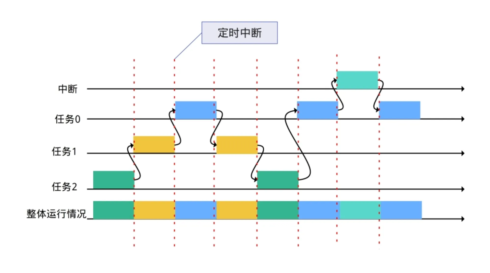
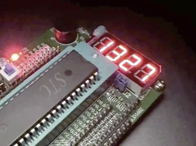
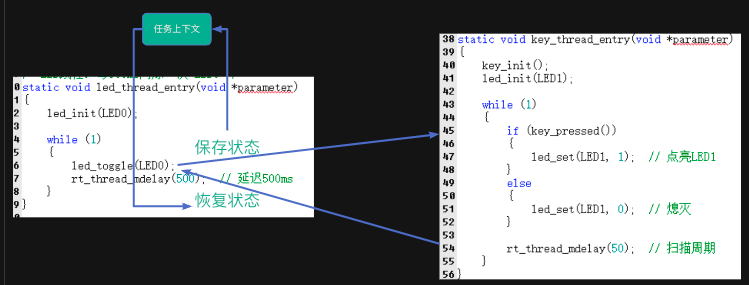

> 为了更好地使用RTOS，我们需要深入理解RTOS工作原理，最好的方法是动手写一个RTOS。
>
> 如果你希望写一个类似RT-Thread/FreeRTOS的系统，欢迎关注这门课程：[【RTOS内核开发】从0手写嵌入式操作系统](https://zw8ls.xetlk.com/s/H2F1Y)
>

本小节主要介绍RTOS是如何控制CPU在不同的任务之间执行。

# 任务运行的表现：并发而非并行执行
在多任务环境下，存在着多个while(1)的任务函数。虽然每个任务看上去都在**持续运行**，比如一个任务在不停闪灯，另一个在读取串口，还有一个在检测按键是否按下。

**但实际上，由于CPU 只有一个，所以它在某一时刻只能执行一个任务。**

那么，问题来了：多个任务是怎么“同时”工作的？

这就是RTOS的强大之处 —— 它让CPU在多个任务之间快速切换执行，每个任务轮流“占用”CPU，但切换得非常快（毫秒级甚至微秒级），人眼看起来就像所有任务都在同时运行一样。

这种有点像我们学习单片机控制多位数码管的操作。每次单片机只能控制一位数码管点亮。通过快速地轮流让每位数码管点亮，只要时间足够快，人眼就察觉不出来这种变量，以为所有数码管在同时点亮。

**综上所述，RTOS控制任务并发执行，而非并行执行。**

+ **每个任务并不是从头运行到尾，而是运行一段就被暂停，等待下次继续**；
+ **RTOS 负责在任务之间切换，让每个任务都能“轮到自己”使用 CPU**；
+ **切换过程非常快，用户感觉不到“换人”了，仿佛所有任务都在并行执行**。

# RTOS是如何做到这一点的
## 原理
我们可以将该CPU看作是唯一的厨师，裸机开发中，他要**一个人轮流完成煮汤、炒菜、接待顾客**这些任务，工作全靠自己的安排（main中的while(1）循环）。

**但在RTOS下，虽然仍然只有一个厨师（CPU），但你请了一个 “调度经理”（RTOS）。他会帮助你把这位厨师的时间合理分配到不同的工作上，让这些任务轮流执行，看起来像是同时在进行。**

具体来说，RTOS通过以下方式来实现这种操作：

| 问题 | 解决 | 概念 |
| --- | --- | --- |
| 厨师不能“同时做三件事”，那怎么办？ | “每次只做一件事，但每件事只做**一小会儿**，就换下一件！例如：每件事做 100 毫秒。” | **时间片轮转调度** |
| 那怎么记住上次做哪儿了？ | 每次切换时，调度经理（RTOS）会： + 记住：工作进行到哪一步了（如炒菜炒到哪了）（保存状态） + 下一次切回来，就从上次离开的地方继续做（恢复状态） | **保存和恢复上下文** |
| 那如果顾客突然进来怎么办？（需要优先处理） | 不管你在搅汤还是炒菜，只要顾客来了，立刻中断工作，去完成“接待顾客”的任务。接待完再回去继续炒菜或搅汤 | **抢占式调度** |

简单来说，RTOS 通过“轮着做 + 紧急插队”的方式，让CPU看起来能同时应付多件事，做到像多个 while(1) 循环一样并发运行。实际上，RTOS通过控制CPU在它们之间快速切换执行来实现。

## 任务上下文
为了理解RTOS如何进行任务切换，我们需要理解什么是任务上下文。

:::info
任务上下文是**一个任务在某一时刻的运行现场信息**，主要包括：

+ **CPU 寄存器的值**（如程序计数器PC、堆栈指针SP等）
+ **栈内容**（函数调用临时数据、返回地址等）
+ **任务状态信息**（运行、就绪、挂起等）

:::

我们可以把“任务上下文”理解为：**一张保存了当前任务执行现场的“快照”**，便于以后能原样“恢复”运行。

为什么需要这些东西？原因在于：RTOS 中有多个任务轮流执行，但 CPU 只有一个，所以当系统从一个任务切换到另一个任务时：

+ 不能丢失当前任务的运行状态
+ 要能够恢复另一个任务的运行状态

也就是说，**我们要保存这些运行状态，以便CPU从某个任务切换出去执行其它任务，再切换回来时，该任务能够继续从原来暂停执行的位置继续往下运行。这些运行状态，保存在任务的上下文。**

## 切换过程
当需要进行任务切换时，整个切换流程如下：

1. 保存当前任务上下文（寄存器 + 堆栈指针）
2. 调度器选择一个新任务
3. 加载新任务的上下文
4. CPU 继续执行新任务

### 什么时候触发切换
具体来说，当发生以下情况时，RTOS会触发任务切换，从而进行上下文切换：

+ 主动让出 CPU（如延时）
+ 更高优先级任务就绪（抢占）
+ 调度器强制切换（时间片到）

