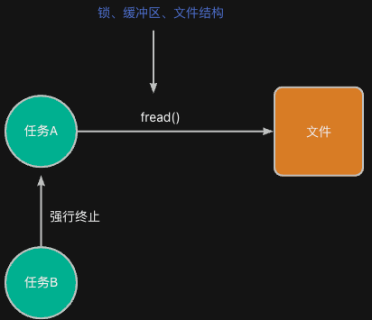

在实际项目中，有些任务是临时性的，只在某段时间内工作。当任务完成使命后，任务应当退出并且释放其所占用的资源。RT-Thread 支持多种方式终止任务，下面将按任务的创建方式分别介绍。

## 终止任务要做哪些工作
为了能够让任务顺利退出并释放资源，通常需要做以下工作：

+ 任务需要先释放自己在运行过程中创建的资源（如动态内存、打开的文件）
+ 将任务从调度队列中移除，使得任务不再被操作系统管理，避免被再次运行。
+ **回收存储空间（仅动态任务）**：
    - 释放任务的栈空间（从堆分配的）
    - 释放任务控制块

也就是说，要做这几部工作：


## 终止方式
### 任务主动结束
任务可以通过从任务函数中返回，来主动结束该任务的运行，示例代码如下：

```c
void key_task_entry(void *param) {
    RT_UNUSED(param);

    int press_count = 0;
    while (1) {
        // .........

        if (press_count >= 3) {
        // .........
           return;  // 自动结束静态任务
        }

       rt_thread_mdelay(200);
    }
}
```

通过这种方式，任务可以先在函数内部自行释放完其占用的所有其它资源（如动态分配的内存、打开的文件等）。

### 强制终止其它任务
而如果在某个任务中，去终止其它任务的运行，则需要使用rt_thread_detach()或者rt_thread_delete()来终止任务的运行。示例代码如下：

```c
static struct rt_thread led_thread;
static rt_uint8_t led_stack[4096];

/*---------------------------------------
 * 动态任务：LED心跳（运行5次后删除）
 *--------------------------------------*/
void led_task_entry(void *param) {
    RT_UNUSED(param);

    for (;;) {
        led_toggle(LED0);
        rt_thread_mdelay(1000);
    }
}

void key_task_entry(void *param) {
    RT_UNUSED(param);

    int press_count = 0;
    while (1) {
        // .........

        if (press_count >= 3) {
            // 强制结束led_thread
            rt_thread_detach(&led_thread);
            //rt_thread_delete(&led_thread);
        // .........

           return;  // 自动结束静态任务
        }

       rt_thread_mdelay(200);
    }
}

```

 对于静态创建的任务，需要使用rt_thread_detach()；而对于动态创建的任务，需要使用rt_thread_delete()。

:::danger
实际上，如果去看这两个函数的实现代码，会发现二者完全相同。。。

所以，就目前来说，随便用哪个都可以。只不过，保不准以后的实现中会有修改，所以还是按照上述规则来。

:::

## 注意事项
> 如果一个任务正在读取文件，其它任务调用rt_thread_detach()强制中止该任务，会有什么不良后果？
>



如果强制终止一个正在执行文件读写的任务，会带来一系列潜在问题，主要包括：

1. **文件句柄或缓冲区未关闭/刷出：**任务在读写过程中，底层可能已经打开了文件描述符并在缓冲区中缓存了部分数据。强行断掉任务后，这些缓冲区的数据**不会被正确刷新到存储介质**，可能导致文件损坏或数据丢失。
2. **资源泄漏：** 打开文件、分配的内存、申请的锁（如读写锁）等资源都不会被正常释放，久而久之会耗尽系统资源，甚至导致 RTOS 原本就很有限的内存被耗光。
3. **锁未解导致死锁：** 如果在文件读写中加了互斥锁保护（mutex），任务被强制终止时锁不会被自动释放，后续任何尝试获取这把锁的任务都会被永远阻塞，造成系统死锁。
4. **系统数据结构不一致：** 文件系统内部维护的状态（比如文件指针位置、打开文件计数器等）在中途被打断，可能留下半成品状态，使得下一次访问同一文件时出现不可预知的错误。

因此，为了避免该问题，需要采用更加安全的做法：

+ **优先让任务自行清理，避免强制删除**：只有在完全确定任务无任何持有的资源、不会破坏系统状态时才可删除，否则应先让任务自行清理。
+ **在任务内部优雅退出**：让任务在检测到“退出标志”后自行关闭所有文件、释放锁和内存，然后自行从任务函数中返回。
+ **使用信号量或事件通知**：由其他任务发一个“请退出”信号，读写任务在安全点（例如每次读写完成后）检查信号并退出。

