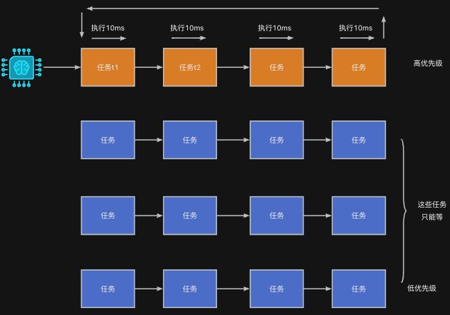

## 什么是主动让出CPU
**任务主动让出CPU**意味着任务当前可以运行，但它**自愿放弃运行权**，允许调度器切换到其他就绪任务（通常是同优先级或更高优先级的任务）。

这是一种**协作式调度行为**，不会被强制打断，而是任务**自己调用接口让出处理器**。



### 示例代码：两个同优先级任务轮流打印
为了能够让任务主动让出CPU，需要使用rt_thread_yield()，具体示例代码如下：

```c
#include <rtthread.h>
#include "base.h"

void task1_entry(void *param) {
    RT_UNUSED(param);

    while (1) {
        rt_kprintf("Task 1 is running\n");
        rt_thread_yield();
    }
}

void task2_entry(void *param) {
    RT_UNUSED(param);

    while (1) {
        rt_kprintf("Task 2 is running\n");
        rt_thread_yield();
    }
}

int main(void) {
    hardware_init();

    rt_thread_t t1 = rt_thread_create(
        "t1",
        task1_entry,
        RT_NULL,
        1024,
        20,     // 相同优先级
        20       // 时间片为5个tick
    );

    rt_thread_t t2 = rt_thread_create(
        "t2",
        task2_entry,
        RT_NULL,
        1024,
        20,     // 相同优先级
        40
    );

    if (t1) rt_thread_startup(t1);
    if (t2) rt_thread_startup(t2);

    return 0;
}
```

上述程序的运行结果如下图所示：

```plain
Task 1 is running
Task 2 is running
Task 1 is running
Task 2 is running
...
```

## 什么情况下可以用rt_thread_yield()
下面给出一个例子，介绍该函数的使用场合。实际在项目中如何使用，取决于项目的需求。

假设系统中需要频繁的监测某个外部设备，并且采用一个任务来完成此项工作。当监测的时间比较短时，我们可能不希望用rt_thread_mdelay()等函数。但是，又不希望该任务一直占用CPU，在这种情况下可以加上rt_thread_yield()。在每次监测之后，主动释放CPU给其它任务。

```c
void monitor_task(void *param)
{
    while (1)
    {
        if (device_ready())
        {
            do_something();
        }

        rt_thread_yield();  // 不休眠太久，快速轮询，但让出时间片
    }
}


```

同时，采用该函数并不会让任务暂停运行。

## 注意事项
+ rt_thread_yield()只影响**当前优先级**的任务，不会切换到低优先级任务。
+ 如果当前任务是该优先级下**唯一的就绪任务**，调用该函数不会发生任务切换。

