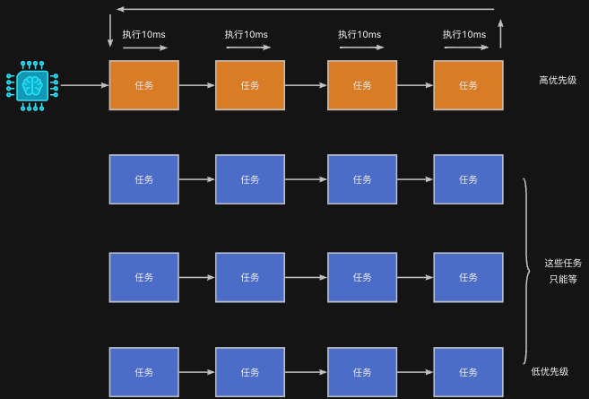
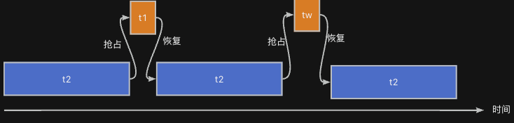

> 为了更好地使用RTOS，我们需要深入理解RTOS工作原理，最好的方法是动手写一个RTOS。
>
> 如果你希望写一个类似RT-Thread/FreeRTOS的系统，欢迎关注这门课程：[【RTOS内核开发】从0手写嵌入式操作系统](https://zw8ls.xetlk.com/s/H2F1Y)
>

在某些情况下，我们可能希望指定的任务能够优先运行、甚至是打断其它任务的执行，因为该任务要完成的工作更加紧急或重要。为解决此问题，可以为该任务指定更高的优先级。

## 什么是优先级调度
我们已经知道，很多RTOS会采用优先级队列来组织所有已经就绪的任务。同样地，RT-Thread也不例外：



RT-Thread内核支持**基于优先级的抢占式调度**：

+ 每个任务在创建时会指定一个**优先级**（0~255，数字越小，优先级越高）。
+ 内核总是选取当前**就绪任务中优先级最高**的任务来运行。
+ 当有更高优先级的任务进入就绪态，调度器**立即中断当前低优先级任务**，切换到高优先级任务。

:::info
可以看到，高优先级的任务总是有优先运行的机会，它会打断低优先级任务的运行，抢占执行机会。--- 抢占式调度

:::

### 示例代码
如下图所示，演示了高优先任务t2抢占低优先级任务t1运行机会的情况。当t2使用for()进行延时时，t1没有任何运行机会；而只有当t2使用rt_thread_mdelay()进行延迟时，即主要放弃CPU暂停运行，t1才有运行的机会。

```c
#include <rtthread.h>
#include "base.h"

void task1_entry(void *param) {
    RT_UNUSED(param);

    while (1) {
        rt_kprintf("Task 1 is running\n");
        // 忙等待模拟工作
        //for (int i = 0; i < 100000; i++);
        rt_thread_mdelay(200);
    }
}

void task2_entry(void *param) {
    RT_UNUSED(param);

    while (1) {
        rt_kprintf("Task 2 is running\n");
        for (int i = 0; i < 100000; i++);
    }
}

int main(void) {
    hardware_init();

    //  0 -- 
    rt_thread_t t1 = rt_thread_create(
        "t1",
        task1_entry,
        RT_NULL,
        1024,
        10,     // 相同优先级
        20       // 时间片为5个tick， 20*1ms = 20ms
    );

    rt_thread_t t2 = rt_thread_create(
        "t2",
        task2_entry,
        RT_NULL,
        1024,
        20,     // 相同优先级
        40          // 40*1ms = 40ms
    );

    if (t1) rt_thread_startup(t1);
    if (t2) rt_thread_startup(t2);

    return 0;
}
```

运行过程的分析示意图如下：



## 注意事项
由于引入了优先级，在为任务配置优先级时需要注意以下事项。

+ **优先级设计要合理**：不合理的优先级设置可能导致低优先级任务“饿死”。
+ **避免高优先级任务一直占用 CPU**：要合理加入rt_thread_mdelay()或rt_thread_yield()等接口
+ **不要所有任务设为同一个优先级**，否则调度结果受时间片影响，无法体现优先级机制。

