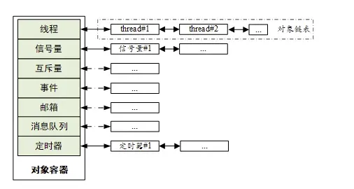
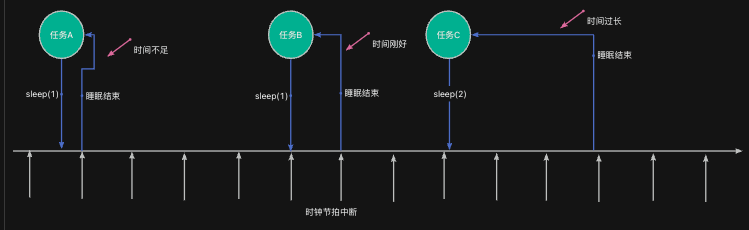

> 为了更好地使用RTOS，我们需要深入理解RTOS工作原理，最好的方法是动手写一个RTOS。
>
> 如果你希望写一个类似RT-Thread/FreeRTOS的系统，欢迎关注这门课程：[【RTOS内核开发】从0手写嵌入式操作系统](https://zw8ls.xetlk.com/s/H2F1Y)
>

本课时介绍如何让任务睡眠，从而让任务暂停运行指定的时间。

## 为什么要延时
在实际项目中，我们经常会用到让任务睡眠相关的接口，从而实现以下功能。

+ 避免CPU占用过多（如忙等）
+ 控制执行节奏（如LED闪烁、采样周期）
+ 给其他任务运行机会

## 工作原理
当任务需要睡眠时，RT-Thread会将其加入到定时器列表里。这样一来，任务就不会参与调度，无法运行。

只有当任务睡眠时间结束时，任务才会从定时器列表移回就绪队列。


## 相关接口
在RT-Thread中，与睡眠相关的接口如表所示：

| 函数名 | 说明 |
| --- | --- |
| rt_thread_mdelay(ms) | 毫秒级延时（常用） |
| rt_thread_delay(tick) | 等同于rt_thread_sleep() |
| rt_thread_sleep(tick) | tick数延时，单位为系统节拍数 |
| rt_thread_delay_until(&tick, inc_ticks) | 从*tick开始的时间，睡眠inc_ticks时间 |


其中，rt_thread_mdelay()以毫秒为单位，其余函数以系统时钟节拍周期为单位。该周期由如下配置宏来决定：

```c
#define RT_TICK_PER_SECOND  1000
```

## 示例代码：每秒闪烁 LED
下面给出了一个简单的示例，展示了部分睡眠函数的作用。

```c
#include <rtthread.h>
#include "base.h"

void task1_entry(void *param) {
    RT_UNUSED(param);

    while (1) {
        rt_kprintf("Task 1 is running\n");
        rt_thread_delay(RT_TICK_PER_SECOND);        // 延时1秒
    }
}

void task2_entry(void *param) {
    RT_UNUSED(param);

    rt_tick_t ticks = rt_tick_get();
    while (1) {
        rt_kprintf("Task 2 is running\n");
        rt_thread_delay_until(&ticks, RT_TICK_PER_SECOND);
    }
}

int main(void) {
    hardware_init();

    rt_thread_t t1 = rt_thread_create(
        "t1",
        task1_entry,
        RT_NULL,
        1024,
        20,     // 相同优先级
        20       // 时间片为5个tick
    );

    rt_thread_t t2 = rt_thread_create(
        "t2",
        task2_entry,
        RT_NULL,
        1024,
        20,     // 相同优先级
        40
    );

    if (t1) rt_thread_startup(t1);
    if (t2) rt_thread_startup(t2);

    return 0;
}
```

## 注意事项
### 睡眠的时间精度取决于系统时钟节拍周期
RT-Thread 使用**系统时钟节拍定时器**来周期性触发任务调度。该时钟节拍由RT_TICK_PER_SECOND宏配置。

假设RT_TICK_PER_SECOND=1000，那么一个tick时间= 1ms。也就说，此时睡眠的最小单位就是 1 Tick。

如果调用睡眠时间的函数时间点卡得不够好，则可能睡眠过多或过多少，具体如下图所示。


**从上图可以看出，实际的睡眠时间比期望的要短或长一些，但是差距不超过一个tick（假设任务在睡眠完之后，能够立即运行）**

**而如果有其它任何干扰，如更高优先级的任务抢占CPU、同优先级其它任务正在运行，则实际延时时间要更长一些。**

:::info
因此，在 RTOS 中我们说延时是“近似的、最小保证的延时”，不能用于精密定时（如 1ms 级别的 PWM 控制），而应使用硬件定时器或定时器中断实现更高精度的控制。

:::


