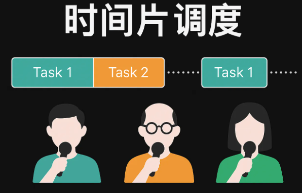
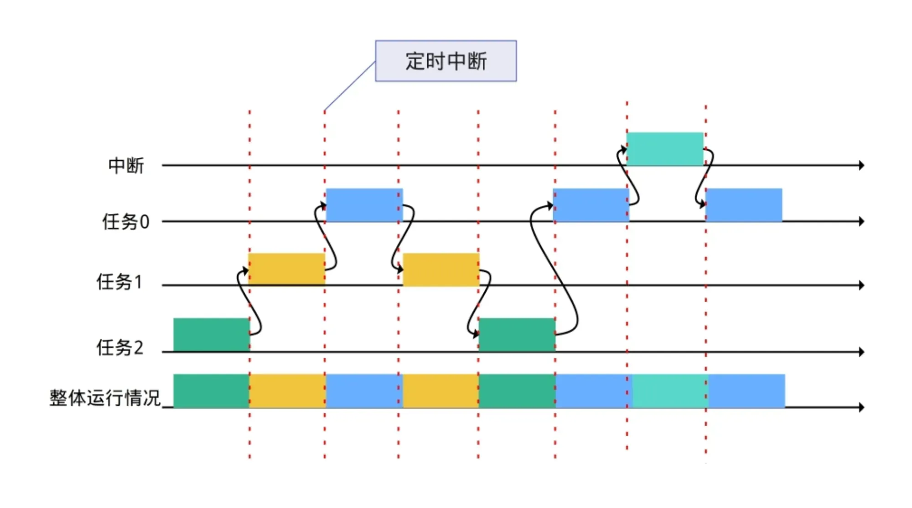
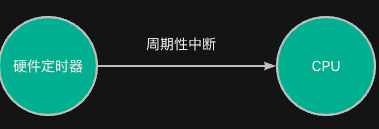
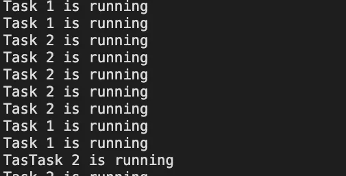
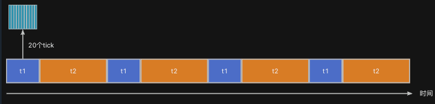

> 为了更好地使用RTOS，我们需要深入理解RTOS工作原理，最好的方法是动手写一个RTOS。
>
> 如果你希望写一个类似RT-Thread/FreeRTOS的系统，欢迎关注这门课程：[【RTOS内核开发】从0手写嵌入式操作系统](https://zw8ls.xetlk.com/s/H2F1Y)
>

本课时主要介绍RT-Thtread中的时间片调度工作机制，通过示例演示多个同优先级任务如何依靠时间片公平执行。

> 注：学习本课时时，可复习第3章中的相关内容。
>

---
## 主要原理
### 基本概念
在多任务操作系统中，如果<font style="color:#DF2A3F;">多个任务的优先级相同</font>，该如何让它们公平地使用CPU呢？这就需要用到**时间片轮转调度。**

就像多人轮流演讲，每个人讲一段时间就交给下一个人，系统通过“时间片”轮流让任务上台执行。


:::info
时间片轮转调度是操作系统中常用的任务调度策略，尤其适用于同优先级任务的公平调度。该策略的核心思想是让每个任务轮流执行固定的时间片段（时间片），超时后强制切换任务，防止单一任务长时间独占 CPU。

:::

例如，对于下图中，任务0-2各自都有相同长度的时间片支持其运行。



### 系统节拍
在RT-Thread中，每个任务的时间片长度可以不同。该参数在rt_thread_create()或rt_thread_create()调用时指定，即指定任务的时间片为多少个系统节拍。

在RT-Thread中，系统默认每经过一定时间（如 1 毫秒）就会产生一次定时器中断。该定时中断用来驱动RTOS内核的调度器和时间相关的功能。


该定时器的中断时间间隔由以下配置宏来决定：

```c
#define RT_TICK_PER_SECOND  1000
```

### 示例代码：两个任务轮流打印
下面的代码展示了两个相同优先级任务轮流打印的示例代码。

```c
#include <rtthread.h>
#include "base.h"

void task1_entry(void *param) {
    RT_UNUSED(param);

    while (1) {
        rt_kprintf("Task 1 is running\n");
        // 忙等待模拟工作
        for (int i = 0; i < 100000; i++);
    }
}

void task2_entry(void *param) {
    RT_UNUSED(param);

    while (1) {
        rt_kprintf("Task 2 is running\n");
        for (int i = 0; i < 100000; i++);
    }
}

int main(void) {
    hardware_init();

    rt_thread_t t1 = rt_thread_create(
        "t1",
        task1_entry,
        RT_NULL,
        1024,
        10,     // 相同优先级
        20       // 时间片为5个tick
    );

    rt_thread_t t2 = rt_thread_create(
        "t2",
        task2_entry,
        RT_NULL,
        1024,
        10,     // 相同优先级
        40
    );

    if (t1) rt_thread_startup(t1);
    if (t2) rt_thread_startup(t2);

    return 0;
}
```

上述代码的运行效果如下图所示。仔细分析可以发现，任务1的代码打印数量比任务2的要少，大约是1/2（不一定准确）。



之所以如此，是因为RT-Thread按时间片来控制两个任务交替占用CPU运行其代码，从而让两个任务都有运行的机会。

此外，由于t1的时间片为20个tick，t2为40个tick；因此，t2每次最大运行的时间为t1的倍。如下图所示。



## 总结
+ **时间片调度**用于相同优先级的任务之间，实现公平轮流执行
+ 每个任务被分配一个固定时间片
+ 时间片用完后，调度器切换到下一个就绪任务
+ 如果任务进入阻塞状态，会提前让出 CPU

## 注意事项
时间片仅起到约束线程<font style="color:#DF2A3F;">单次运行时长的作用</font>，任务每次运行的时间可以小于该时间片。

