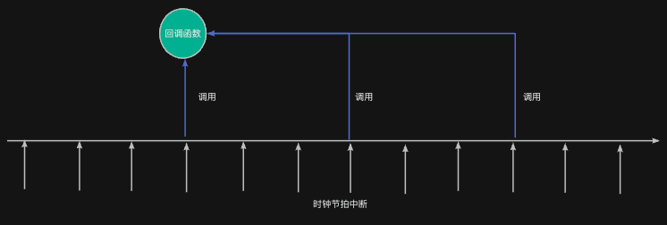

在很多时候，系统中需要周期性地做某些事情，或者推迟执行某件事，此时可以借助定时器来实现这些功能。

## 什么是定时器？
RT-Thread中的定时器是一个“<font style="color:#DF2A3F;">非阻塞式</font>”的延迟或周期执行工具，它不依赖任务执行，而是**<font style="color:#DF2A3F;">在系统时钟节拍中断</font>****（****<font style="color:#DF2A3F;">或者指定的定时器任务）</font>**中被调度触发，执行预设的<font style="color:#DF2A3F;">回调函数</font>。



它与任务中使用延时函数有着不同的特性，具体来说有如下几个方面：

| 特性 | 延时函数（`如rt_thread_delay()`） | 定时器 |
| --- | --- | --- |
| 执行者 | 当前任务本身 | 系统 tick 定时触发回调 |
| 是否阻塞 | 阻塞当前任务 | 非阻塞 |
| 使用场景 | 任务内部临时等待 | 轻量定时触发任务逻辑 |
| 执行位置 | 任务上下文 | 中断上下文（或任务上下文） |


## 典型应用场景
通常情况下，我们常常将定时器用于以下几种场合。**虽然在这些场合中可以使用硬件定时器实现相同的功能；但是，硬件定时器毕竟有限，于是就需要利用RT-Thread提供的定时器。**

### 1. 周期性任务调度
例如：LED 心跳灯、状态刷新。每隔一秒刷新一次界面、闪一次灯，不需要一个完整的任务做这件事。

如果单独创建一个任务来完成这些简单的工作，则过于浪费任务资源。

### 2. 超时检测机制
例如：串口接收超时、按键长按。如果在一定时间内没收到数据，说明通信异常，可以重连。

### 3. 替代任务延时函数，提高响应效率
在任务中，可以避免使用rt_thread_mdelay()等函数，而是在事件发生时被定时器唤醒或回调执行。这样任务就可以尽早做某它事情。

### 4. 软件看门狗
定时执行一个喂狗操作，防止系统死锁。

### 5. 延迟启动某项功能
例如，设备开机后延迟5秒启动某个服务。

## 案例演示：定时闪烁LED（1秒闪一次）
下面的示例使用一个定时器，每隔 1 秒切换一次 LED 状态。

```c
#include <rtthread.h>
#include "base.h" 
#include "rtconfig.h"

// 回调函数
static void led_timer_cb(void *parameter) {
    RT_UNUSED(parameter);
    led_toggle(LED0);  // 切换LED 状态
}

int main (void) {
    // 创建一个周期性定时器（1000ms）
    rt_timer_t led_timer = rt_timer_create("led_t",
                                led_timer_cb,
                                RT_NULL,
                                rt_tick_from_millisecond(500),  // RT_TICK_PER_SECOND, 
                                RT_TIMER_FLAG_PERIODIC);

    if (led_timer != RT_NULL) {
        rt_timer_start(led_timer);  // 启动定时器
    }

    return 0;
}
```

可以看到：如果要使用定时器，我们需要先创建定时器再启动（与任务创建相同）。但是，当定时器启动后，系统会根据定时器的要求周期性（或一次性）的调用定时器指定的回调函数。

### 


